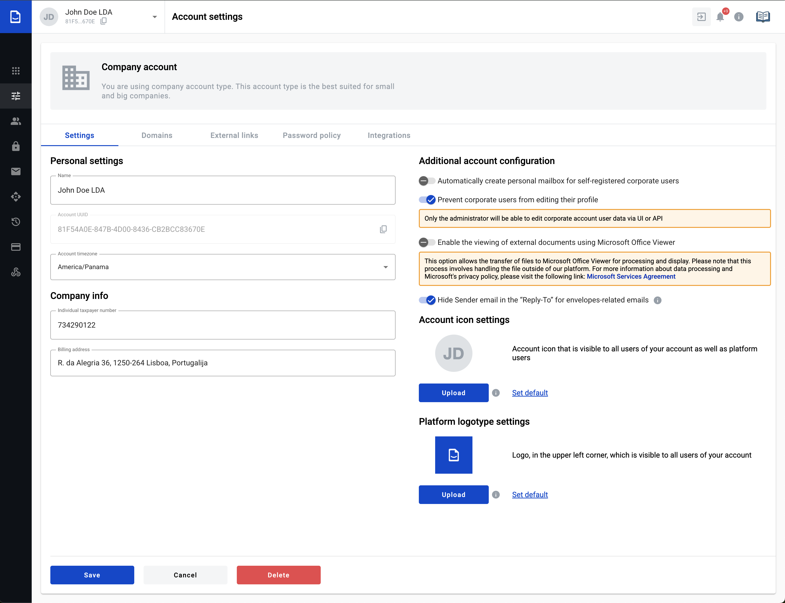
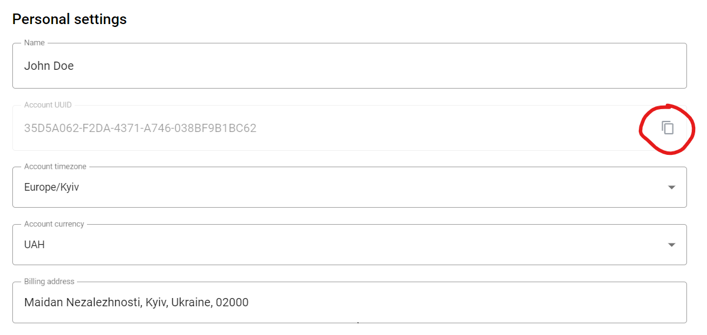
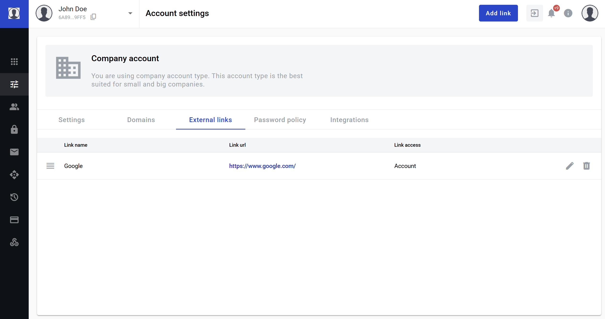
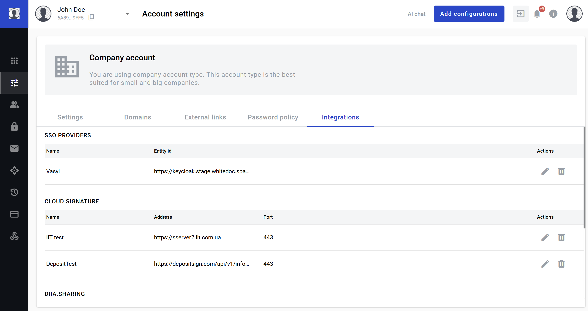
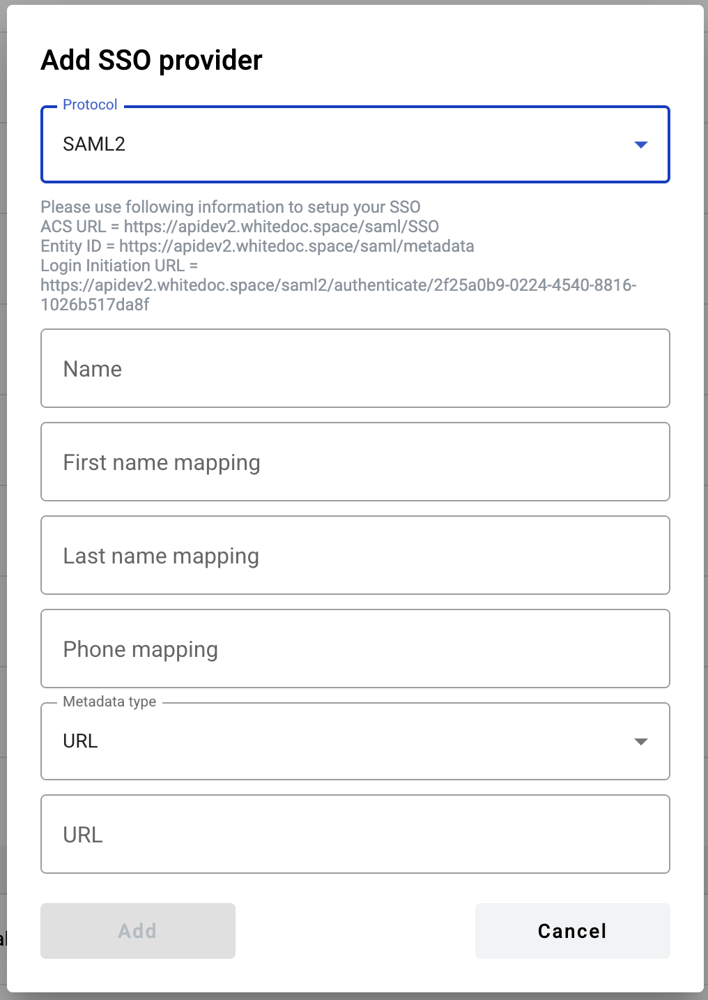

.. _accountSettings:

============
Settings tab
============

Settings is a page with account properties that help to identify and manage the account. Data from account is used for mailboxes creation and billing. From here you can :ref:`manage your accounts<accountSettings>`, :ref:`configure domains<domains>`, :ref:`add SSO providers<ssoProviders>`, :ref:`create external links<externalLinks>`, :ref:`configure password policy<passwordPolicyConfig>`, and :ref:`manage cloud signatures<cloudSignature>`.

How to update account name?
===========================

1. Click the "Name" input
2. Edit account name (min 3 to max 256 symbols)

3. CLick the "Save" button
4. Success message will appear and name will be updated

How to copy account UUID?
=========================

1. Click the "Copy account UUID" button
2. Success message will appear and UUID will be copied to the clipboard

How to configure automatic mailbox creation for corporatre users?
=================================================================

.. note:: This section will be visible and active only if you have the 10014 (rolesListView) account permission and your account has at least one verified domain.

1. Enable the toggle switch in this section

2. In the "Mailbox role" input select the mailbox role which will be assigned to the corporate users for automatically created mailboxes
3. You can start typing in the role name in the input to narrow the roles list
4. After clicking on the required role click the "Save" button
5. Success message will appear and settings will be saved

.. _msViewerConfiguration:

How to configure document viewing through the Microsoft Viewer?
===============================================================

.. note:: This action allows you to activate the Microsoft Office Viewer. The active option allows the transfer of files to the Microsoft Office Viewer for processing and display. This process involves handling the file outside our platform. For more information about data processing and Microsoft's privacy policy, please visit the following link: https://www.microsoft.com/en-us/servicesagreement

1. Enable the toggle switch in this section

2. Modal window with a confirmation request will be displayed

3. Accept the agreement
4. Toggle switch will be activated
5. Click the "Save" button to save changes

.. note:: As soon as you activated this option, all mailboxes withing this account will view external documents with uploaded files in .doc, .docx, .ppt, .pptx .xls, .xslb, .xlsm, and .xlsx formats in MS viewer iframe.

If the option is turned off, files will no longer be displayed by MS viewer and will be displayed with the DocStudio engine,  if rendering is possible.

How to upload an account and platform images?
=============================================

1. Images can be uploaded in the "Account icon settings" and "Platform logotype settings" sections

2. Click the respective "Upload" button and choose the image (click the info icon to view image requirements)
3. Click the "Save" button
4. Default logo can be restored by the "Set default" button. In this case account logo will consist on two first letters of the account name, and WhiteDoc logo is used for platform logo

How to delete an account?
=========================

1. Click the "Delete" button
2. Modal window will appear

3. Type your user email in uppercase in the email input
4. Click the "Confirm" button

.. _domains:

===========
Domains tab
===========

.. note:: This tab is available only in company accounts.

This page allows to manage, verify and activate domains and also for the SSO settings for each domain. Domains are necessary for corporate users creation.

.. image:: pic_accountSettings/domains.png
   :width: 600
   :align: center

How to add a domain?
====================

1. Click the "Add domain" button
2. Enter the name of a domain that you own and confirm your action

.. image:: pic_accountSettings/domainsAdd.png
   :width: 600
   :align: center

3. If domain is existing, we can ping it and if the domain has not been verified by anyone else yet, it will be added to the domains list

How to verify a domain?
=======================

1. Add a domain
2. You will see a window with instructions

3. Copy data from the modal and enter to the respective field on the DNS configuration of your domain
4. Click the "Verify" button on modal window and system automatically tries to confirm you ownership
5. As soon as system get proofs of your ownership admin get email notification related to successful domain verification on the platform

How to activate a domain?
=========================

1. Click the "Activate" button near an inactive domain
2. Domain is active

How to delete a domain?
=======================

1. Click the "Delete" buttoin near a domain
2. Confirm you action

.. note:: If verified domain is deleted you will lose the ability to manage users in it.

.. _externalLinks:

How to configure SSO per domain
===============================

For each domain, you can activate an SSO provider so that users within that domain can log in using OAuth-based authentication. This allows users to access the system seamlessly using their existing credentials from the authorized identity provider.

1. Click the settings icon in the domain you want to configure.

2. In the dropdown menu, select an available SSO provider to connect, if it was previously added on the Integrations tab.

.. image:: pic_accountSettings/domainSsoSettingsManage.png
   :width: 600
   :align: center

3. If you select the None option, the SSO authentication method will not be activated.

As soon as you add any SSO provider, the SSO status label will change to active, and a "Deactivate" button will appear. You can deactivate or reactivate SSO access for users simply by clicking the corresponding button.

==================
External links tab
==================

This page allow to manage list of the links to the external resources.

How to add an external link?
============================

1. Click the "Add link" button. Window will appear

2. Enter link name, url and access level. If you choose account access level for link all users who have access to mailboxes from this account will see the link. If you set as access level specific mailbox only users who have access to this mailbox will see the link
3. Popup will be closed and new link will be added to the end of the existing links list
4. You can edit and delete links by clicking the "Edit and "Delete" buttons
5. Drag the links by the "Reorder" icon to update links order

.. _passwordPolicyConfig:

===================
Password policy tab
===================

.. note:: This tab is available only in company accounts.

You're able to configure password and session policy for all users with verified domains in your account. You can make it more strict than default system configuration. To do that follow next instructions. More info on password policy can be found :ref:`here <passwordPolicy>`.

.. image:: pic_accountSettings/passwordPolicy.png
   :width: 600
   :align: center

How to change password or session policy?
=========================================

1. First of all verify any domain. It's necessary to do, because without users with verified domains rules won't work
2. Open /admin/account-settings?activeTab=password-policy page
3. Make rule stricter than default system rule and save changes

After actions above password or session policy will be applied for any user with email from verified domain.

How to make password policy more strict?
========================================

There are a lot of password policy and session policy options:

1. Minimum password length. It means that minimal quantity of symbols in password should be not less than configured, so to make this option stricter you can use value bigger or equal than default value "min-length" in configuration
2. Maximum password length. It means that maximum quantity of symbols in password shouldn't be bigger than configured, so to make this option stricter you can user value lower or equal than default value "max-length" in configuration
3. Require uppercase letters. It means that password should contain at least N uppercase letters where N is value "uppercase" in configuration. To make it stricter use value bigger or equal as in configuration. But don't use quantity of symbols bigger than maximum available length of password
4. Require lowercase letters. It means that password should contain at least N lowercase letters where N is value "lowercase" in configuration. To make it stricter use value bigger or equal as in configuration. But don't use quantity of symbols bigger than maximum available length of password
5. Require numeric value. It means that password should contain at least N numeric symbols where N is value "digit" in configuration. To make it stricter use value bigger or equal as in configuration. But don`t use quantity of symbols bigger than maximum available length of password
6. Require at least one special character. It means that password should contain at least N special characters where N is value "special-symbol" in configuration. To make it stricter use value bigger or equal as in configuration. But don't use quantity of symbols bigger than maximum available length of password
7. Do not allow repeat. It means that password shouldn't contain repeated symbols. So if in configuration is "Don't allow repeat" value 3, you can't use three repeated characters ("111", "aaa" or etc.). To make this option stricter use lower or equal value "repeat-character" as in configuration
8. Allow whitespace in password. This option allows or disallows to use whitespaces in password
9. Do not allow the use of forbidden passwords. This option allows or disallows to use forbidden passwords
10. Do not allow the use of forbidden words. This option allows or disallows to use forbidden words in password
11. Enable password expiration. This is option which responsible for password expiration. If you want to make stricter rules set value lower than value "expiration-days" in configuration
12. Send password expiration notification. This is option which responsible for quantity of days for password expiration notification. To make it stricter set value "notify-before-days" lower than in configuration
13. Do not allow reuse of passwords. Option which is responsible for period of time which password can't be re-used. To make it stricter set value "prevent-reuse-months" bigger than in configuration
14. Do not allow reuse of recent. Option which is responsible for quantity of previous password which can't be re-used. To make it stricter set value "prevent-reuse-count" bigger than in configuration

How to make session policy more strict?
=======================================

1. Keep session during idle period. Option which is responsible for time while session is active in idle. To make it stricter set value "session-hours" lower than in configuration
2. Single session for one user. Option which allows or disallows single browser session
3. Single user session per IP. Option which allows or disallows single IP session
4. Maximum login attempts before locking. Option which is responsible for quantity of incorrect password user enters before locking. To make it stricter set value "max-login-attempts" lower than in configuration
5. Lock time after multiple login attempts. Option which is responsible for period of time on which user will be locked. To make it set value "max-attempts-timeout-minutes" bigger than in configuration
6. The list of allowed IPs. The list of IP addresses from which users are able to log in on platform
7. The list of blocked IPs. The list of IP addresses from which users aren't able to log in on platform

================
Integrations tab
================

.. note:: This tab is available only in company accounts.

This tab contains configurations of integration with different external services.

.. _ssoProviders:

How to add an SSO provider?
===========================

Single Sign-On (SSO) is an authentication method that allows users to log in once and gain access to multiple related systems without needing to enter their credentials repeatedly.
SSO authentication methods can be created for the users inside a corporate account. 
Follow these steps to do so:

1. Create a domain and verify it on the platform
2. Click the "Add configurations" button and select the "SSO providers" option from the menu

3. When you open the modal to add an SSO provider, the settings for the SAML protocol will be displayed by default. In this protocol configuration, you can choose to provide either a Metadata URL or upload a Metadata XML file.

- Metadata URL: This is a web address where the identity provider’s metadata is hosted. By providing the URL, your system can automatically fetch and update the configuration details when they change.
- Metadata XML file: This is a static XML file containing the identity provider’s metadata. Uploading this file allows you to manually configure the connection based on the exact information provided.

4. If you need to configure SSO using the OAuth protocol, select the corresponding option, and the settings for OAuth will appear.
Here, by clicking the "Google" or "Azure" buttons, the fields such as Issuer URI, Authorization URL, Token URL, and JWK Set URL will be automatically filled with predefined data. You can also fill in these fields manually if needed.

3. Fill in all the required fields for the protocol you need and click the "Add" button.
4. All added SSO providers will be displayed in the corresponding table with the following details: Name, Protocol, Entity ID and Actions.
5. To edit the details of a specific SSO provider, click the pencil icon, make your changes, and then click the "Edit" button to save them.

6. You can delete an SSO provider by clicking the Delete icon.

**To activate an SSO** for the users go to the :ref:`domains tab <domains>`. 

.. note:: Once SSO is connected to a domain, your corporate users can log in using SSO authentication. When a corporate user enters their corporate domain, they will be directed to the SSO authorization page. After submitting their credentials, the user will either be successfully logged in or receive a notification indicating that they need to register through the SSO system. This allows users to sign in easily with their existing corporate login details.

.. _cloudSignature:

How to add a cloud signature?
=============================

Custom Cloud signature providers can be added for the users inside a corporate account. Follow these steps to do so:

1.  Click the "Add configurations" button and select the "Cloud signature" option from the menu
2.  Fill in the main fields in the opened window. Name of the signature can be anything you want, URL should contain address to the signature server, and port should be available for connection on the specified server. When all fields are filled, click the "Add" button

