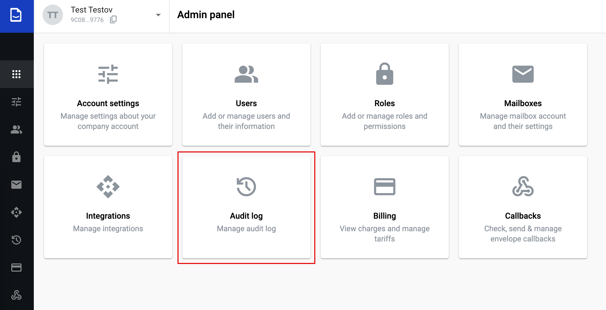
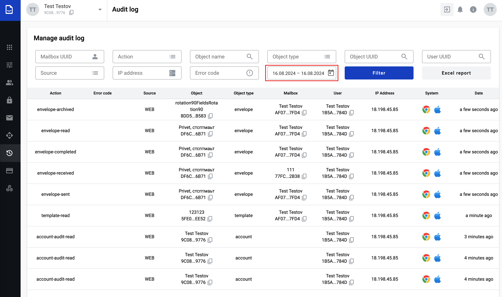
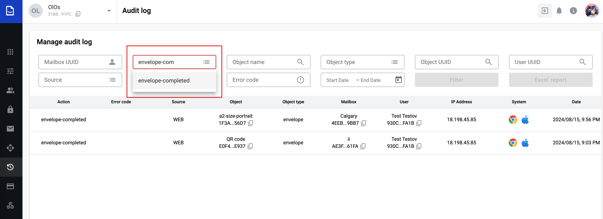
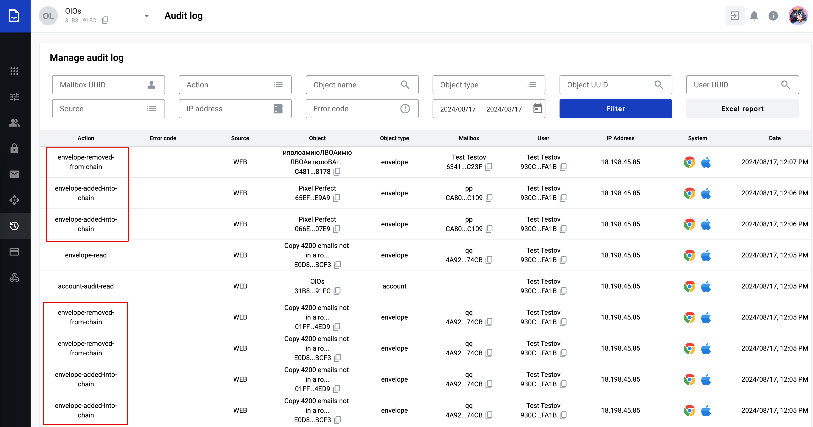

=========
Audit Log
=========

The Audit Log is a feature that allows you to view and filter different events within an account.
It is located in the administrative panel

Manage audit log
================

1. When you open the audit log, you will see all the events that occurred within the account on the current day for all users who has access to the account.

   
2. Events that are logged and can be displayed on the page include the following.

Template actions:
- template-read
- template-created
- template-archived
- template-zip-structure-created
- template-zip-structure-deleted

Mailbox actions:
- mailbox-created
- mailbox-archived
- mailbox-name-changed
- mailbox-filter-created
- mailbox-filter-updated
- mailbox-filter-deleted
- mailbox-label-created
- mailbox-label-updated
- mailbox-label-deleted
- mailbox-alias-created
- mailbox-alias-deleted
- mailbox-integration-updated

User actions:
- user-invited-to-account
- user-invited-to-mailbox
- user-permission-changed
- user-password-reset
- user-password-renew
- user-blocked
- user-unblocked
- user-created
- user-deleted

Category actions:
- category-created
- category-updated
- category-deleted
- category-moved

Dictionary actions:
- dictionary-created
- dictionary-updated
- dictionary-access-changed
- dictionary-column-created
- dictionary-column-updated
- dictionary-column-deleted
- dictionary-record-created
- dictionary-record-updated
- dictionary-record-deleted
- dictionary-archived
- dictionary-download
- dictionary-uploaded

Envelope actions:
- envelope-read
- envelope-draft-created
- envelope-draft-updated
- envelope-draft-deleted
- envelope-label-assigned
- envelope-label-unassigned
- envelope-label-assigned
- envelope-sent
- envelope-archived
- envelope-unarchived
- envelope-updated
- envelope-data-updated
- envelope-recieved
- envelope-completed
- envelope-cancelled
- envelope-expired
- envelope-invitation-accepted
- envelope-report-download
- envelope-delegated
- envelope-delegation-cancelled
- envelope-sent-for-approval
- envelope-approval-cancelled
- envelope-approved
- envelope-rejected
- envelope-deleted
- envelope-restored
- envelope-archive-saved
- envelope-archive-downloaded
- envelope-copy-shared
- envelope-shared-copy-revoked
- envelope-erased
- envelope-columns-setting-reset
- envelope-added-into-chain
- envelope-removed-from-chain

Approval flow actions:
- approval-flow-created
- approval-flow-updated
- approval-flow-deleted

Scenario actions:
- scenario-created
- scenario-updated
- scenario-deleted
- scenario-cloned
- scenario-run

Account actions:
- account-created
- account-updated
- account-pilicies-updated
- account-cripto-config-created
- account-cripto-config-deleted
- account-external-link-created
- account-external-link-deleted
- account-domain-created
- account-domain-updated
- account-domain-deleted
- account-audit-read
- account-mailbox-report-download
- account-users-report-download
- account-tariff-changed
- account-sso-idp-created
- account-sso-idp-updated
- account-sso-idp-deleted

Role actions:
- role-created
- role-updated
- role-deleted

Integration actions:
- integration-rule-created
- integration-rule-updated
- integration-rule-deleted

Errors actions:
- forbidden-error
- not-found-error
- unauthorized-error

3. You can filter the list by a specific event in the Actions menu. Simply start typing the name of the event you are looking for, or select it from the dropdown list.

4. When the list is filtered by a specific parameter, you can view the following data:

*Action* = Events that have occurred with various functionalities in the account, such as the creation of a dictionary, approval or signing of an envelope, creation of a new mailbox, and others listed above.
*Error code* = An entry about errors that occurred, with the option to follow a link to documentation on error codes.
*Source* = WEB or API.
*Object* = Object name and its UUID, available for copying.
*Object type* = Template, envelope, user and others listed above.
*Mailbox* = Mailbox name and its UUID, available for copying.
*User* = User name and its UUID, available for copying.
*IP Address* = user's IP address.
*System* = Browser and OS.
*Data* = Date when the event occurred.

Envelope action description
==========================

1. **Envelope chain**
When an envelope is added to or removed from a chain of envelopes, the following actions are logged in the audit log:

- envelope-added-into-chain
- envelope-removed-from-chain

.. note:: To learn how to add or remove an envelope from a chain, please refer to the link - :ref:`Envelope chain <envelopeChain>`
