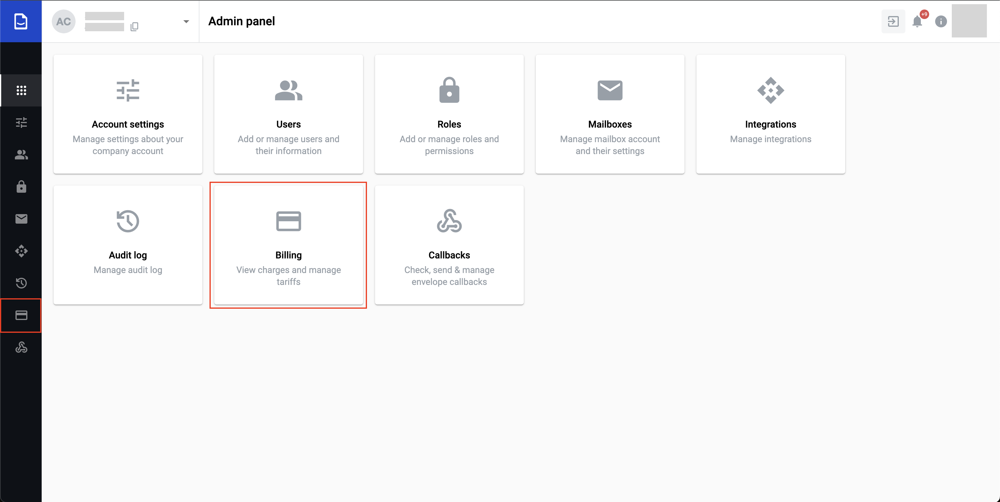
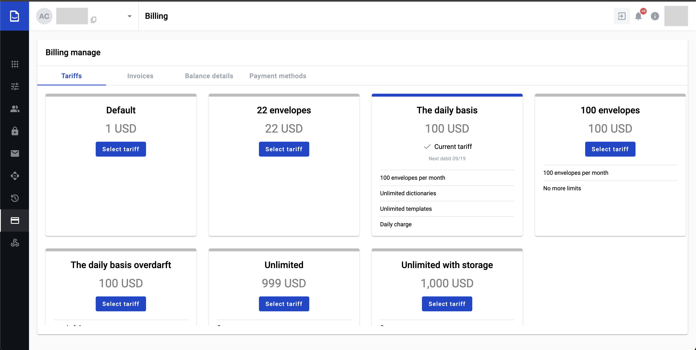
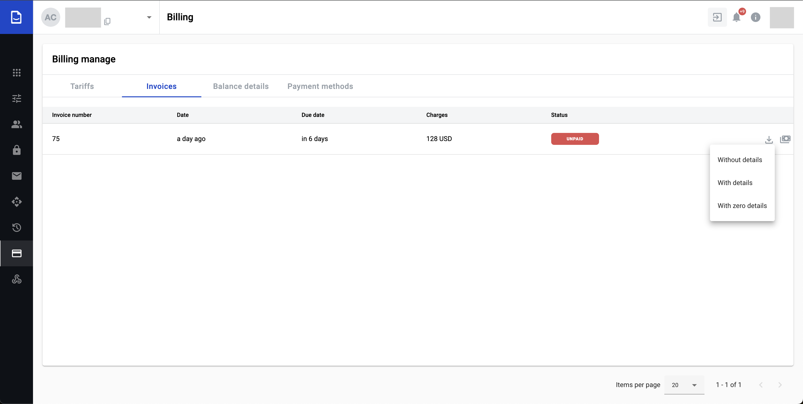
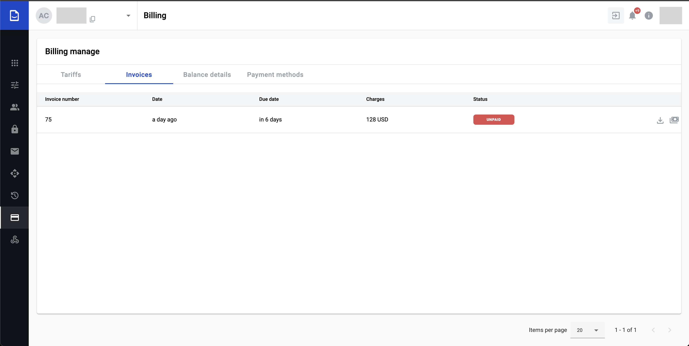
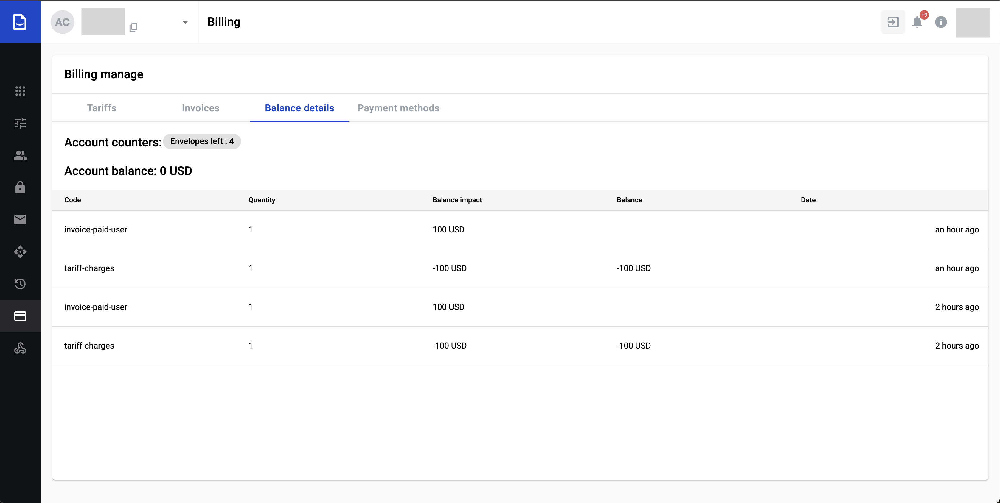
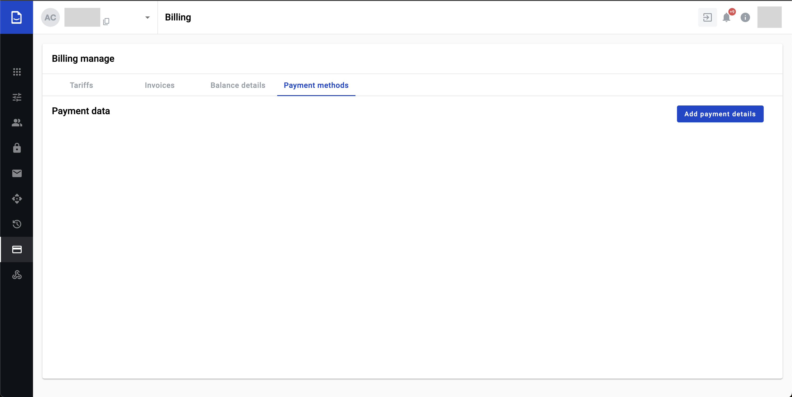
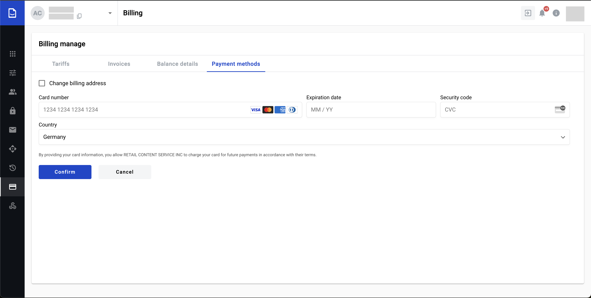
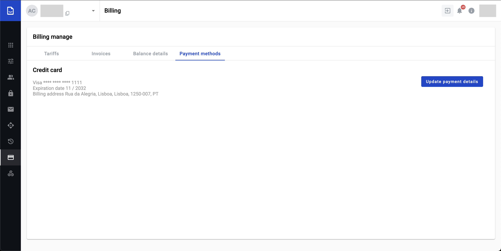

=======
Billing
=======

Billing the functionality is allowing to manage :ref:`tariffs <tariffs>`, :ref:`invoices <invoices>`, :ref:`payment methods <paymentDetails>` and viewing the account balance details.

Billing may not be displayable in administrative panel if instance settings configuration prohibit it. But if it's allowed you can observe respective tab in administrative dashboard and left side menu

.. _tariffs:

Tariffs
=======

Tariffs page represents available tariffs on the instance and the actual tariff assigned to the account.

Tariff may be applied by clicking on the respective button "Select tariff". By clicking on the "Select tariff" button modal window with confirmation will be displayed for customer. By confirming, the applicable tariff will be assigned to the account.

.. note:: If instance contains payment provider "Stripe" the following verifications and actions will be performed

**Account doesn't have billing address or payment details or both**

1. By confirming, the applicable tariff the system will verify if account has billing address and :ref:`payment method <paymentDetails>`
2. If one of the billing address and :ref:`payment method <paymentDetails>` is not added to the account, modal window with respective configuration will be displayed
3. As soon as user enters payment and billing details it will be added to the account as :ref:`payment method <paymentDetails>`
4. On this step, if tariff has prepay configuration (most tariffs has), tariff will be assigned to the account, :ref:`invoice <invoices>` will be generated and paid (if the added payment method has sufficient funds)

**Account has payment details and billing address**

1. By confirming, the applicable tariff the system will verify if account has billing address and :ref:`payment method <paymentDetails>`
2. If tariff has prepay configuration (most tariffs has), tariff will be assigned to the account, :ref:`invoice <invoices>` will be generated and paid (if the added payment method has sufficient funds)

.. note:: You can choose only one tariff at the moment. You can change tariff not more that 1 time per hour.

.. _invoices:

Invoices
========

Invoices page contains account invoices. On this page user is able to observe paid, unpaid and cancelled invoices, download them and pay them.

Invoice may be issued in manual or automatic way, usually in automatic way. In automatic way it works according to tariff configuration.

**Invoice download options**

You are able to download invoices by clicking on the respective button in the specific invoice and choose the one of the invoice option

1. Without details - will be downloaded basic invoice without any details about the account events
2. With details - will be downloaded basic invoice with positive and negative details about the account events (positive and negative events are events that made positive or negative impact for account balance)
3. With zero details - will be downloaded basic invoice with positive, negative and zero details about the account events (zero events the events that did zero impact for account balance)

**Invoice payment options**

If you have unpaid invoices, you are able to pay the invoices manually by clicking on respective button in the specific invoice and choose the one of the available payment provider

As soon as you click on the button "Pay invoice" the modal window will be opened

.. image:: pic_billing/invoicesPagePayInvoiceModal.png
   :width: 400
   :align: center

You can choose one of the appropriate payment provider to pay the invoice and proceed with payment provider, as soon as invoice paid you will observe paid invoice

.. image:: pic_billing/invoicesPagePaid.png
   :width: 400
   :align: center

.. _balanceDetails:

Balance details
===============

Balance details page represents details related to account events activities that impact the account balance and the account counters (f.e.: envelopes quantity left, mailboxes quantity can be created and etc.(each counter depends on tariff configuration))

.. _paymentDetails:

Payment details
===============

.. warning:: We are not storing your payment details. The payment details are stored by "Stripe" payment provider

Payment details page represents payment details of the "Stripe" payment provider assigned to the account.

.. note:: If payment provider "Stripe" is presented on the instance the page will be available otherwise page will not be accessible

By default page doesn't contain payment details

You are able to add them by clicking on "Add payment details"

By default you are able to add payment method only, but if you need to add/update the billing address withing the payment details you will set checkbox on "Change billing address"

.. image:: pic_billing/paymentMethodsPageAddPaymentWithAddress.png
   :width: 400
   :align: center

As soon as you added payment details and/or billing address you will observe payment details with possibility to update them

.. note:: Only one payment method can be active at the moment for one account. If you update payment method the updated one will be active and previous payment method will no longer be available.
