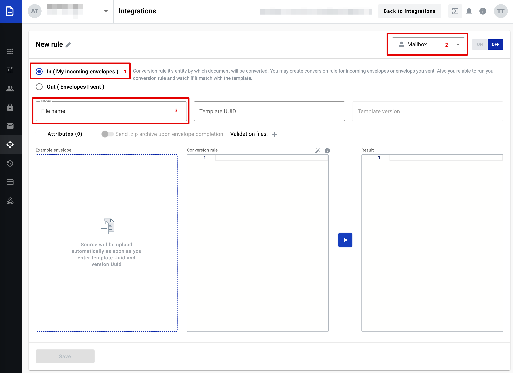
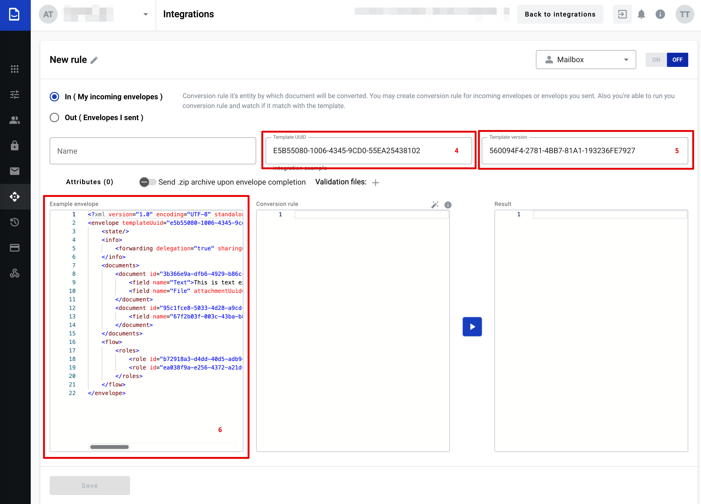
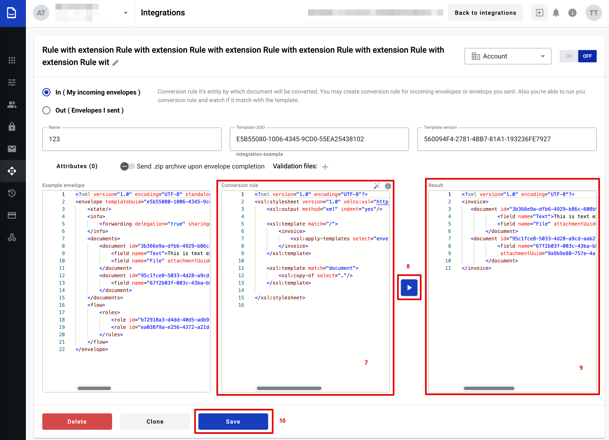
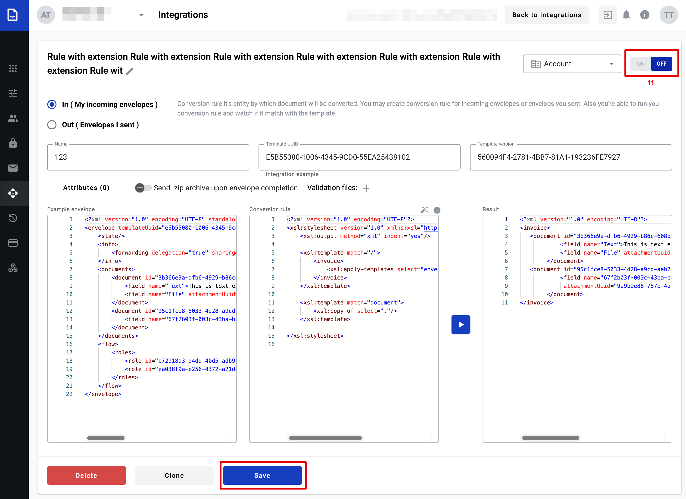
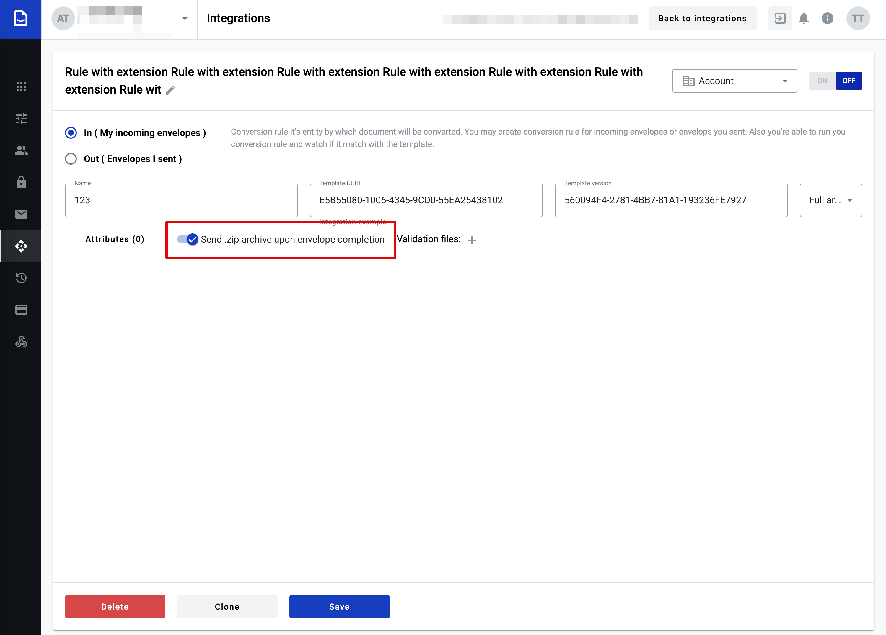
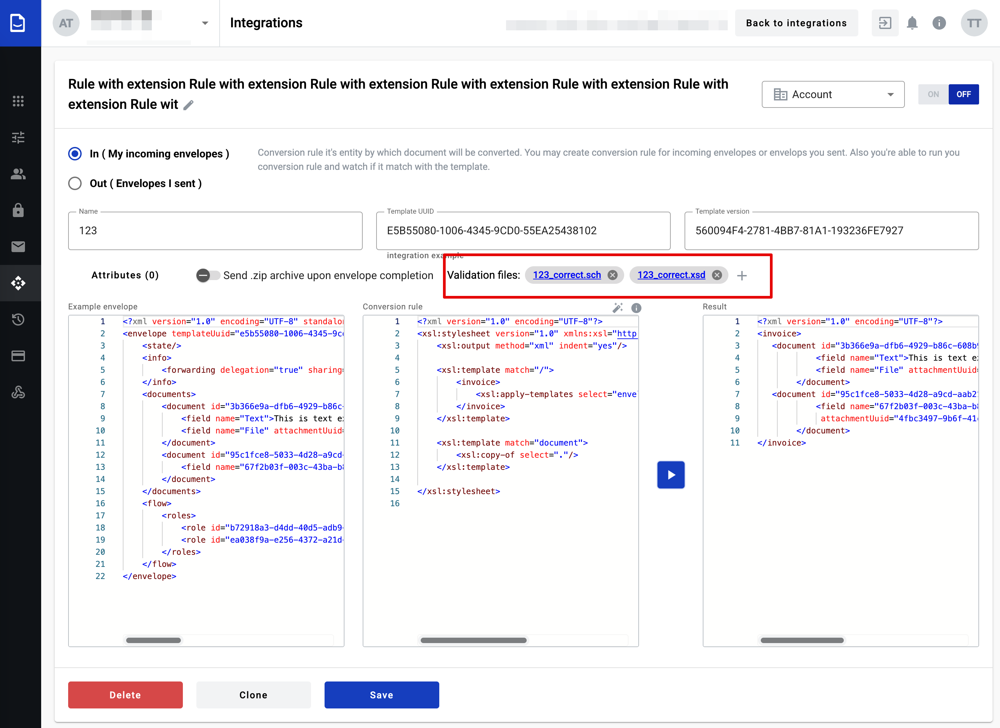

===============
Conversion rule
===============

Conversion rule allows to convert documents to whitedoc format from other formats and vise versa. To do so you should create a conversion rule and depending on the selection on this page you can create conversion rule for incoming and outgoing documents. Existing conversion rule can be updated, cloned or deleted here.

Conversion rule creation process for outgoing document
======================================================

1. To create a conversion rule for outgoing document you should select checkbox "Out (Envelope I sent)" (1)
2. You need to decide whether this rule will apply to a specific mailbox or work across the entire account. By default, each rule is created for a specific mailbox. To change the access level, select 'Account' in the corresponding menu (2).
3. In field (3) you can provide rule name or leave default name

.. image:: pic_ConversionRuleCard/integrationRuleCreationOut1.jpg
   :width: 1000
   :align: center

4. In field (4) you should provide matching rule. According this rule will be matching document and conversion rule (matching rule can be created using RegExp)

.. important:: F.e.: you have a couple of files with different names and similar part of name: example111.txt, example222.txt and example333.txt. To write a matching rule which will be appropriate for all of the files you can write next expression: example.*.txt and all files will be correspond to your matching pattern. `How to use regular expression you can find here <https://en.wikipedia.org/wiki/Regular_expression>`_

4. In field (5) you should select according what content will be make matching
    - Name - matching rule will be match with file name
    - Content - matching rule will be match with file content

5. In a field (6) you should provide template UUID that matches the outgoing document
6. Once you insert a valid template UUID, the system will automatically populate the template version UUID field (7). This ensures that you are always working with the correct and most up-to-date version of the template. But you can use any version if needed, by clicking the template version input and selecting a version from the list. 

.. image:: pic_ConversionRuleCard/integrationRuleCreationOut2.jpg
   :width: 1000
   :align: center

7. When fields (6) and (7) filled, fields (8) will be filled with autogenerated data - XSLT (eXtensible Stylesheet Language Transformations). You can see conversion rule example by clicking the info icon inside field (8).

XSLT code in the Conversion rule block is an instruction that tells the system how to convert the data from the template into the final document:
- Defining the structure of the output document
- Specifying which data from the template should be included
- Setting formatting and transformation rules for the information

If needed you can update conversion rule inside this field (8). 

.. image:: pic_ConversionRuleCard/integrationRuleCreationOut3.jpg
   :width: 1000
   :align: center

8. Once the conversion rules are automatically populated in the Conversion rule block, You need to upload a file (9) that will be validated against these rule. This file serves as the input data that is transformed based on the predefined XSLT rules. To do this you should click this field, after that will be open file explorer where you can select source file in local machine. The format of incoming files can be .xml, .xls, .xlsx, .xlsm, .edi. When file selected and opened, data from this file will be shown in this field. If you want to update data in this field he should make changes in file and upload updated file to this field
9. When fields (8) and (9) filled with correct data, you can check conversion result. The system will compare the uploaded file with the conversion rules displayed in the Conversion rule block. To compare data you need to click the execute (10) button.
10. If execution is finished successfully envelope XML structure will be shown in the Result (11) block and you can save new conversion rule by clicking the Save (12) button
If execution is finished unsuccessfully you will see a message telling you what is wrong. You will need to fix these issues in your file and upload and execute it again.

.. image:: pic_ConversionRuleCard/integrationRuleCreationOut4.jpg
   :width: 1000
   :align: center

11. You can turn on conversion rule from this page, for that you need move toggle to the left side and click the Save button. After that rule will be applied to all outgoing documents which match the rule.

.. image:: pic_ConversionRuleCard/integrationRuleCreationOut5.jpg
   :width: 1000
   :align: center

Conversion rule creation process for incoming document
======================================================

1. To create conversion rule for incoming document you should select checkbox "In (My incoming envelope)" (1)
2. You need to decide whether this rule will apply to a specific mailbox or work across the entire account. By default, each rule is created for a specific mailbox. To change the access level, select 'Account' in the corresponding menu (2).
3. In field (3) you should provide name. This name will be part of full name for all converted documents. Full name will be consist name from field (4) + time when this document was converted if document with similar name has been already created. You can customize name using special variables for naming pattern:

- {mailboxUuid} - mailbox UUID which is using integration functionality
- {envelopeUuid} - envelope UUID of the envelope which has been created on platform
- {randomNumber} - random number
- {templateUuid} - template UUID on platform using which envelope has been created
- {date dateFormat} - date of the envelope receiving in format you need (dateFormat can be DDMMYYYY or any of available date formats)
- {"documentId":"fieldName"} - value from the specific document of the template version used in integration rule.

.. important:: **Restrictions of using field value {"documentId":"fieldName"}** - available fields: text, number, currency, date, dictionary, lookup, formula, duplicate, autonumber. Fields used in dynamic table can not be used in the naming pattern

.. note:: **Validation of field value in the naming pattern** - field can be optional and in case if field is not filled in empty value will be placed instead of variable. If mandatory field not filled yet until conversion rule should be applied empty value will be placed instead of variable. If naming pattern will contain only optional field or in the moment of file creation no obligatory fields filled in yet we'll place "filename_empty" text instead of variables.

4. In field (4) you should provide templateUUID which match to incoming document
5. Once you insert a valid template UUID, the system will automatically populate the template version UUID field (5). This ensures that you are always working with the correct and most up-to-date version of the template. But you can use any version if needed, by clicking the template version input and selecting a version from the list.
6. When fields (4) and (5) filled, field (6) will display an example of the envelope structure based on the selected template. If you want to change data in field (6), you should update particular template and select necessary template version.

7. In field (7) you need input conversion rule which is a set of instructions that tells the system how to transform your data into the format required by the envelope. The conversion rule should be in XSLT (eXtensible Stylesheet Language Transformations) format. If needed you can update conversion rule inside this field (7)
8. When fields (6) and (7) filled with correct data, you can check conversion result. To do so you need to click the execute (8) button.
9. If the execution is successful, you will see a preview of the transformed data in XML format in the Result block (9) and you can save new conversion rule by clicking the Save (10) button
If the execution is unsuccessful, you will see an error message explaining what went wrong.

10. You can turn on conversion rule from this page, for that you need move toggle (11) and click the Save button. After that rule will be applied to all incoming documents which match the rule.

.. important:: **Please note!** `Conversion rule info <conversionRuleInfo.html>`_

**You might want to receive envelope archive to your server according to protocol you've chosen.**

1. Enter template UUID you want to make integration with
2. Set toggle "Send .zip archive upon emvelope completion" in active state to activate ZIP archive functionality
3. Chose archive type you want to send as soon as envelope will be COMPLETED

**You might want to configure additional validation to incoming envelopes

In the integration rule for incoming envelopes, you can add validation files in  XSD files (.xsd) and SCH files (.sch) formats.

Both file types serve important roles in data validation and integration:
- XSD files ensure that incoming XML data meets the expected structure and format.
- SCH files help validate and map database-related information in the incoming envelopes.

By adding XSD and SCH validation files to integration rules, you can catch problems with incoming data before it's fully processed.
- If the data is correct, the envelope will be successfully created and sent to the mailbox.
- If there are errors in the data, the system will reject it early. This prevents incorrect or incomplete envelopes from being created and sent to the mailbox.

This approach helps ensure that only valid, complete envelopes reach the user's mailbox, saving time and reducing confusion caused by faulty data.

You can add either a single validation file or multiple ones. Use the plus icon to add a new file.

WWorking with existed conversion rules
======================================

#. Update
#. Clone
#. Delete

**Edit**
To edit a conversion rule for outgoing or incoming document you should upload a valid source file and successfully execute the rule. "Save" button will be unavailable until that.

**Clone**
You can create a new conversion rule using clone function. To do so open a rule from conversion rule list and click the "Clone" button.

**Delete**
You can delete any conversion rules by opening a it and clicking the "Delete" button.