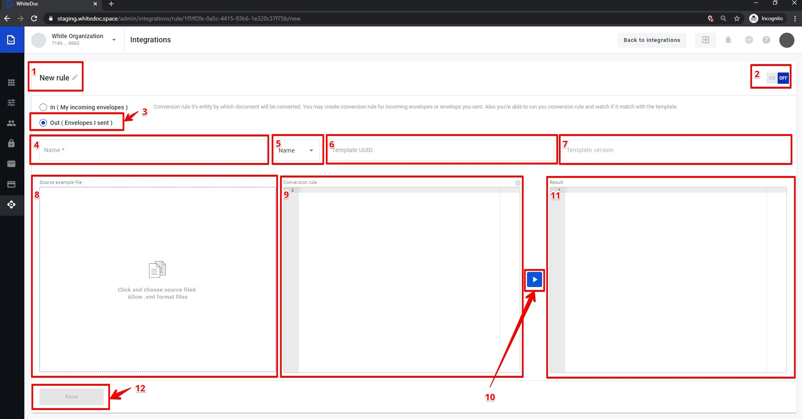
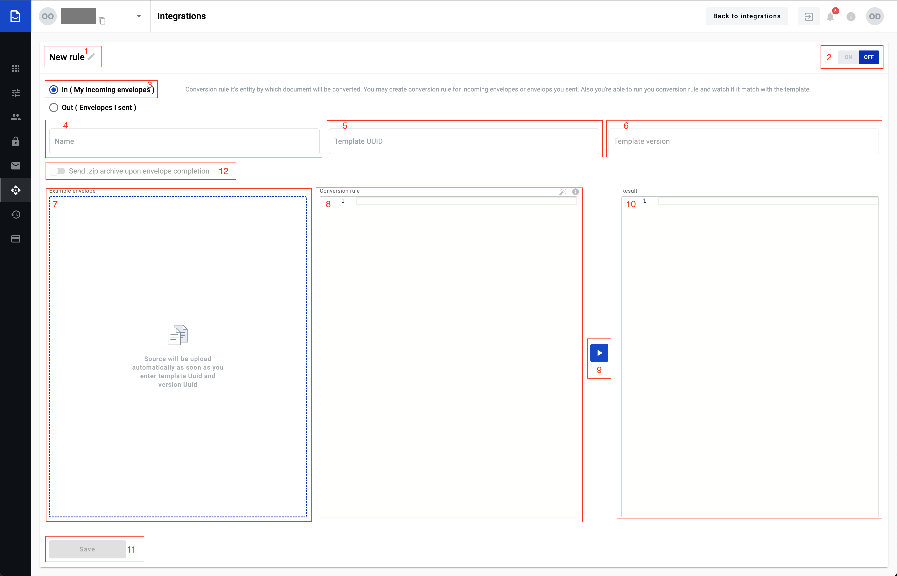
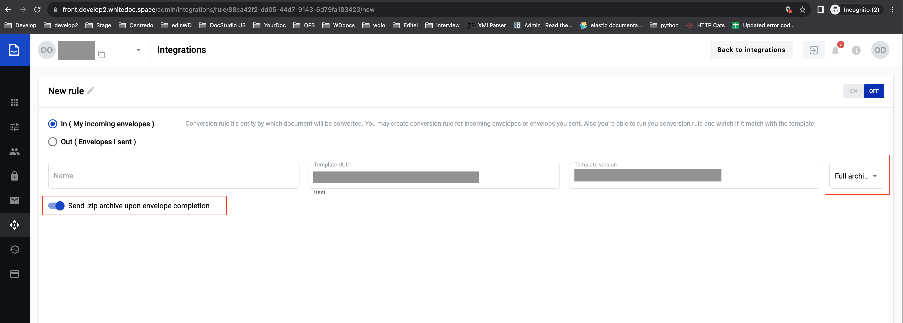

===============
Conversion rule
===============

Conversion rule allows to convert documents to whitedoc format from other formats and vise versa. To do so you should create a conversion rule and depending on the selection on this page you can create conversion rule for incoming and outgoing documents. Existing conversion rule can be updated, cloned or deleted here.

Conversion rule creation process for outgoing document
======================================================

1. To create a conversion rule for outgoing document you should select checkbox (3)
2. In field (1) you can provide rule name or leave default name
3. In field (4) you should provide matching rule. According this rule will be matching document and conversion rule (matching rule can be created using RegExp)

.. important:: F.e.: you have a couple of files with different names and similar part of name: example111.txt, example222.txt and example333.txt. To write a matching rule which will be appropriate for all of the files you can write next expression: example.*.txt and all files will be correspond to your matching pattern. `How to use regular expression you can find here <https://en.wikipedia.org/wiki/Regular_expression>`_

4. In field (5) you should select according what content will be make matching
    - Name - matching rule will be match with file name
    - Content - matching rule will be match with file content

5. In a field (6) you should provide templateUUID that matches the outgoing document
6. Field (7) will be auto populated with last template version. You can use any version if needed, by clicking the template version input (7) and selecting a version from the list. When fields (6) and (7) filled, fields (9) and (11) will be filled with autogenerated data
7. In field (9) shown conversion rule (you can see conversion rule example by clicking the info icon inside field (9)), if needed you can update conversion rule inside this field(9). In field(11) shown autogenerated template
8. For fill in source example file field (8) you should click this field, after that will be open file explorer where you can select source file in local machine. When file selected and opened, data from this file will be shown in this field(8). If you want to update data in this field he should make changes in file and upload updated file to this field
9. When fields (8) and (9) filled with correct data, you can check conversion result, for that need to click the execute (10) button. Envelope will be shown in the Result(11) block after that
10. If execution is finished successfully, you can save new conversion rule by clicking the Save (10) button
11. You can turn on conversion rule from this page, for that you need move toggle (2) to the left side and click the Save (12) button. After that rule will be applied to all outgoing documents which match the rule

Conversion rule creation process for incoming document
======================================================

1. To create conversion rule for incoming document you should select checkbox (3)
2. In field (1) you can provide rule name or leave default name
3. In field (4) you should provide name, this name will be part of full name for all converted documents. Full name will be consist name from field (4) + time when this document was converted if document with similar name has been already created. You can customize name using special variables for naming pattern:

- {mailboxUuid} - mailbox UUID which is using integration functionality
- {envelopeUuid} - envelope UUID of the envelope which has been created on platform
- {randomNumber} - random number
- {templateUuid} - template UUID on platform using which envelope has been created
- {date dateFormat} - date of the envelope receiving in format you need (dateFormat can be DDMMYYYY or any of available date formats)
- {"documentId":"fieldName"} - value from the specific document of the template version used in integration rule.

.. important:: **Restrictions of using field value {"documentId":"fieldName"}** - available fields: text, number, currency, date and time, dictionary, lookup, formula, duplicate, autonumber. Fields used in dynamic table can not be used in the naming pattern

.. note:: **Validation of field value in the naming pattern** - field can be optional and in case if field is not filled in empty value will be placed instead of variable. If mandatory field not filled yet until conversion rule should be applied empty value will be placed instead of variable. If naming pattern will contain only optional field or in the moment of file creation no obligatory fields filled in yet we'll place "filename_empty" text instead of variables.

4. In field (5) you should provide templateUUID which match to incoming document
5. Field (6) will be auto filled with last template version. If needed you can use not a last template version, for that need click the template version input(6), after that will be open list with all template version, you can select necessary template version from this list. When fields (5) and (6) filled, field (7) will be filled with autogenerated data. If you want to change data in field (7), he should update particular template and select necessary template version
6. In field (8) need input conversion rule which will be used for convert all incoming files, if needed you can update conversion rule inside this field(8)
7. When fields (7) and (8) filled with correct data, you can check conversion result, for that need click the execute (9) button and after that in block Result(10) will be shown document example after conversion
8. If execute finished with success you can save new conversion rule, for that need to click the Save (11) button
9. You can enable conversion rule from this page by moving toggle (2) to the left side and clicking the Save (11) button. After that to all incoming documents will be able this conversion rule

.. important:: **Please note!** `Conversion rule info <conversionRuleInfo.html>`_

**You might want to receive envelope archive to your server according to protocol you've chosen.**

1. Enter template UUID you want to make integration with
2. Set toggle (12) in active state to activate ZIP archive functionality
3. Chose archive type you want to send as soon as envelope will be COMPLETED

Working with existed conversion rules
=====================================

#. Update
#. Clone
#. Delete

**Edit**
To edit a conversion rule for outgoing or incoming document you should upload a valid source file and successfully execute the rule. "Save" button will be unavailable until that.

**Clone**
You can create a new conversion rule using clone function. To do so open a rule from conversion rule list and click the "Clone" button.

**Delete**
You can delete any conversion rules by opening a it and clicking the "Delete" button.