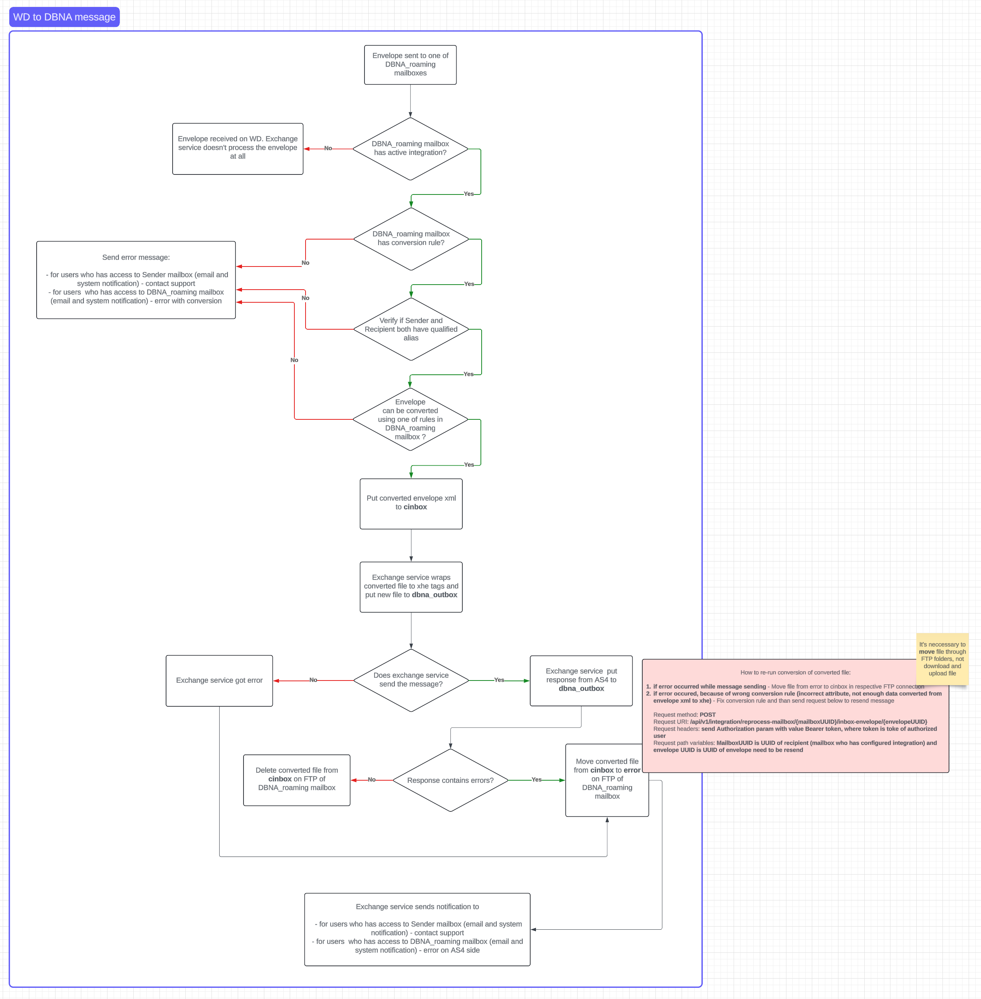
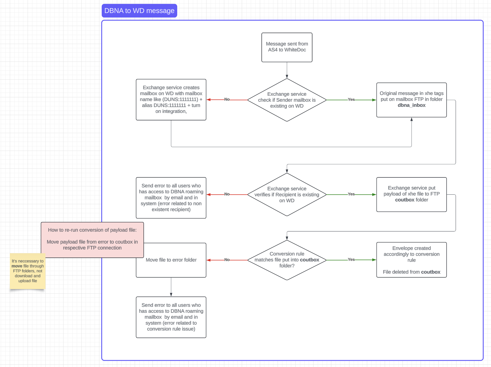

==================
DBNA configuration
==================

DocStudio instance has integration with DBNAliance services and it allows to transfer data through AS4 protocol between DBNAliance members. But before you can do it, you have to configure account

DocStudio to DBNA message configuration
=======================================

**To configure data transferring between DocStudio and DBNA (production env) you have to follow instructions**

1. Create a mailbox for recipient in DBNA roaming account
2. Add a qualified alias with DBNA ID (that you've get while register in DBNA as participant) to the mailbox created above in format DUNS::123456789 or US:TIN::123456789
3. Make sure that in DBNA roaming account integration turned on and AS4 transfer protocol selected
4. Create IN integration rule for template you want to send. Rules are already created in account level. But if you need rule specifically for you custom template for specific mailbox you can do it (It is necessary to specify attributes for such rule)
    .. image:: pic_dbna/inRuleAttributesDbna.png
        :width: 600
        :align: center

    .. code-block:: json

        {
            "PROCESS_ID": "bdx-procid-transport::bdx:noprocess",
            "CUSTOM_SMP_URL": "http://dbna/smp",
            "DOCUMENT_TYPE_ID": "bdx-docid-qns::urn:oasis:names:specification:ubl:schema:xsd:Invoice-2::Invoice##bpc-1.0-data-core",
            "SML_PROFILE" : "production"
        }

    3.1 Specify DOCUMENT_TYPE_ID in attributes (required) - DOCUMENT_TYPE_ID is attribute refer to document type will be send to recipient

    3.2 Specify SML_PROFILE in attributes (optional) - SML_PROFILE is an attribute define in which environment message will be sent. Available three options "production", "pilot" and "test". If SML_PROFILE is not defined in attributes default one will be set. Default profile is "test"

    3.3 Specify CUSTOM_SMP_URL (optional, for testing purposes)

    3.4 Specify PROCESS_ID in attributes (optional, default is ::bdx:noprocess) - if recipient side requires PROCESS_ID it necessary to define this attribure

    3.5 Specify SENDER_MAILBOX (optional, if DBNA integration is configured for a role other than sender)

    3.6 Write XSLT map (default namespace 'xmlns' is required for generated XML)
5. Activate and save IN rule

**To configure data transferring between DocStudio and DBNA (test and pilot env) you have to follow instructions**

1. Create a mailbox for recipient in DBNA roaming account
2. Add a qualified alias with DBNA ID (that you've get while register in DBNA as participant) to the mailbox created above in format DUNS::123456789 or US:TIN::123456789
3. Make sure that in DBNA roaming account integration turned on and AS4 transfer protocol selected
4. Create template you want to send with additional field with dropdown type, name f.e.: **SMP Profile** and with two options: test and pilot
5. Create IN integration rule for template you want to send. Create conversion rule specifically for newly created template (It is necessary to specify attributes for such rule)
    3.1 Specify DOCUMENT_TYPE_ID in attributes (required) - DOCUMENT_TYPE_ID is attribute refer to document type will be send to recipient

    3.2 Specify SML_PROFILE in attributes (required) - as this conversion rule will be used within template where we've added selector with profile options we have to specify dynamic attribute of profile SML_PROFILE = //field[@name=’SMP Profile’]/text(). Where "SML profile" the name of the dropdown field with options test and pilot

    3.3 Specify CUSTOM_SMP_URL (optional, for testing purposes)

    3.4 Specify PROCESS_ID in attributes (optional, default is ::bdx:noprocess) - if recipient side requires PROCESS_ID it necessary to define this attribure

    3.5 Specify SENDER_MAILBOX (optional, if DBNA integration is configured for a role other than sender)

    3.6 Write XSLT map (default namespace 'xmlns' is required for generated XML)
6. Activate and save IN rule

**Send DocStudio to DBNA message through DocStudio envelope functionality**

As soon as you configured recipient you're able to send envelope with template you're used in integration of recipient mailbox or from DBNA roaming account if you're using account integration rule

**DocStudio to DBNA message schema**

DBNA to DocStudio message configuration (DocStudio side)
========================================================

**To send message in DBNA to DocStudio direction you need to make small configuration activities**

.. note:: you can skip this activities and don't configure anything. In this case if you receive the message from DBNA side our system will automatically create mailbox with qualified alias, but message will be added to error in respective ftp folder of exchange mailbox. In this case administrator of DBNA roaming account should verify if conversion rule exists for this mailbox or account and put file again in coutbox folder (see screenshot below)

1. Create a mailbox for recipient in DBNA roaming account
2. Add a qualified alias with DBNA ID (that you've get while register in DBNA as participant) to the mailbox created above in format DUNS::123456789 or US:TIN::123456789
3. Make sure that in DBNA roaming account integration turned on and AS4 transfer protocol selected
4. Create OUT integration rule
    4.1 Select option "Attribute" in dropdown for matching pattern

    4.2 Write a condition in a 'Name' field of matching pattern in format DOCUMENT_TYPE_ID=={regex}

    4.3 Add <xsl:param name="RECIPIENT_MAILBOX"/> to XSLT you've created in the middle screen of integration rule

    4.4 Use param above for mailboxUuid="{$RECIPIENT_MAILBOX}"

    4.5 Add param <xsl:param name="SML_PROFILE"/> to your xslt conversion map

    4.6 Add block of XML to the envelope message block which will add to the end of the message SML_PROFILE value. If it's production it will add nothing.
        .. code-block:: xml

            <message>
                <xsl:value-of select="cbc:Note"/>
                <xsl:choose>
                    <xsl:when test="$SML_PROFILE = 'production'">
                        <xsl:text></xsl:text>
                    </xsl:when>
                    <xsl:otherwise>
                        <xsl:text></xsl:text>
                        <xsl:value-of select="translate($SML_PROFILE, 'abcdefghijklmnopqrstuvwxyz', 'ABCDEFGHIJKLMNOPQRSTUVWXYZ')"/>
                    </xsl:otherwise>
                </xsl:choose>
            </message>

5. Enable rule and save it

**Send message from DBNA to DocStudio**

1. Send message in DBNA app as Sender from steps above to recipient
2. Get envelope on DocStudio transformed accordingly to xslt conversion rule

Error handling
==============

In this section describe most common errors which can appears while exchanging messages between DocStudio and DBNA

**DocStudio to DBNA message errors**

Errors describe below will be send to Sender and to administrator of DBNA roaming mailbox. In all cases Sender of envelope will receive message with error and request to contact support for further details. And administrators of DBNA roaming mailbox receive detailed error in email.

1. DBNA roaming mailbox does not have conversion rule for received envelope
2. Sender or Recipient does not have qualified alias
3. None of the rule can not convert envelope
4. Exchange service received error while sending message
5. Response from DBNA side contains errors

You can re-run conversion process of converted file

1. if error occurred while message sending - Move file from error to cinbox in respective FTP connection
2. if error occurred, because of wrong conversion rule (incorrect attribute, not enough data converted from envelope xml to xhe) - Fix conversion rule and than send request below to resend message

::

    Request method: POST
    Request URI: /api/v1/integration/reprocess-mailbox/{mailboxUUID}/inbox-envelope/{envelopeUUID}
    Request headers: send Authorization param with value Bearer token, where token is toke of authorized user
    Request path variables: MailboxUUID is UUID of recipient (mailbox who has configured integration) and envelope UUID is UUID of envelope need to be resend

**DBNA to DocStudio message errors**

1. *Recipient doesn't exist in DocStudio. Send error to all users who have access to DBNA roaming mailbox by email and in system (error related to non existent recipient)*
2. Exchange service can not find conversion rule in sender mailbox integration or in account integration level. Send error to all users who have access to DBNA roaming mailbox by email and in system (error related to non existent conversion rule)
3. Exchange service can not convert message with conversion rule matched with message. Send error to all users who have access to DBNA roaming mailbox by email and in system (error related to issue with conversion of the message)

You can re-run conversion process if one of Exchange service errors appear. To do that you have Move payload file from error to coutbox in respective mailbox FTP integration
