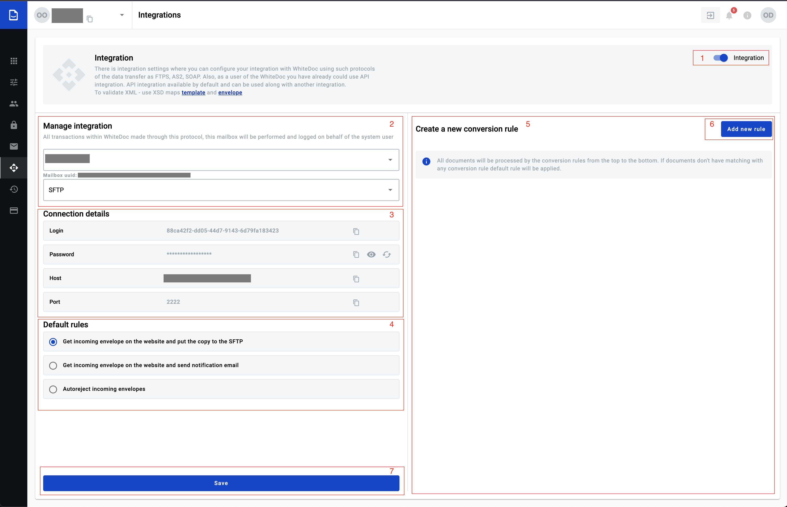

=================
Integrations page
=================

Integrations can be enabled on  `integration page </admin/integrations/list>`_ with Integrations toggle (1).

.. note:: If this toggle is disabled conection to the remote server will not be possible.

On this page customer can turned integration for all mailboxes in same account one by one. When customer open this page
and he has mailbox all field will be pre-filled(except: "Notify by email")

Manage integration (2)
======================

In manage integration block (2) customer can customize integration properties:

#. mailbox for integration
#. connection protocol
#. email address

If customer has more than one mailbox in this account he can change mailbox for integration in first field selection.
In second field selection customer will provide connection protocol, depends on this selection will be changed connection details(3)
block.
In the third field customer can provide email address where will be send all notification which related to integrations. Also this email will be use in second default rule.

Connection details (3)
======================

#. For SFTP protocol all data except in connection details (3) block is automatically generated. Password is generated after Save button clicked. Credential from this block should be used for connection to the FTP server. Each parameter can be copied by clicking on copy button. New password can be created by Reset button.
#. For AS2 protocol only Self URL and Self certificate will be generated automatically, the rest of credentials should be filled in manually.

Default rules (4)
=================

#. Get incoming envelope from website and put a copy to the remote server
#. Get incoming envelope from website and send notification email
#. Autoreject incoming envelopes

If incoming documents don't match with any created conversion rules, default rules will be applied to incoming documents. It can be selected from 3 predefined options. If third rule is selected, reject reason can be specified and all incoming documents will be rejected with this reason.

Conversion rules list (5)
=========================

Conversion rule list is empty be default. To create a new rule click on the "Add new rule" button, to open rule creation form. All new rules will be shown on this list. User can enable or disable each rules from this list. Existing rules can be updated, cloned and deleted. It is done in a rule properties form which is opened by clicking on the rule name. To save changes click on the Save (7) button.