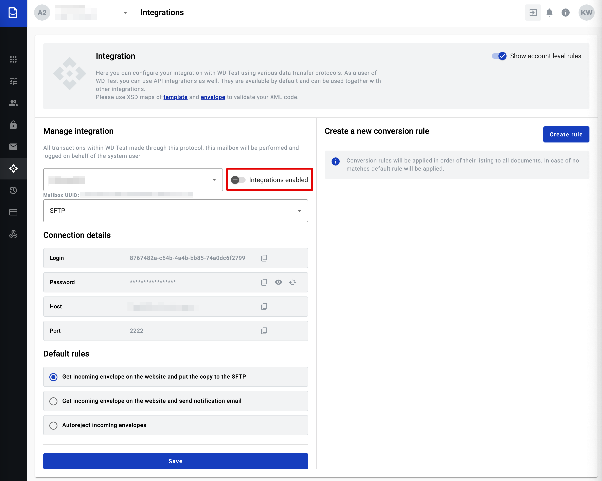
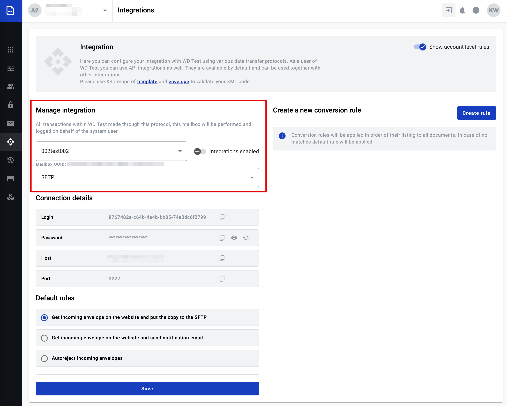
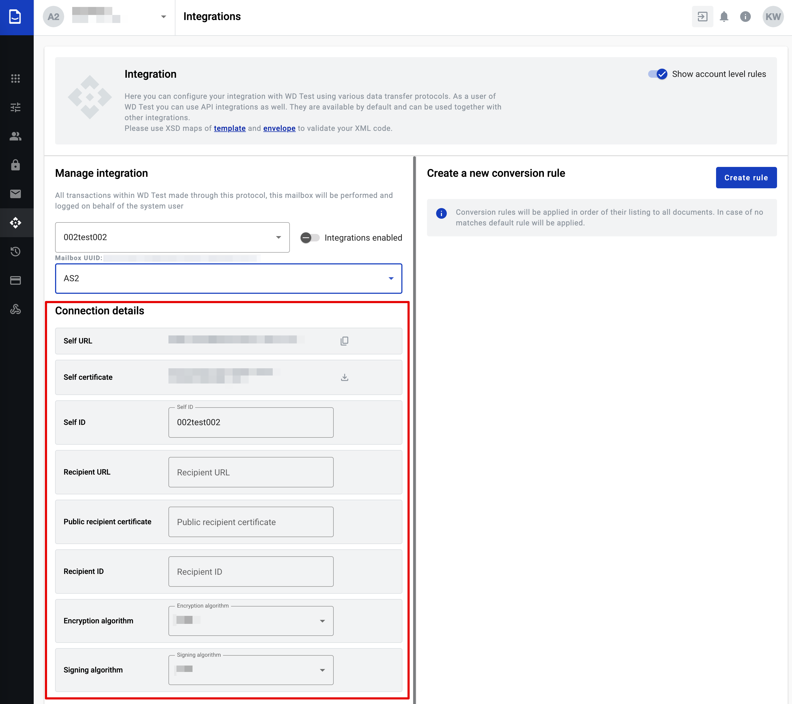
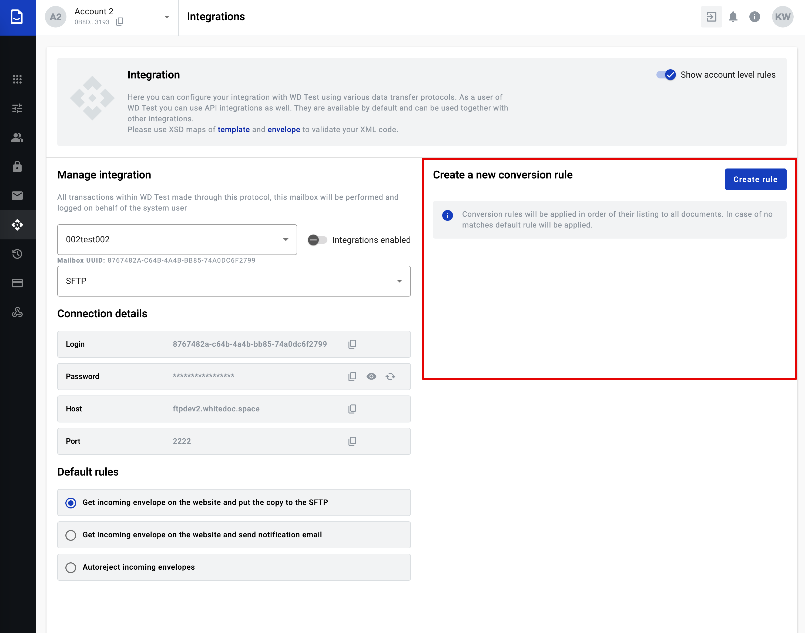
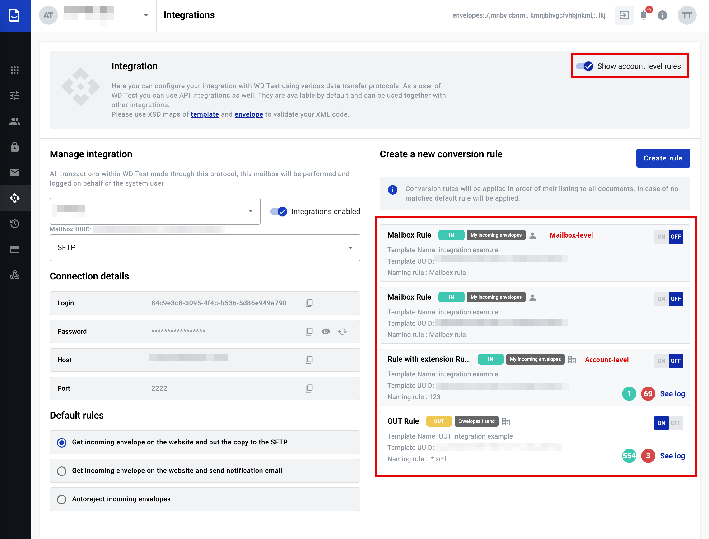
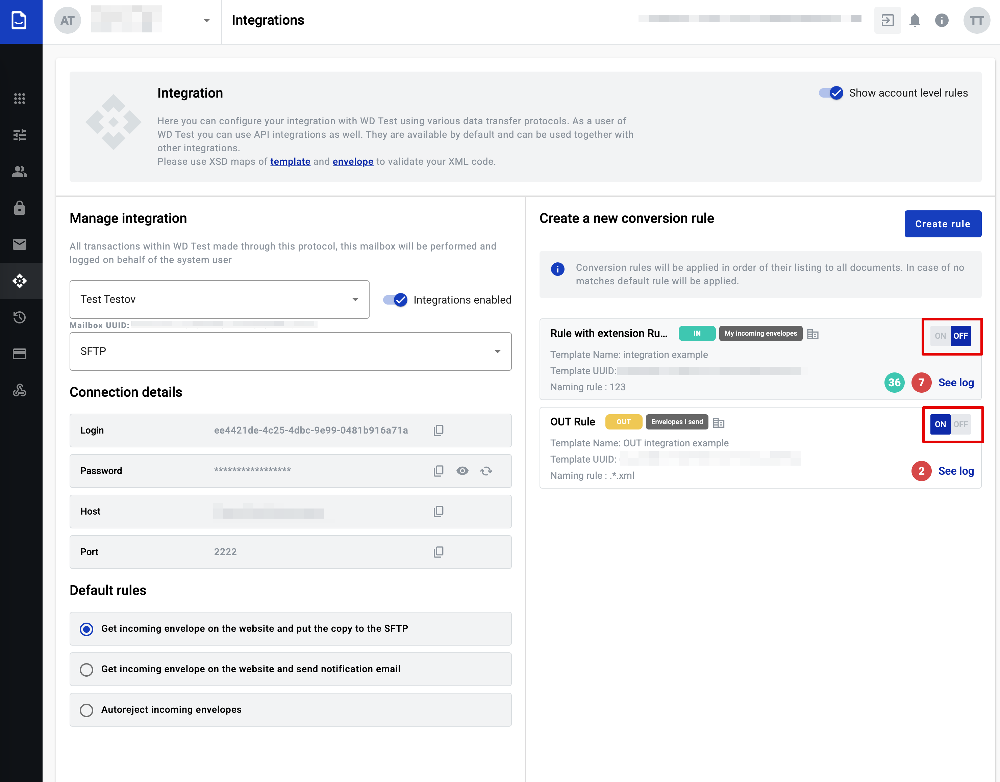

=================
Integrations page
=================

Integrations can be enabled or disabled with Integrations toggle. Integrations are disabled by default.

.. note:: If this toggle is disabled conection to the remote server will not be possible.

Manage integration
==================

In manage integration block you can customize integration properties:

#. mailbox for integration
#. connection protocol - SFTP or AS2

You can manage the integrations for each mailbox individually within the account. If you have more than one mailbox in this account you can change mailbox in first field selection. 
In the second field selection you should provide connection protocol, depends on this selection will be changed connection details block.

Connection details
==================

#. For SFTP protocol all data except password in connection details block is automatically generated. Password is generated after Save button clicked. Credential from this block should be used for connection to the FTP server. Each parameter can be copied by clicking the "Copy" button. New password can be created by Reset button.
#. For AS2 protocol only Self URL and Self certificate will be generated automatically, the rest of credentials should be filled in manually.

Default rules
=============

If SFTP connection protocol is selected:
#. Get incoming envelope on the website and put a copy to the SFTP
#. Get incoming envelope on the platwebsite and send notification email
#. Autoreject incoming envelopes

If AS2 connection protocol is selected:
#. Get incoming envelope on the website and put a copy to AS2
#. Get incoming envelope on the platwebsite and send notification email
#. Autoreject incoming envelopes

If incoming documents don't match with any created conversion rules, default rules will be applied to incoming documents. It can be selected from 3 predefined options. If third rule is selected, reject reason can be specified and all incoming documents will be rejected with this reason.
To save changes click the Save button.

Conversion rules list
=====================

Conversion rule list is empty by default. 
To create a new rule click the "Create rule" button, to open rule creation form.  

An integration rule can be created for a specific mailbox or for the entire account, applying to all mailboxes within it.  

The display of account-level rules can be configured using the corresponding toggle.  
#. If the toggle is enabled, the rule list will show both integrations for specific mailboxes and account-wide integrations (if configured).  
#. If the toggle is disabled, only rules for the selected mailbox will be displayed (if any are configured).

Account-level and mailbox-level integration rules are distinguished by icons.

To start or stop applying the created rules, they need to be activated or deactivated using the toggle.

