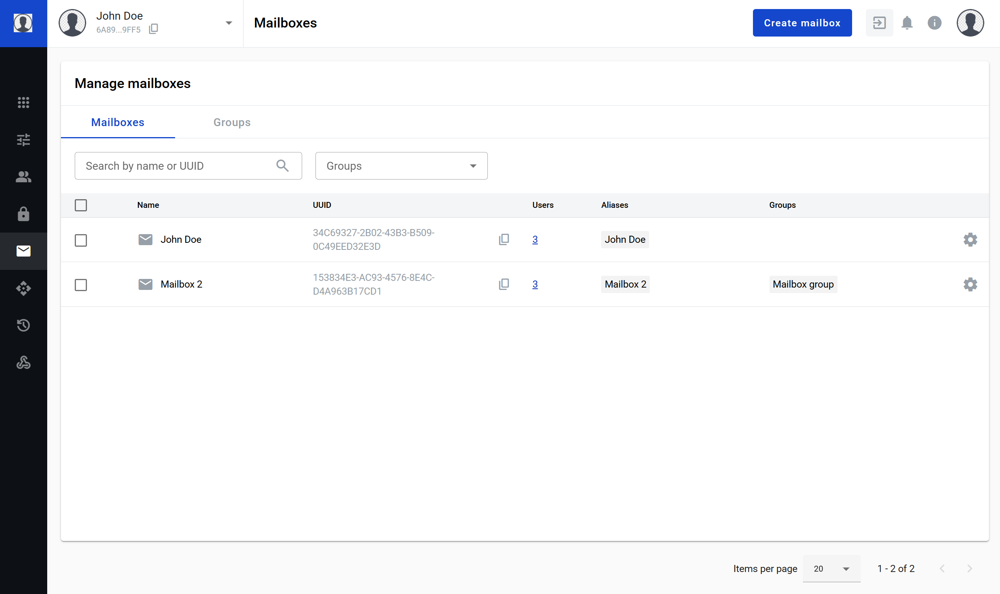
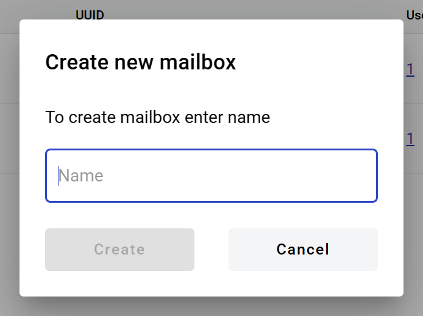
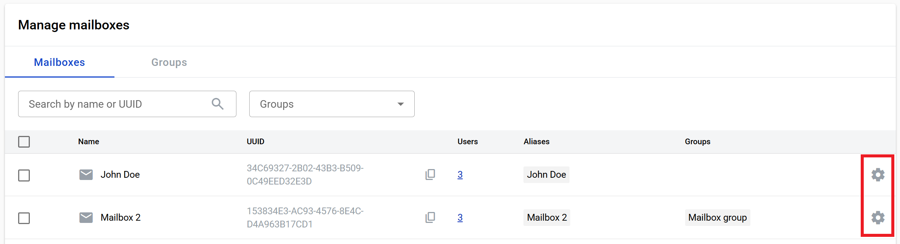
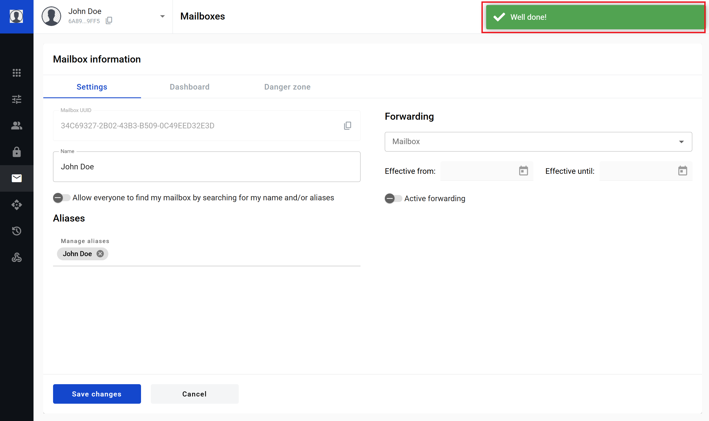
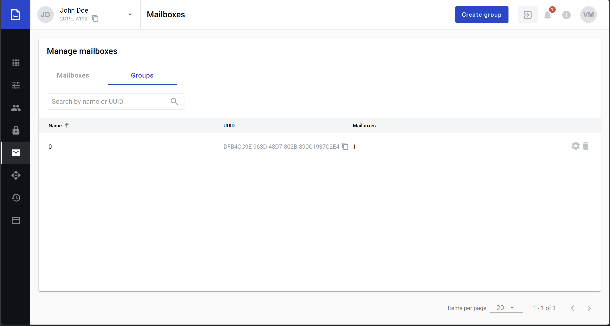

=========
Mailboxes
=========

Mailboxes page is a part of admin panel interface. This page allows to:

1. Create, manage and delete mailboxes
2. Create, manage and delete mailbox groups

Mailboxes tab
=============

**How to create a mailbox**

1. Click on the button "Create mailbox"
2. Enter new mailbox name in the opened window

3. Click on the "Create" button (it will become enabled after name is entered)

**How to generate a report by mailbox**

1. Select all necessary records
2. Click on "Generate report" button in table header
3. After click you will see the message that report will be send to you email after generation
4. Open email you got
5. Click on button "Download"

.. note:: You also can edit groups assigned to mailboxes in bulk. To do so click on "Add mailboxes to group" button in table header.

**How to check users assigned to mailbox**

To see the list of users which have access to the mailbox click on the link with number in the column "Users". After this action you will be redirected to the Users page with filter predefined by mailbox.

**How to edit a mailbox**

Edition interface allows update name of the mailbox, add and remove aliases to the mailbox, copy the mailboxs UUID, unassign all users with access to the mailbox and delete mailbox. To open mailbox edit form click on the settings icon.

Mailbox settings page
=====================

**How to copy mailbox UUID**

To copy the mailbox UUID click on the copying icon. After successful copying the notification message will be shown at the right corener of the page.

**How to edit mailbox name**

1. Name field has length validation: 1 - 255 symbols
2. To edit name just focus the name change it and click on "Save changes" button

3. After successful edition of the mailbox the notification message will show at the right corner of the page

**How to edit mailbox name visibility**

You can hide visibility of your mailbox for system members.To do this, activate the toggle: "Hide name/aliases from other accounts". When the toggle is active mailbox name or alias can be found only by users who have access to this account.

**How to manage mailbox aliases**

Two identical aliases can not be added to one mailbox.

.. note:: Two different mailboxes in the system can have same alias. If you need to ensure that you're alias is unique systewide, you can use qualified alias. Qualified aliases use a prefix with semicolon in the end e.g. TIN:youralias. If such prefix is used, same alias with same prefix can not be created in the system after initial one is created. For such aliases only letters, numbers and dash are allowed. Please note that not any prefix can be used - please contact your administrator for information on what unique prefix groups are used on your instance of application.

To add alias(es) to the mailbox:

1. Click on the aliases area of the page 

2. Enter the alias and press "Enter", "." or "," button on keyboard to add alias to the list, after that click on "Save changes" button

3. To remove alias from the mailbox, click on remove icon of the alias and click on "Save changes" button

4. After successful edition of the mailbox the notification message will show at the right corner of the page

**How to configure envelope forwarding**

In this section you can configure automatic forwarding of all incoming envelopes.

1. Select a target mailbox which will be a delegate of yours
2. Select effective from date - it will specify a start date of the forwarding period (can be left empty to start period immediately)
3. Select effective until date - it will specify an end date of the forwarding period (can be left empty to make period indefinite)
4. Enable "Active forwarding" toggle
5. Click on "Save changes" button

Forwarding is configured now. If you wish to disable it at some point later, you can disable "Active forwarding" toggle and click on "Save changes" button.

.. _customDashboard:

Dashboard tab
=============

To create custom dashboard instead of default one switch to tab "Dashboard" which contains:

1. Editor area where you able to enter your HTML code which will replace default dashboard
2. Checkbox to activate custom dashboard
3. Button "Save" changes

If you want to customize dashboard it's necessary to put content to html area, set checkbox in active state and save changes. Than dashboard will be changed to custom HTML for this specific mailbox and all users who has access to mailbox will see custom dashboard.

.. note:: Custom HTML can not be more than 16 mb size.

Danger zone tab
===============

To remove all users from mailbox or delete mailbox switch to "Danger Zone" tab by click on "Danger Zone" heading

.. image:: pic_mailboxes/mailboxesDangerZoneView.png
   :width: 600
   :align: center

**How to remove users from mailbox**

1. To remove all users from mailbox (remove all permissions to the particular mailbox from the all users who has it except the user who do the action) click on the button "Deactivate"
2. Confirm the decision and users will be unassigned

**How to delete mailbox**

1. Click on "Delete" button
2. Enter the mailbox in upper case to the field in the modal window which opens after click on "Delete" button
3. Confirm the decision and mailbox will be deleted

.. note:: `Behaviour of mailbox after deletion <delete_mailbox_behaviour.html>`_

.. _mailboxesGroup:

==========
Groups tab
==========

**How to create a mailbox group**

1. Click on "Create group" button. Group creation form will appear

.. image:: pic_mailboxes/groupsTabCreate.png
   :width: 600
   :align: center

2. Fill group name (1 character min, 64 characters max)
3. Add mailboxes from Add mailbox search box
4. Added mailboxes can be searched and removed
5. Click on Create button when all details are filled

Group will be created and you will be returned to groups list.

**How to edit a mailbox group**

1. Click on "Settings" button (gear icon) in group row. Group properties form will appear

2. Update any group details which are needed to be updated
3. Click on "Save" button to save group details changes
4. Click on "Cancel" button to revert group details changes
5. Click on "Delete" button to delete group

.. note:: You can also delete group from groups list by "Delete" button (Trash bin icon) in group row. Here are more details on :ref:`deleted mailbox behavior`.

You will be returned to groups list after taken action.