=====
Users
=====

This page allows to create and manage account users.

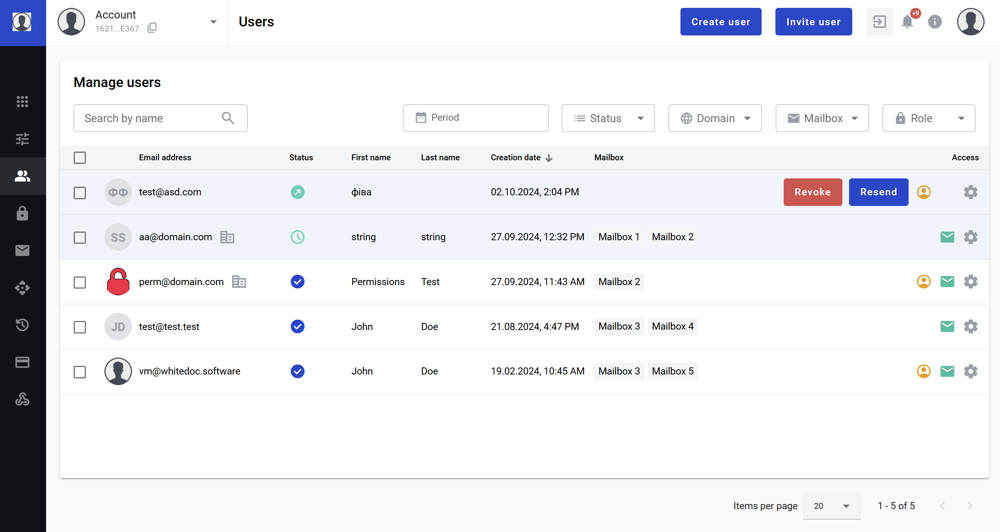

Invite a users to the Account/Mailbox by email
==============================================

Registered and not registered users can be invited to an Account/Mailbox with specified permissions. To invite a user to your Account/Mailboxes follow next steps:

1. Navigate to https://platform_address_here/admin/users/
2. Click the "Invite user" button in the page header
3. Fill the opened invitation form and click the "Invite user" button in the form

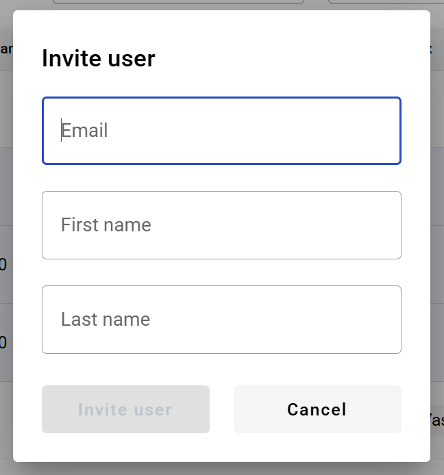

4. After this you will be redirected to the user edition page where you can assign account and mailbox permissions which you want to grant for this user
5. After selecting all required account and mailbox permission click the "Invite user" button in the page header once more to send the invitation (invitation can also be sent without any granted permissions)

Grant account permissions
=========================

You can grant a role (permissions preset) to user. To add a role click the "Add role" button. You can assign several roles to a user. System roles will be available by default and custom roles can be created on the roles page of the admin panel.

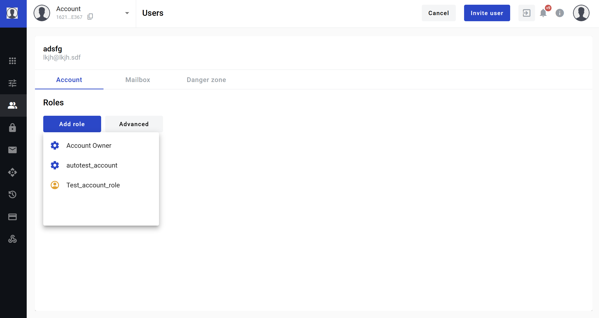

It is also possible to grant specific permisisons without using roles. To select a specific permissions click the "Advanced" button. In the opened form you will see a permission search field, permission filters and permissions list. To grant permissions you should select them by a checkboxes near permission names. When all required permission are selected click the "Apply" button in the form.

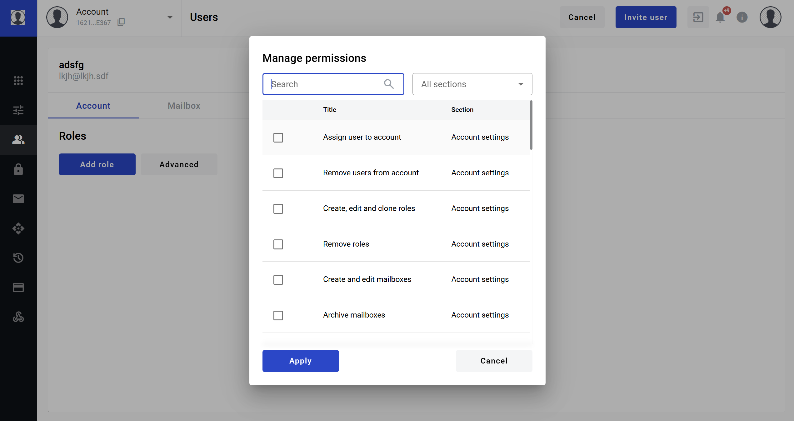

.. note:: :ref:`Account permissions list and description <accountPermissions>`

Grant mailbox permissions
=========================

You can grant mailbox roles and permissions in a similar manner as account roles and permissions on the mailbox tab. Only difference is that you need to click the required mailbox first, and then selects roles and/or permissions.

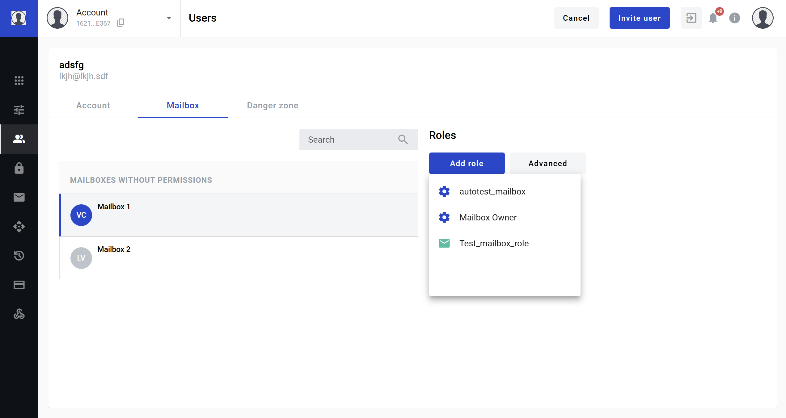

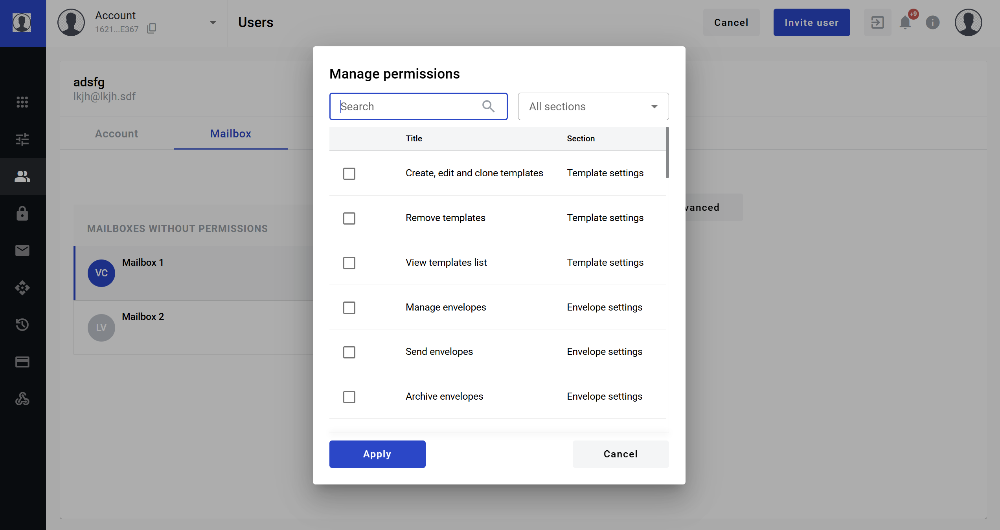

.. note:: :ref:`Mailbox permissions list and description <mailboxPermissions>`

Registered user invitation
==========================

After an invite is sent, registered user will get an email with a link to the invites tab of user profile page with all invites listed there and options to accept or decline them.

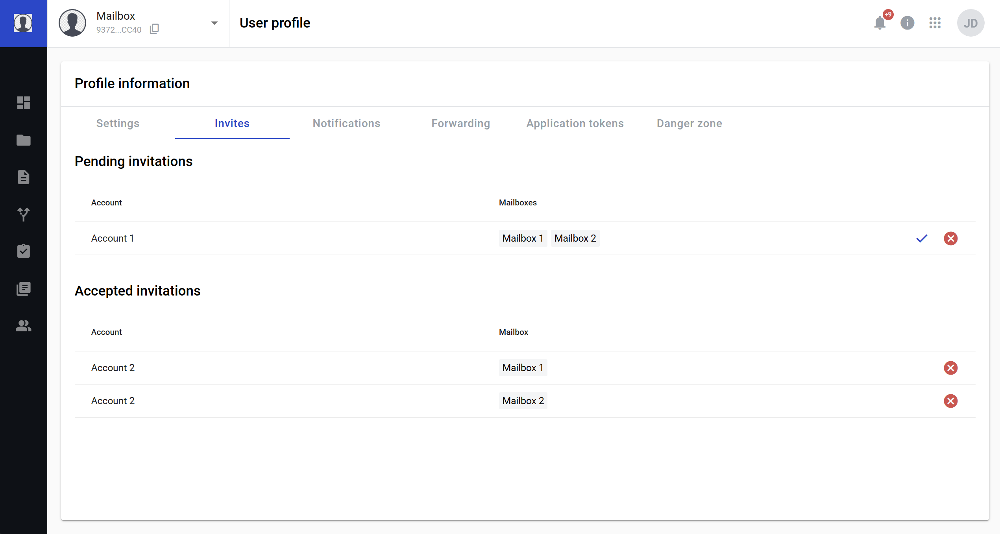

After user accepted or declined an invitation you will receive a notification email with details.

Not registered user invitation
==============================

After an invite is sent, not registered user will receive an email with a link to the registration page. By following the link user will be redirected to the registration form with prefilled email address and name (if it was filled in the invitation form). After completing this form, profile, account and personal mailbox (alongside with access to the mailboxes from the invitation) will be created for the user and permissions specified in the invitation will be granted.

===============
Corporate users
===============

Corporate user is a special type of user that can be created, menaged and removed by an administrator of an accoun with at least one active domain. Such users can only be created with an email address from a verified domain of the account. All users using such emails during self-registration will also be automatically assigned to the this account. More info on the domains management can be found :ref:`here <domains>`.

Users assignment to a domain account
====================================

As soon as you've added, verified and activated a domain you can create and manage users with it.

* Users registered before a domain activation will be automatically assigned to the domain account after the domain activation. They will not lose any previosly owned permissions to other accounts and mailboxes.
* Users registered after a domains activation will be automatically assigned to the domain account immediately. They will not have any account and mailbox permissions until granted by the account administrator. Personal mailbox with a specified role may or may not be automatically created for such users based on the :ref:`account configuration <accountSettings>`.

In case of a domain unverification or deactivation all domain users will retain all assigned account and mailbox permissions, but creation or self-registration of new users in this domain be disabled. In case of an account deletion all user will lose acces to the account and its' mailboxes, but retain a corporate user status, meaning that they will not be able to create accounts and delete their user profiles.

Single corporate user creation
==============================

As an administrator of an account you can create a corporate user, which is useful for company accounts. To do so follow next steps:

1. Navigate to https://platform_address_here/admin/users
2. Click the "Create user" button and select "Create user" option from the menu
3. Fill in all fields on the user creation form. Also you can choose should a personal mailbox be created for this user

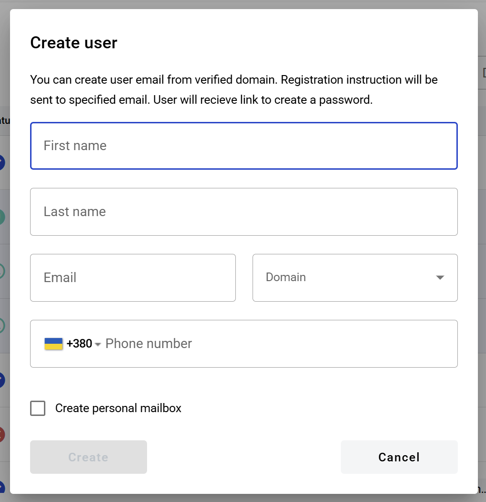

4. Click the "Create" button
5. After this steps user will be created and you will be redirected to the permissions configuration page
6. You can also open Settings tab to edit user details, such as name, timezone, phone (if it is enabled for users in instance settings), default mailbox etc.

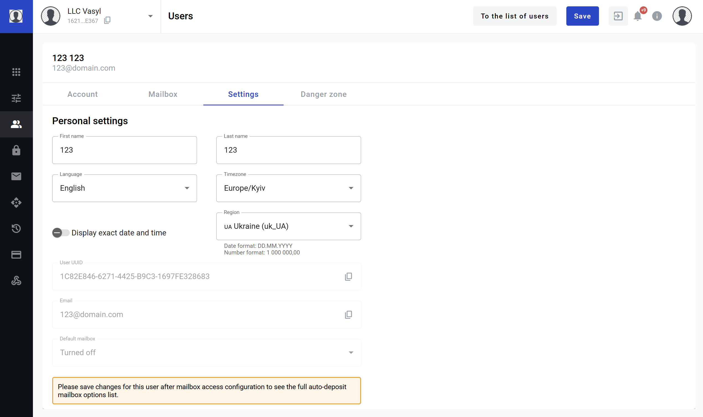

.. note:: If you are editing existing users, this tab will be available only for corporate users.

7. When all permissions are defined click the "Save" button in the header of the page

Mass corporate users creation
=============================

As an administrator of account you can also can mass-create corporate users, which is useful for company accounts with a big number of employees. To do so, click the "Create user" button in the page header and select "Create user" option from the menu. A form will appear, allowing you to download the example file for mass user creation. You can open the file using any tool which support .xlsx format. Also, you have to save the file in this particular format, so make sure to not change the file extention after editing.

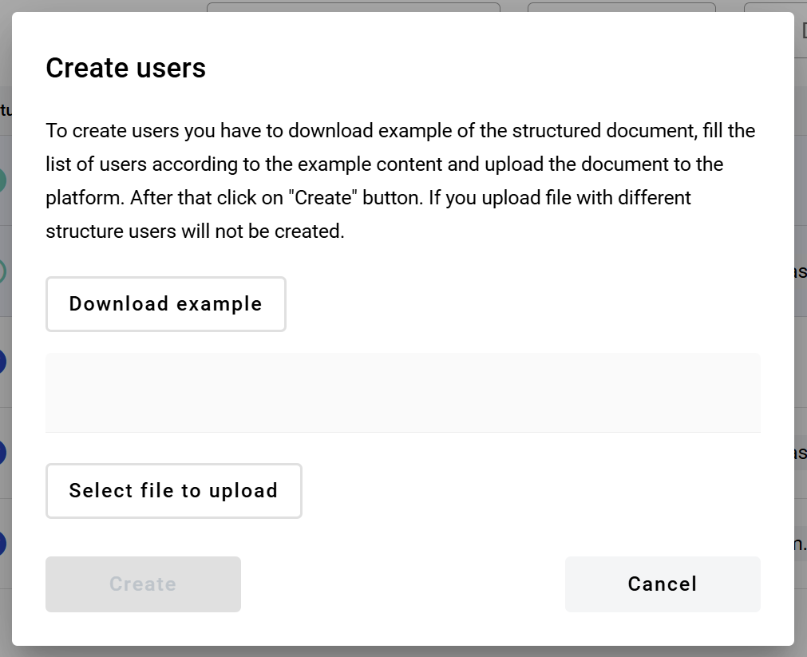

1. First sheet is "Roles". It lists all roles available for the account which can be used on the "Account" and "Mailbox" sheets

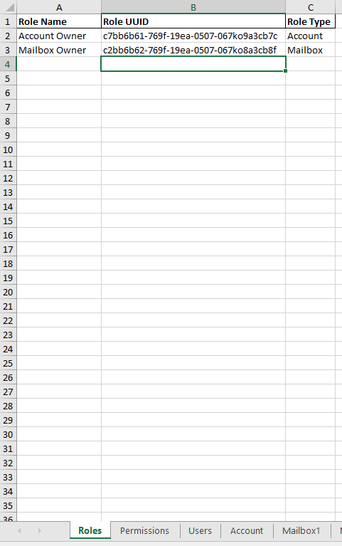

2. Second sheet is "Permissions". It lists all permissions which can be used on the "Account" and "Mailbox" sheets

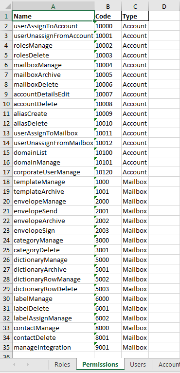

3. Third sheet is "Users". Here you should enter users data (first name, last name and email). Also can choose should a personal mailbox be created for each user individually (Y to create, N or leave empty to not create). Users will be created according to this data

.. warning:: All users in the list should have relations to an active domain(s). If any users without such relation will be added to the list, user creation process will fail.

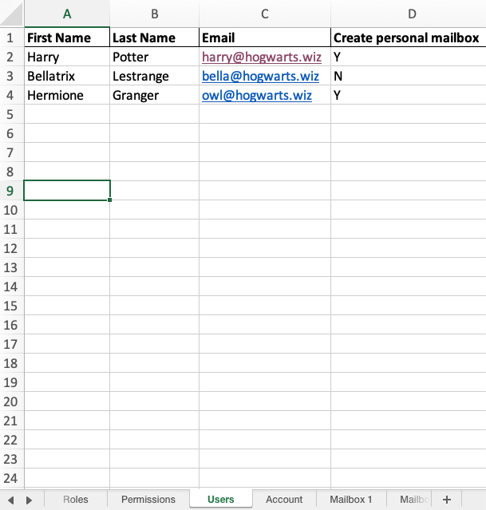

4. Fourth sheet is "Account". This sheet allows to set account roles and permissions for each user from the list

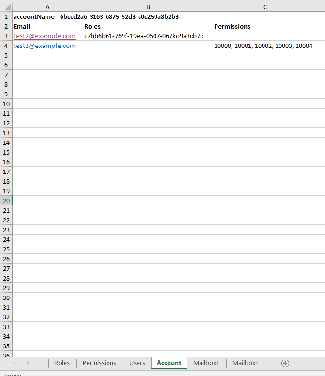

.. warning:: If ny incorrect emails will be added to the sheet, such users will not be created.

5. Fifth and the rest of sheets are "Mailbox" sheets. These sheets allow to set mailbox roles and permissions for each user from the list

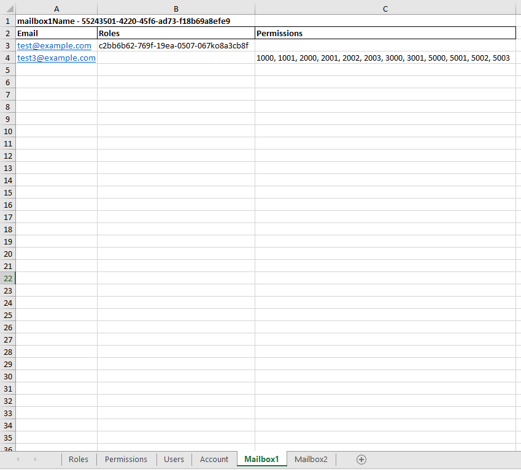

.. warning:: If ny incorrect emails will be added to the sheet, such users will not be created.

When you will fill the file with data you should upload it in the users creation form and submit it. All users will receive email notifications with the instructions as described below.

How to authorized as a corporate user
=====================================

1. Open "You are registered on the electronic document management platform" email

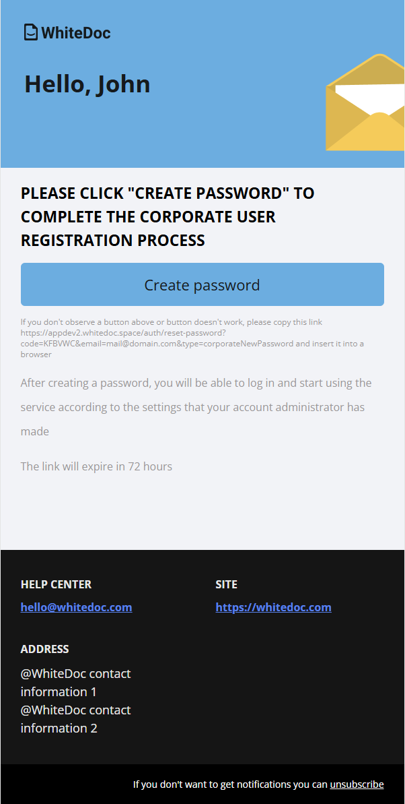

2. Follow the link to create a password for your user profile
3. Create a password and confirm it

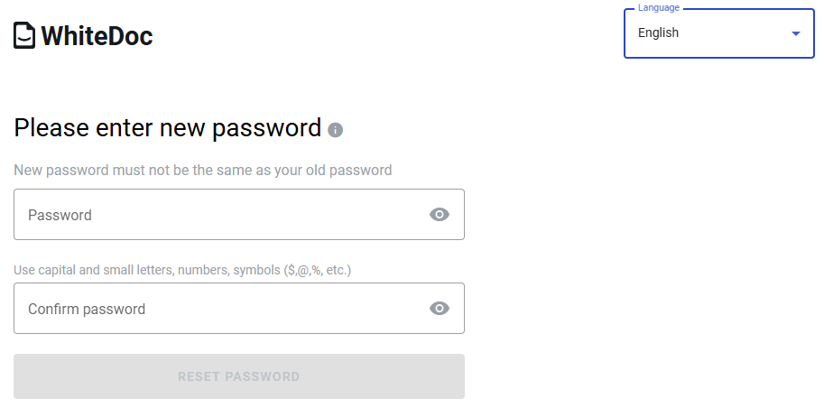

4. Authorize on platform using credentials above

============
Users report
============

You can generate a report by account users as described below:

1. Navigate to https://platform_address_here/admin/users
2. Open "Users" tab and select all necessary records
3. Click the "Generate report" button (document icon)
4. After click you will see a message that report will be sent to your email after generation
5. Follow to email address
6. Open email you got
7. Click the "Download" button