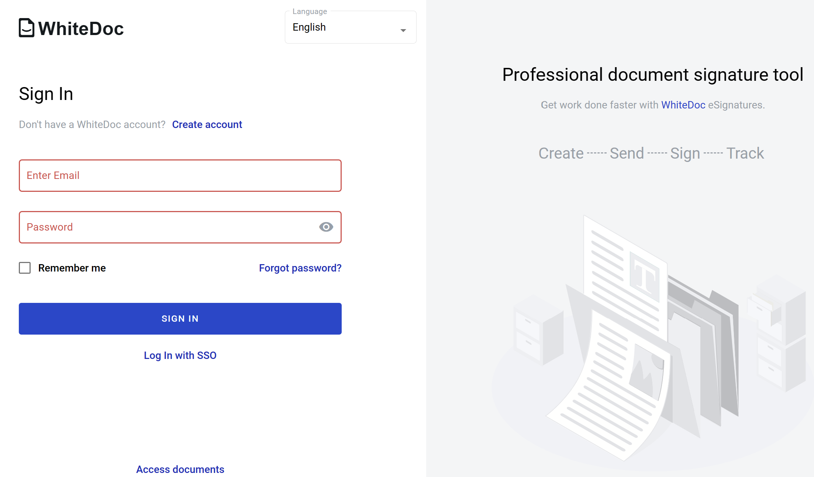
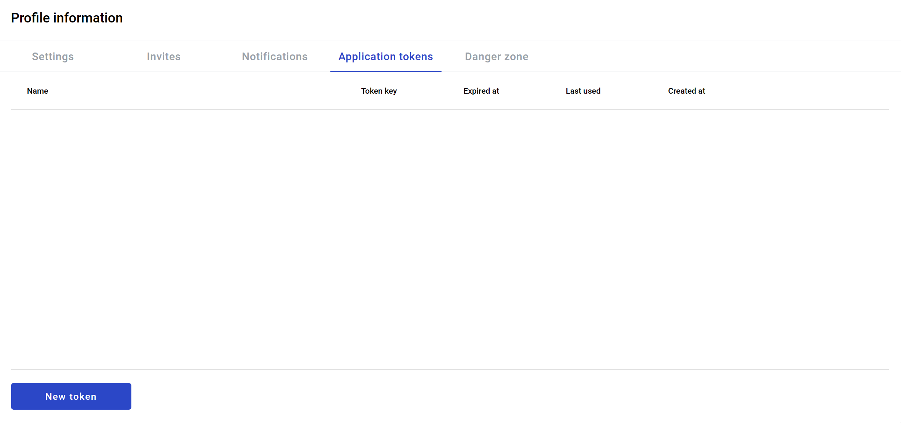
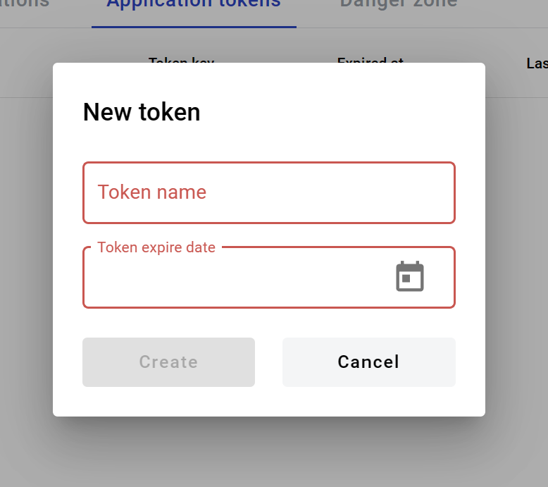
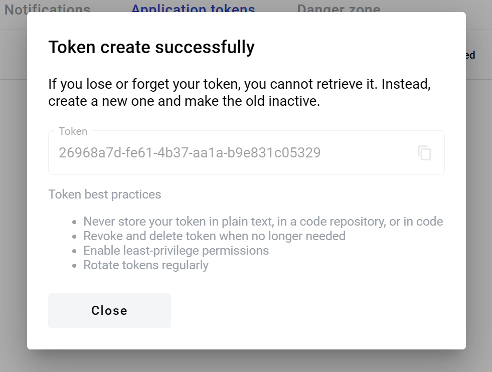
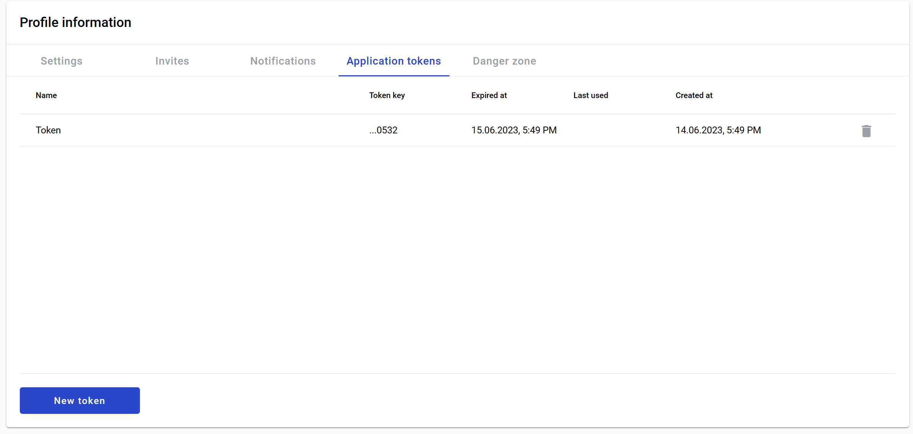

=============================
Authorization on the platform
=============================

To work on the platform you have to :ref:`authorize <login>`. To do so you will have to :ref:`register <registration>` a user account (note that there are :ref:`password policies <passwordPolicy>`). If you are planning to work with the platform via API you can use :ref:`application tokens <appToken>` (please note that this feature can be disabled by instance administrator).

.. _registration:

How to register on the platform?
================================

To register user account on the platform:

1. Click the "Create account" link
2. Select account type you want to create

.. note:: Platform has two types of account: personal and company. Personal accounts fit to small companies who want to use a couple of mailboxes. Company account is better for big companies with big amount of employees.

3. Fill in required details and proceed according to :ref:`instructions <registration-instruction>`.

Note that there are password policies which you can see :ref:`here <passwordPolicy>`.

.. _login:

How to authorize on the platform?
=================================

To authorize on the platfor platform:

1. Open /auth/login page

2. Enter you email and password and click the "Sign in" button

Additionally you can "Remember" the email you've entered for next signs in on platform, to do this set checkbox on "Remember me" text. If you forgot password and want to reset it, click the "Forgot password?" link and follow the instructions. If your password has been expired according to the :ref:`password policy <passwordPolicy>` and you are trying to sign in to platform, instead of successful authorization you will be redirected to special page for password renewal.

.. _passwordPolicy:

Password policies
=================

Password policies are strict regulations of password content. Next policies are used on the platform:

1. Password must be at least eight characters long
2. Password should not be easily guessed (the password should not include a repeating sequence of any characters, as "111111", "aaaaaa", "12345", "qwerty", "йцукен", etc.)
3. Password should not include easily selectable combinations of symbols (first names, surnames, names, nicknames of pets, dates of birth, etc.) and generally accepted abbreviations (computer, LAN, USER, etc.)
4. Password must contain characters from following categories:
    1. Uppercase English letters (A-Z)
    2. Lowercase English letters (a-z)
    3. Numbers (0-9)
5. Password can't be reused for 12 month (default configurable value)
6. 5 last passwords can't be reused (default configurable value)
7. If password wasn't updated for 90 days (default configurable value), user account will be blocked

.. _appToken:

Application tokens
==================

.. note:: This feature can be disabled by instance administrator. In such case possibility to create new tokens will be disabled. All previously existing tokens will continue beeing valid (up to expiration date).

You can create authorization tokens for use with API and 3rd party integrations. To do so:

1. Go to /profile?activeTab=application-tokens page

2. Click the "New token" button
3. Fill in Token name and Token expire date

4. Confirmation window will open. Make sure to copy your token because this will be only time you see it. Also make sure to read token best practices

.. warning:: It will be impossible to see your token after this window is closed.

5. All done. Now you can see list of your tokens on this page and revoke them if needed.

.. note:: You will receive email notification before token expiration in 30 and 1 days before it expires.