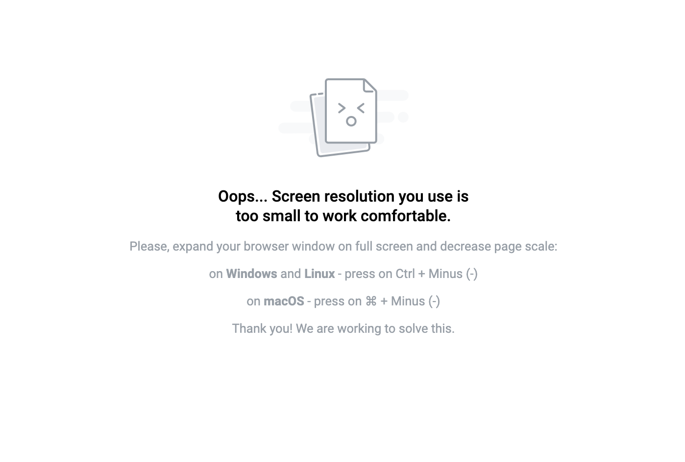
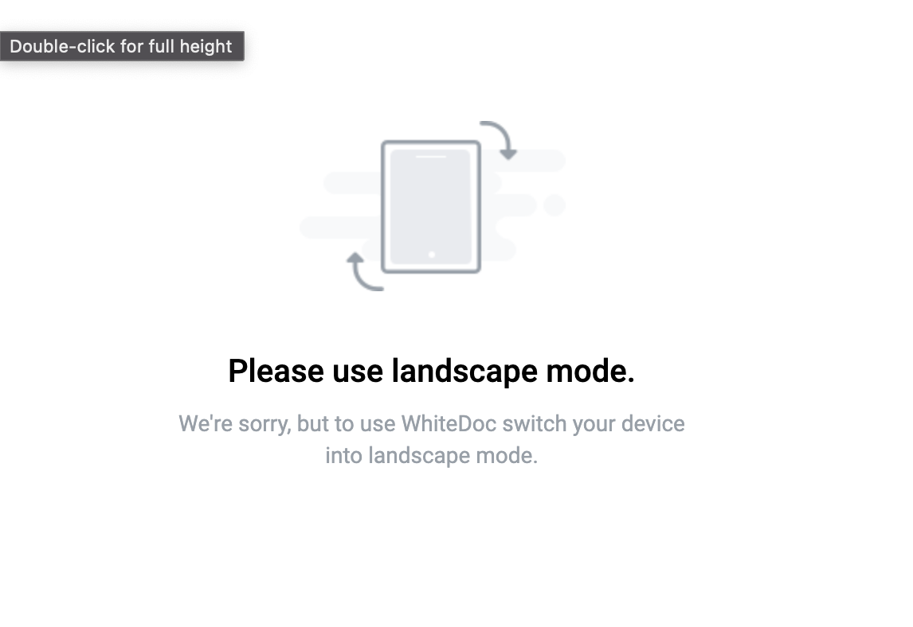
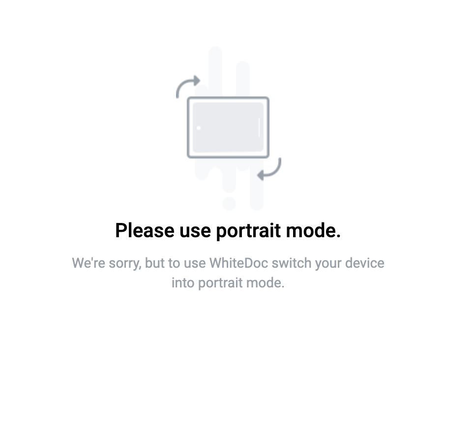

==================================================
Supported devices, browsers and screen resolutions
==================================================

The platform can operate as a browser application on the following devices: PC, tablet, or mobile phone.

During initialization or when changing the screen resolution, the system verifies whether the user's current screen resolution is suitable for continued seamless operation. It also checks the OS and browser versions.
We recommend having one of the following screen resolutions and one of the following versions of OS and browser for the proper functioning of the platform.

Supported screens resolution
============================

1. Desktop - minWidth = 1440,
2. Tablet - minWidth = 756, maxWidth = 1439
3. Mobile - minWidth = 320, maxWidth = 755,

If a user employs a screen resolution unsuitable for service operation, they will encounter a notification providing instructions for next steps.

Supported OS and browser versions
=================================

We cannot specify a particular version, but we will consistently support the latest versions of operating systems and browsers as per the list below

1. latest 2 Chrome major version
2. latest 1 Firefox major version
3. latest 2 Edge major versions
4. latest 2 Safari major versions
5. latest 2 iOS major versions
6. latest 2 Opera major versions
7. latest 2 OperaMini major versions
8. Firefox ESR

.. note:: we're not supporting IE 11 (Internet Explorer)

User messages
=============

1. If the user is using a desktop computer, they will be prompted to:

 "Oops... Screen resolution you use is too small to work comfortable.
 Please, expand your browser window on full screen and decrease page scale:
 on Windows and Linux - press on Ctrl + Minus (-)
 on macOS - press on command button on keyboard + Minus (-)
 Thank you! We are working to solve this."

2. If the user is using a mobile or tablet device, they will be prompted to change it orientation to album or portrait:

