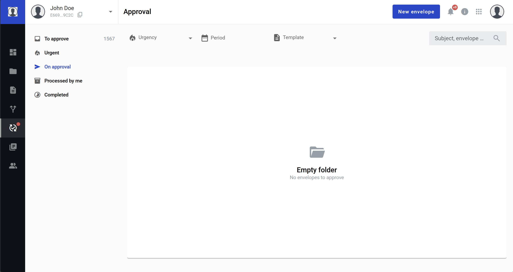
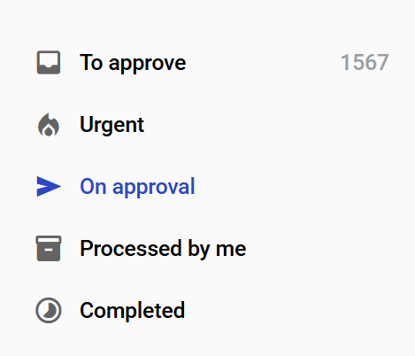
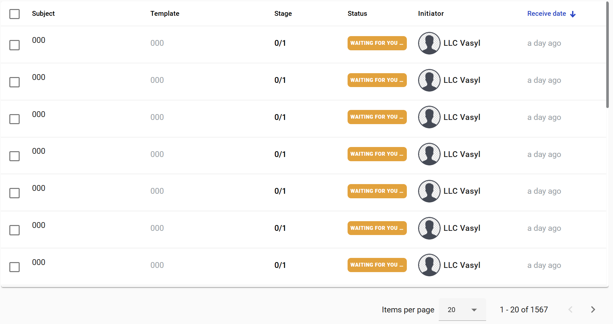
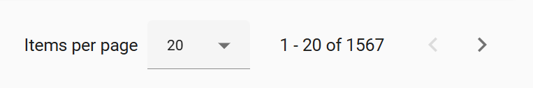
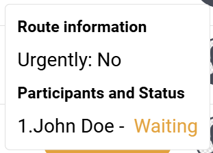

=============
Approval page
=============

This page contains envelopes which are assigned to you for approval and envelopes the were already approved and rejected by you. It allows you to:

1. Manage approvals
2. Filter approvals
3. See approval list folders
4. Approve and reject envelopes

.. note:: This page is only accessible with appropriate permission.

You can switch approval folders by the left side of the page.

At the top of the page you can find approvals filter and search.

In the middle of the page you can find a list of the envelopes generated according to the selected folder, filters and the search query.

Approval list page controlls are located at the bottom of the page.

Clicking the status label of en envelope displays the approval status information.

How to approve or reject several envelopes?
===========================================

Open "To approve" or "Urgent" folder, select several approvals you want to process and click the "Approve" or "Reject" button in the list header. Modal window with comment area and confirmation button will appear. Add comment (mandatory only for the reject action) and confirm your action. As soon as all approvals will be processed results will be displayed in the modal window.