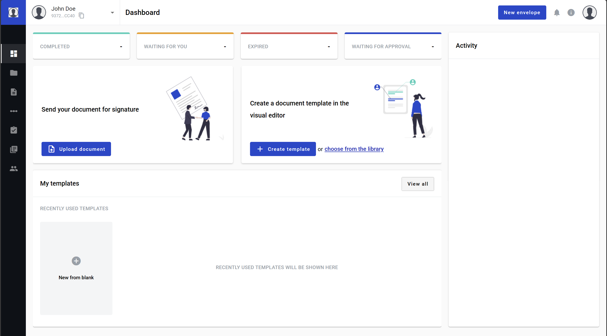

.. _dashboard:

==================
Platform dashboard
==================

Dashboard is a page you reach after a successful :ref:`authorization <login>`. It contains several sections and links to other parts of the platform. Please refer to the content list for individual description of each section.

.. warning:: Dashboard can differ from what described above. You can configure custom look on your mailbox settings page. :ref:`More info on this topic can be found here. <customDashboard>`

**Content list**

.. toctree::

    counters/counters.rst
    quickSend/quickSend.rst
    templates/templates.rst
    recentlyUsed/recentlyUsed.rst
    activity/activity.rst