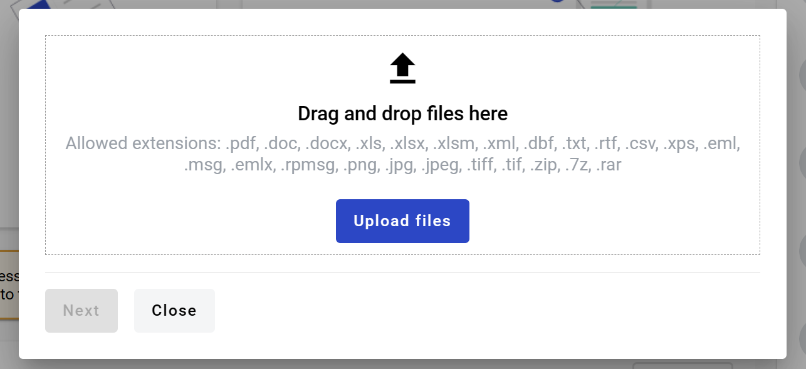
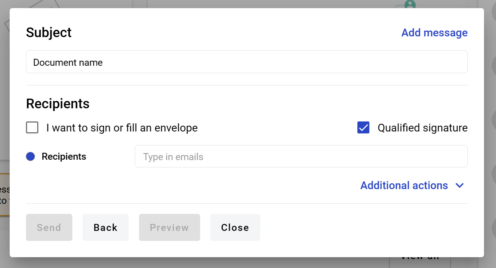
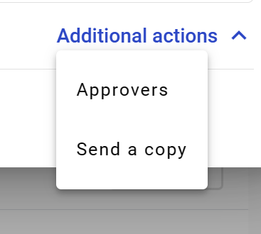
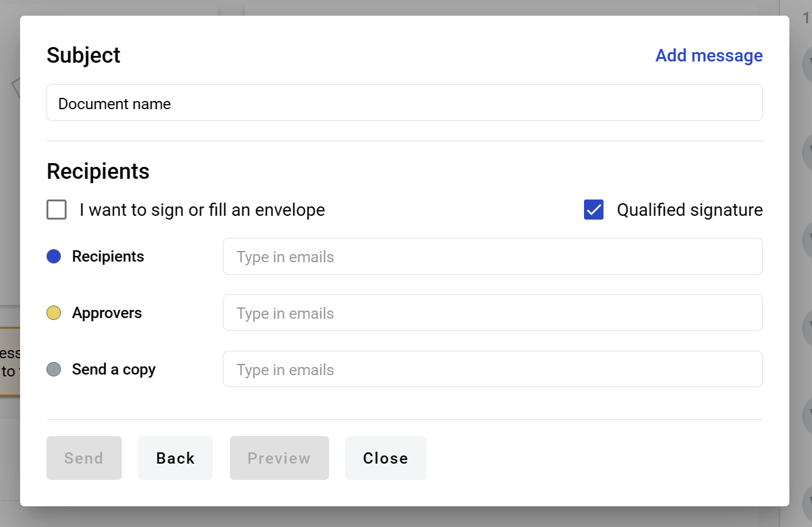
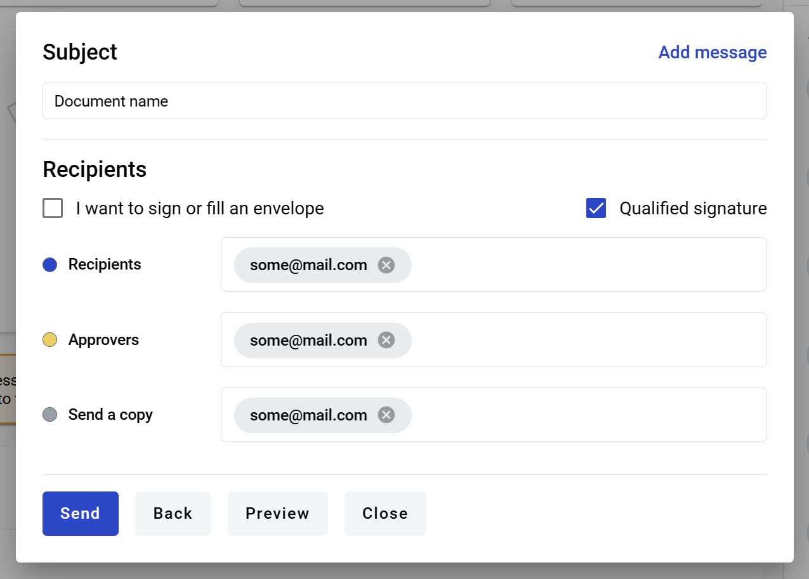
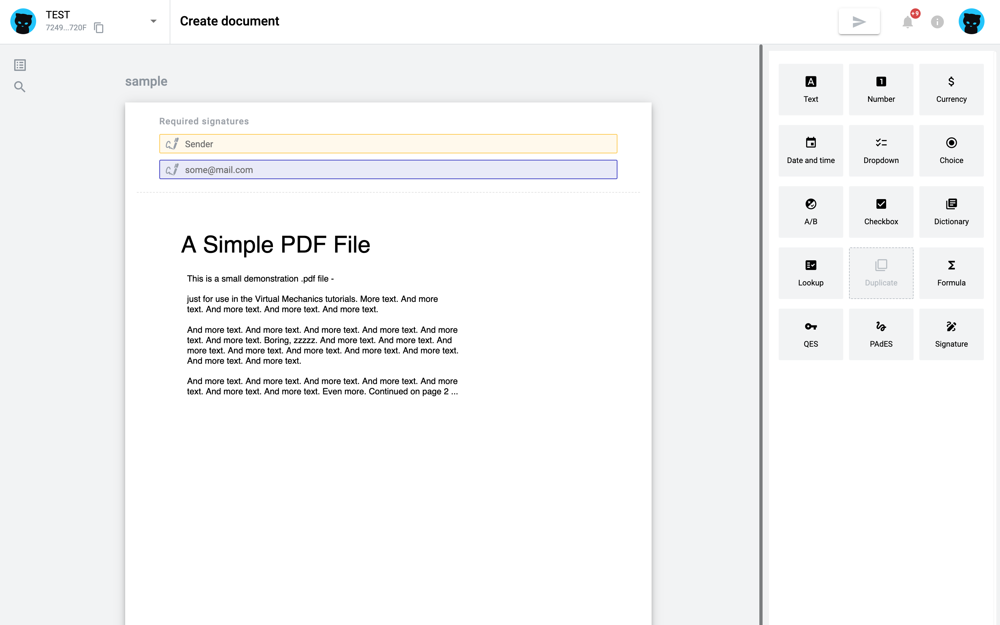
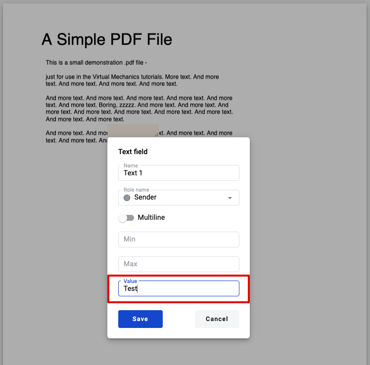
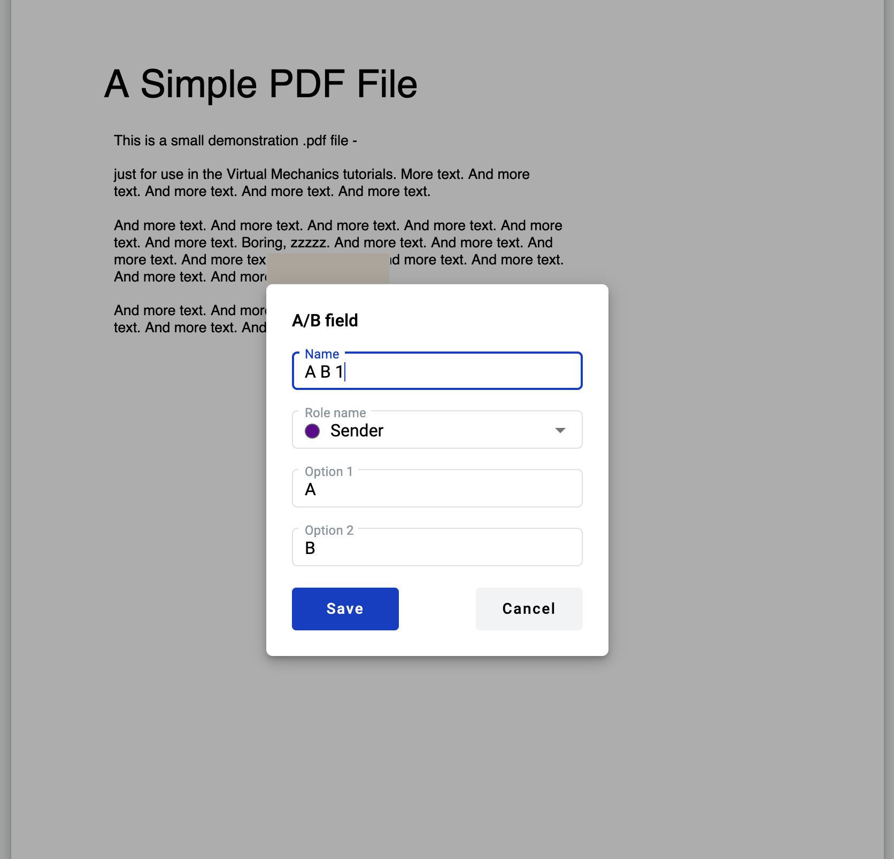
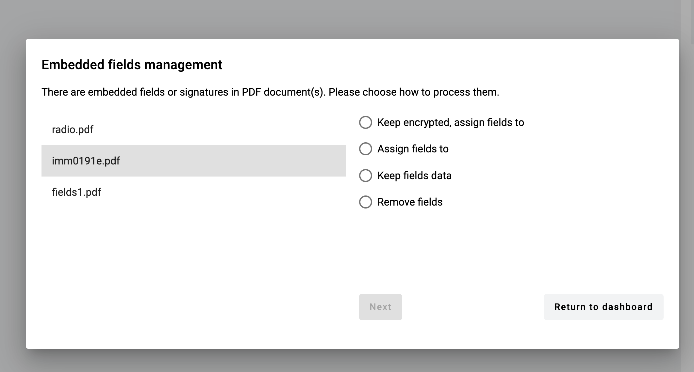
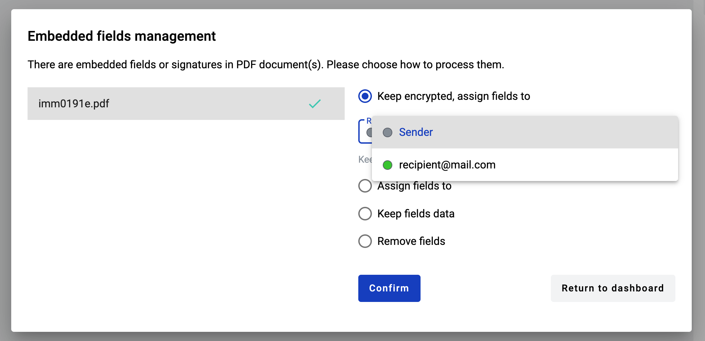

.. _dashboard:

==================
Dashboard overview
==================

Dashboard has two blocks for quick actions - quick send of file as copy or for sign and template creation.

How to send document using quick send function?
===============================================

If you want to send external document (such as image, document, archive) to anyone in a quick way you can use quick send functionality. To do so:

1. Open dashboard and click on button "Upload document" in quick send block

.. image:: pic_dashboardOverview/overview.png
   :width: 400
   :align: center

2. After click on "Upload document" button modal window will open. Here you can upload file for quick send (50 documents maximum, 5MB per file max and 25MB total max)

3. After file upload you can see all files in the list on screenshot above

4. You can add other roles to envelope by expanding Addition action menu

5. After selection roles they will appear in quick send window

6. To specify participants of the flow you need to add their emails to according inputs (to separate emails press enter or space)

.. note:: Also you can add yourself as signer or recipient by checking 'I want to sign or fill an envelope' checkbox.

7. If PDF documents were uploaded, you can select QES or e-ink type of signature. If 'Qualified signature' checkbox is checked — QES will be used, if not — e-ink will be used

.. note:: If PDF and non-PDF documents were uploaded and e-ink was selected, signatures will be applied only to PDF documents. If only non-PDF documents were selected, QES will be used by default.

8. When you will finish all required actions with envelope properties you can click "Next" button and envelope editor preview will be opened where you can add fields to Recipient and Signer roles. 

9. If "I want to sign an envelope" checkbox was selected you will be able to assign fields also for Sender role. Please note that for Sender role you should set fields value right on the editor. This applies to fields such as Text, Number, Currency, Date and time, Dropdown, Choice, Checkbox, Dictionary, Lookup, Duplicate and Signature.

10. The rest of the fields, such as A/B, Formula, QES and PAdES could be added without value and new role for Sender will be created, which can be completed by filling in the fields after envelope send action.

11. As soon as all Recipient roles and Sender role (in case of setting in up "I want to..." checkbox) have at least one field you can click on the Send button in the header

How to import embedded PDF fields?
==================================

1. If your uploaded PDF documents have embedded fields they can be converted to WhiteDoc dynamic fields. In this case, you will see a modal window where you should select one of the actions for each document with such fields.

2. Depending on the type of built-in fields you will see different options:

- Keep signature = Only QES/PAdES fields will be allowed to create in the document.
- Keep already existing data = Keep already existing data. Only QES/PAdES fields will be allowed to create in the document.
- Keep encrypted, assign fields to = Keep file encrypted. Creating new fields in it will be restricted, only new QES fields will be available for creation. Existing fields can be assigned a selectable role.
- Assign fields to = Convert dynamic fields embedded in the document into WhiteDoc fields (if existing) and assign them to a selectable role . Any new fields can be added to the document.
- Keep fields data = Preserve dynamic fields embedded in the document in read-only state. Any new fields can be added to the document.
- Remove fields = Remove dynamic fields embedded in the document. Any new fields can be added to the document.

.. note:: If the document contains more signatures than recipients Assign fields option will not be available

3. You can assign fields to Recipients if they have been added to the appropriate field, or to Sender if the "I want to sign or fill the envelope" checkbox has been selected.

4. Embedded PDF fields can be converted to WhiteDoc dynamic fields. Please see conversion map below:

- Text => Text field
- Date => Text field
- Checkbox => Checkbox field
- Radio button => Choice field
- Dropdown menu => Menu field
- Listbox => Menu field
- Signature => PAdES field (only if such field type is enabled by system administrator, otherwise it will be ignored)
- Picture => currently is not supported, fields will be ignored
- Barcode => currently is not supported, fields will be ignored

.. note:: All imported fields except Choice inherit theirs optional/required attribute status from original PDF file.