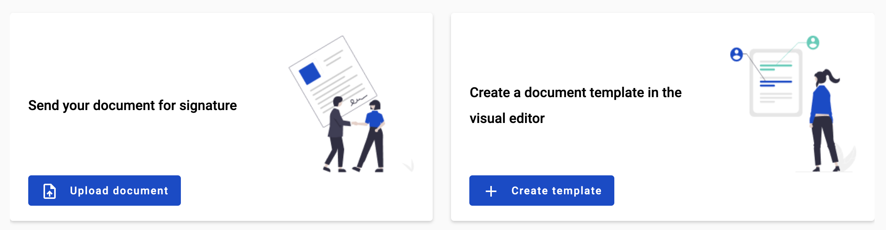

.. _dashboard:

==================
Dashboard overview
==================

Dashboard has two blocks for quick actions - quick send of file as copy or for sign and template creation.

How to send document using quick send function?
===============================================

If you want to send external document (such as image, document, archive) to anyone in a quick way you can use quick send functionality. To do so:

1. Open dashboard and click on button "Upload document" in quick send block

2. After click on "Upload document" button modal window will open. Here you can upload file for quick send (5MB per file max and 25MB total max)

.. image:: pic_dashboardOverview/dragAndDropModal.png
   :width: 400
   :align: center

3. After file upload you can see all files in the list on screenshot above

.. image:: pic_dashboardOverview/envCreationModal1.png
   :width: 400
   :align: center

4. You can add other roles to envelope by expanding Addition action menu

.. image:: pic_dashboardOverview/additionalActions.png
   :width: 400
   :align: center

5. After selection roles they will appear in quick send window

.. image:: pic_dashboardOverview/envCreationModal2.png
   :width: 400
   :align: center

6. To specify participants of the flow you need to add their emails to according inputs (to separate emails press enter or space)

.. image:: pic_dashboardOverview/envCreationModal3.png
   :width: 400
   :align: center

.. note:: Also yo can add yourself as signer or recipient by checking 'I want to sign or fill an envelope' checkbox.

7. If PDF documents were uploaded, you can select QES or e-ink type of signature. If 'Qualified signature' checkbox is checked — QES will be used, if not — e-ink will be used

.. note:: If PDF and non-PDF documents were uploaded and e-ink was selected, signatures will be applied only to PDF documents. If only non-PDF documents were selected, QES will be used by default.

8. When you will finish all required actions with envelope properties you can click "Next" button and envelope editor preview will be opened where you can add fields to Recipient and Signer roles. If "I want to sign an envelope" checkbox was selected you will be able to assign fields also for Sender role.

.. note:: You can add following fields on quick-editor preview: Text, Number, Currency, Date and time, Dropdown, A/B, Checkbox, Dictionary, Lookup, Duplicate, Formula, QES, PAdES and Signature

9. As soon as all Recipient roles and Sender role (in case of set in up "I want to..." checkbox) has at least for one field you can click on Send button in the header

.. note:: Some fields assigned to sender can be filled in on the form of field assignment, such as Text, Number, Currency, Date and time and Signature. The rest of the fields could be added without value and new role for Sender will be created, which can be completed by filling in the fields after envelope send action.
