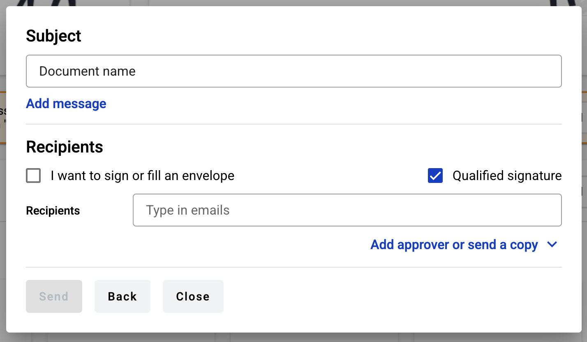
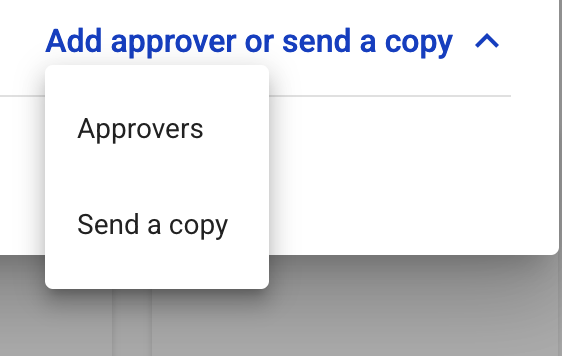
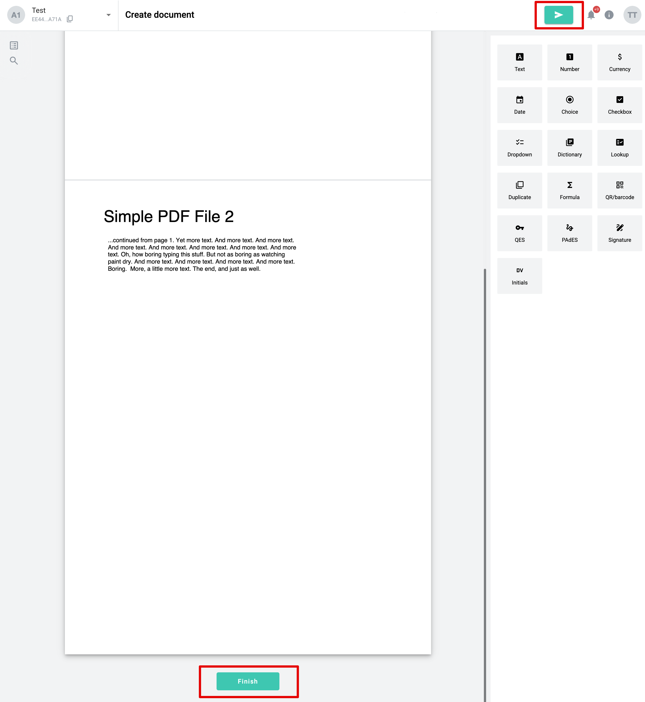
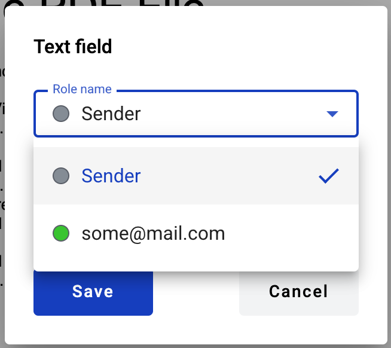
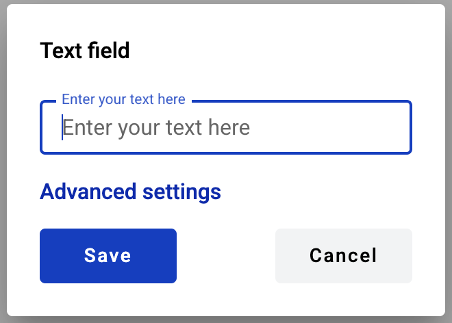
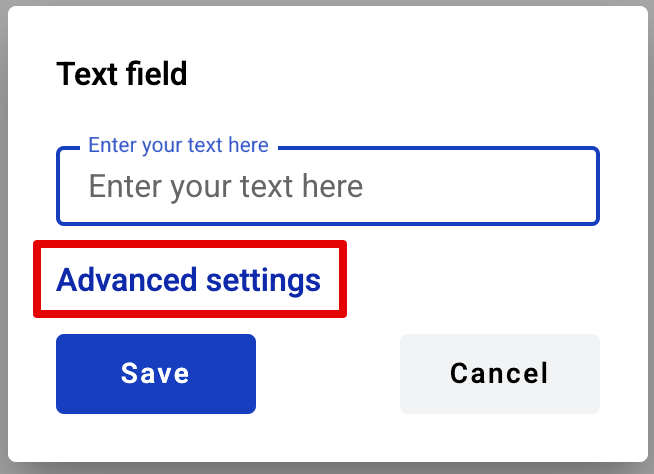
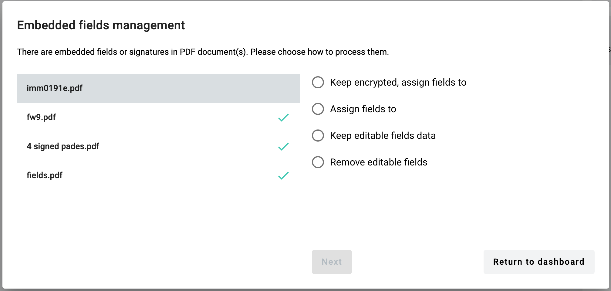

==========
Quick send
==========

If you want to send external document (PDF, image, archive, etc.) to anyone in a quick way you can use quick send functionality. To do so:

1. Open dashboard and click the "Upload document" button in quick send block

2. After clicking the "Upload document" button modal window will open. Here you can upload file for quick send (50 documents maximum, 5MB per file max and 25MB total max)

.. image:: pic_quickSend/dragAndDropModal.png
   :width: 600
   :align: center

3. After file upload you can see all files in the list on screenshot above

4. You can add other roles to envelope by expanding Add approver or send a copy menu

5. After selection roles they will appear in quick send window

6. To specify participants of the flow you need to add their emails to according inputs (to separate emails press enter or space)

.. note:: Also you can add yourself as signer or recipient by checking 'I want to sign or fill an envelope' checkbox.

7. If PDF documents were uploaded, you can select QES or e-ink type of signature. If 'Qualified signature' checkbox is checked — QES will be used, if not — e-ink will be used

.. note:: If PDF and non-PDF documents were uploaded and e-ink was selected, signatures will be applied only to PDF documents. If only non-PDF documents were selected, QES will be used by default.

8. When you will finish all required actions with envelope properties you can click "Next" button and envelope editor preview will be opened where you can add fields to Recipient and Signer roles. 

9. If "I want to sign an envelope" checkbox was selected you will be able to assign fields also for Sender role. Please note that for Sender role you should set fields value right on the editor. Applies to fields such as Text, Number, Currency, Date, Dropdown, Choice, Checkbox, Dictionary, QR/barcode, Signature and Initials.

10. The rest of the fields, such as Lookup, Duplicate, Formula, QES and PAdES could be added without value. If QES and PAdES will be added than new role for Sender will be created, which can be completed by filling in the fields after envelope send action.

11. The sender can add fields for one, all, or none of the specified recipients, as well as for themselves (in case of setting in up “I want to…” checkbox) — or not add any fields at all. In any case, the envelope can be sent by clicking the "Send" or "Finish" buttons in the header or below all uploaded documents.

12. Recipients who have not been assigned any fields will automatically be converted to the "CC" role.

How to fill fields by Sender role on Quick-send editor?
=======================================================

If user selected "I want to sign an envelope" option in quick-send, he is able to add fields assigned to Sender and fill them in. Next fields can be filled in by Sender: Text, Number, Currency, Date and time, Choice, Checkbox, Dropdown, Dictionary, Lookup, Duplicate, Formula, QR/barcode, Signature and Initials.

If there is a recipient in addition to the sender, the option to select who should fill in the field will appear when adding a field. For each specified recipient email address, it will be possible to assign a field.

If the sender is the only role, all fields will be assigned to them by default, and there will be no option to select a role when adding a field.

Each field has advanced settings that can be configured by clicking the corresponding button.

Using the advanced settings, it is possible to configure the field more precisely and specifically, for example, by adding a minimum or maximum for Number or Currency fields, specifying not only a date but also a time for a Date field, setting a custom size for a QR/barcode, simply changing the fields name, and other settings depending on the type of field selected.

There are two ways how to enter data into fields:

1. Fill data inside field properties. This option is available for all fields that can be assigned to Sender. To view and edit field properties, click the field — all available attributes for editing will be displayed.
Please note that the "Show advanced settings" option is available only while no additional attributes have been added to the field.
Once at least one additional attribute is added — either during creation or later in edit mode — this option will no longer appear, and all available attributes will be displayed for editing instead.
2. Draw a signature by clicking the signature field
3. Fill data by double-clicking the field. This option is available for the following fields: Text, Number, Currency, Date, Choice, Checkbox and QR/barcode (if data code content is selected).

- By double-clicking the Text, Number or Currency fields, edit mode of the field will be activated and user will be able to enter data in the field
- By double-clicking the Date or QR/barcode (if data code content is selected) fields, modal window will be opened and user will be able to select or filll in required data
- By double-clicking the Choice option or Checkbox, it will be marked as selected

How to import embedded PDF fields?
==================================

1. If your uploaded PDF documents have embedded fields they can be converted to WhiteDoc dynamic fields. In this case, you will see a modal window where you should select one of the actions for each document with such fields.

2. Depending on the type of built-in fields you will see different options:

- Keep signatures and fields = Only QES/PAdES fields will be allowed to create in the document.
- Keep encrypted, assign fields to = Keep file encrypted. Creating fields in it will be restricted, except QES.
- Assign fields to = Convert dynamic fields embedded in the document into WhiteDoc fields (if existing).
- Keep editable fields data = Preserve editable fields embedded in the document in read-only state, remove signature and/or encryption. In this case all existing fields will be disabled and not converted in WhiteDoc format. New fields can be added to the document.
- Remove editable fields = Remove embedded signatures, encryption, editable fields in the document. In this case any new fields can be added to the document.

.. note:: If the document contains more signatures than recipients Assign fields option will not be available.

3. You can assign fields to Recipients if they have been added to the appropriate field, or to Sender if the "I want to sign or fill the envelope" checkbox has been selected.

4. Embedded PDF fields can be converted to WhiteDoc dynamic fields. Please see conversion map below:

- Text => Text field
- Date => Text field
- Checkbox => Checkbox field
- Radio button => Choice field
- Dropdown menu => Menu field
- Listbox => Menu field
- Signature => PAdES field (only if such field type is enabled by system administrator, otherwise it will be ignored)
- Picture => currently is not supported, fields will be ignored
- Barcode => currently is not supported, fields will be ignored

.. note:: All imported fields inherit optional/required attribute status from the original PDF.

5. If you are uploading multiple PDF documents with embedded fields, you will need to choose how to handle the fields for each document individually. You can do this by switching between the documents in the left part of the window.

