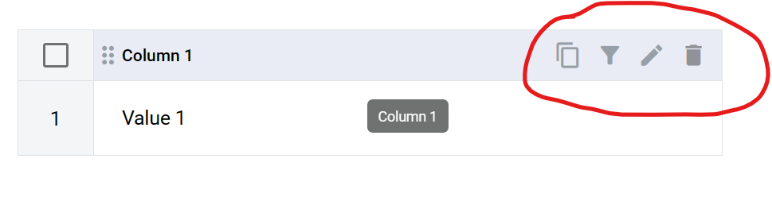
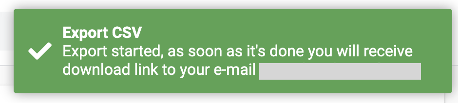

============
Dictionaries
============

Dictionary is a table of records, e.g. list of employees (Name, Surname, Age, Address).

Dictionary creation
===================

.. note:: This functionality is blocked if mailbox has no permission. Dictionary editing is available only to mailbox which is an owner of this dictionary.

**Permissions:**

*Dictionary manage* - allows to create new dictionaries, add columns, change columns order, edit columns, change name, description and access level of dictionaries.
*Dictionary delete* - allow to delete dictionaries.
*Dictionary row manage* - allow to create records and change values in records.
*Dictionary row delete* - allow to delete records.

1. Navigate to platform_address_here/dictionary
2. Click on create dictionary button

3. New dictionary will be opened

4. New dictionary - default name of a dictionary. You can change it as needed (128 characters max)
5. Description - default description of a dictionary. You can change it as needed (256 characters max)
6. Allow filtered access - this attribute specifies if access to this dictionary will be filtered or full. If disabled - all records from a column will be available for choice in the envelope with dictionary field. If enabled - only values form matching rows will be returned. Values from other columns are used for row matching
7. Access level (mailbox by default) - specifies which mailboxes will have access to the dictionary

*Mailbox* - dictionary is visible to current mailbox only. In envelopes with this dictionary field records from this dictionary will be available to current mailbox only. Roles with other mailboxes will not be able to select data from this dictionary field.
*Account* - dictionary is visible to all mailboxes in this account. In envelopes with this dictionary field records from this dictionary will be available to mailboxes in current account. Roles with mailboxes from other accounts will not be able to select data from this dictionary field.
*Public* - dictionary is visible to all mailboxes. In envelopes with this dictionary field records from this dictionary will be available to any mailbox. Roles with any mailbox will be able to select data from this dictionary field.

8. Click on Add row button to add new row
9. You can select rows with a checkmark. If any rows are selected, Delete rows button will appear which allow you to remove rows
10. Click on Add column button to add new column
11. Enter a column name (64 characters max)

12. Hover over column header to see column edition options (copy column UUID, filter, rename and delete)

.. note:: If column is less then 300 px in width these options will be truncated to a single dropdown menu.

.. warning:: `Behaviour of dictionary field after deleting a dictionary column <delete_behaviour.html>`_

13. Columns can be rearranged via drag & drop by this icon (same order will be used in dictionary field creation menu)

Record editing
==============

1. Click on a table cell and enter a value (256 characters max)
2. Click checkmark to apply new value (also you can click outside of a cell)
3. Click cancel to revert changes

Records filtration
==================

Multiple filters connected by 'OR'. Filter types: Contains, Does not contain, Is equal, Is not equal, Is empty, Is not empty.

1. Click on a filter icon (appears on column header hover)
2. Select filter and enter value
3. Click on Add button
4. Column name with active filter will have the same color as filter
5. Filters are sorted by column order

Dictionary deletion
===================

1. Click on a delete icon on according dictionary on a dictionary list page
2. Confirm your action

Dictionary import
=================

You are able to import csv file to the dictionary which will be converted into the dictionary records. To read more about import logic depends on configuration :ref:`click here <import logic>`

.. note:: The order of the rows may not be saved after import of csv file data into the dictionary

1. Navigate to platform_address_here/dictionary
2. Open dictionary for editing (by clicking on edit icon) or create new one
3. Click on "Import" button in the header

At this moment you will observe modal window with upload csv file button

4. Clicking on "Select file to upload" button file manager on your PC will be opened
5. As soon as file is chosen you can click on the "Next" button

At this moment you will observe modal window with uploaded csv file and two configuration options of importing file "Header 1st row?" and "Replace". To read more about import logic depends on configuration :ref:`click here <import logic>`

.. note:: "Header 1st row?" - the option is responsible for determination if first row from csv file will be the header row in dictionary after import

.. note:: "Replace" - the option defines if existing dictionary records will be replaced or not after import

6. You can chose any combination of configuration file and proceed by clicking on the "Next button"

At this moment you will observe modal window with preview of the dictionary import results

7. If preview corresponds to expected import results, you can proceed with import and click on "Confirm" button. If not you are able to `adjust the import configuration`_
8. You will be redirected to dictionary list and dictionary with import process will be locked for the time, until dictionary imported
9. As soon as dictionary imported all users who have access to mailbox receive an email and system notification (in case if the notifications are not turned off in the user profile)

.. _adjust the import configuration:

Import configuration adjustment
###############################

Import preview modal window contains import configuration properties and you are able to adjust them

1. "Header 1st row?" - you are able to make the option selected or not and according to the choice data from csv will be parsed differently

By clicking on "Change delimiter" button additional configuration options open

2. "Delimiter" - the option defines the type of the records delimiter in csv uploaded by you. Available options ",", ";", "tab(\\t)" and "space(\\s)"
3. "Quote" - the option defines type of the quotes is using in csv uploaded by you. available options double quote ("), single quote (') or null value if no quotes should be defined
4. "Escape" - the option defines type of the escape symbol is using in csv uploaded by you. available options backslash (\\), double quote (") or null value if no escape symbol should be defined

.. note:: to read more about how additional parameters "Delimiter", "Quote", "Escape" work, follow `the link to apache docs <https://commons.apache.org/proper/commons-csv/apidocs/org/apache/commons/csv/CSVFormat.html#DEFAULT>`_

.. _import logic:

Import logic depends on configuration
#####################################

Import of csv data works differently depends on the configuration you chose and here it is described. In general it can be 4 main cases

1. :ref:`Checkbox "Header 1st row" selected and "Replace" is not <case#1>`
2. :ref:`Checkbox "Header 1st row" is not selected and "Replace" is selected <case#2>`
3. :ref:`Checkbox "Header 1st row" and "Replace" are selected <case#3>`
4. :ref:`Checkbox "Header 1st row" and "Replace" are not selected <case#4>`

But depends on the content of csv file it may be more cases

.. _case#1:

**Checkbox "Header 1st row" selected and "Replace" is not**

The data from the CSV will be added to the dictionary according to the column names. Already existing data will not be affected in two cases

.. note::
    1. CSV contains the same quantity of columns and the names of columns are equal to dictionary column names
    2. CSV contains less columns than dictionary and columns in dictionary and csv are the same names

-----------------

New columns will be created according to the column names from CSV, the data from the CSV will be added to the newly created columns with the names of the first row in CSV. Already existing data will not be affected in three cases

.. note::
    1. CSV contains the same quantity of columns but the names of columns are not equal to dictionary column names
    2. CSV contains more columns than dictionary and columns in dictionary and csv are different names
    3. CSV contains less columns than dictionary and columns in dictionary and csv are different names

-----------------

The data from the CSV will be added to the dictionary according to the column names and new columns will be created for the names of the columns from CSV which don't match column names in dictionary. Already existing data will not be affected in two cases

.. note::
    1. CSV contains more columns than dictionary and some of the columns in dictionary and csv have the same names
    2. CSV contains less columns than dictionary and columns in dictionary and csv are partially the same

.. _case#2:

**Checkbox "Header 1st row" is not selected and "Replace" is selected**

The data from the CSV will be added to the dictionary according to the column order (first column records from CSV will be added to first dictionary column records). Already existing data will be replaced in two cases

.. note::
    1. CSV contains the same quantity of columns and the names of columns are equal to dictionary column names
    2. CSV contains the same quantity of columns but the names of columns are not equal to dictionary column names

-----------------

The data from the CSV will be added to the dictionary according to the column order (first column records from CSV will be added to first dictionary column records). New columns will not be created for difference between CSV and dictionary columns. Already existing data will be replaced in one case

.. note:: CSV contains more columns than dictionary and some of the columns in dictionary and csv have the same names

-----------------

The data from the CSV will be added to the dictionary according to the column order (first column records from CSV will be added to first dictionary column records). New columns will not be created for difference between CSV and dictionary columns. Already existing data will be replaced in one case

.. note:: CSV contains more columns than dictionary and columns in dictionary and csv are different names

-----------------

Import error occurs. Dictionary data will not be updated in three cases

.. note::
    1. CSV contains less columns than dictionary and columns in dictionary and csv are different names
    2. CSV contains less columns than dictionary and columns in dictionary and csv are the same names
    3. CSV contains less columns than dictionary and columns in dictionary and csv are partially the same

.. _case#3:

**Checkbox "Header 1st row" and "Replace" are selected**

The data from the CSV will replace all data in dictionary

.. note::
    1. CSV contains the same quantity of columns and the names of columns are equal to dictionary column names
    2. CSV contains the same quantity of columns but the names of columns are not equal to dictionary column names
    3. CSV contains more columns than dictionary and some of the columns in dictionary and csv have the same names
    4. CSV contains more columns than dictionary and columns in dictionary and csv are different names
    5. CSV contains less columns than dictionary and columns in dictionary and csv are different names
    6. CSV contains less columns than dictionary and columns in dictionary and csv are the same names
    7. CSV contains less columns than dictionary and columns in dictionary and csv are partially the same

.. _case#4:

**Checkbox "Header 1st row" and "Replace" are not selected**

The data from the CSV will replace all data in dictionary, except column names (column names will be kept), data will be placed to the dictionary column according to the csv order (records from column 1 in CSV will be placed in column 1  in dictionary) in two cases

.. note::
    1. CSV contains the same quantity of columns and the names of columns are equal to dictionary column names
    2. CSV contains the same quantity of columns but the names of columns are not equal to dictionary column names

-----------------

The data from the CSV will replace all data in dictionary, according to the quantity of columns in dictionary, except column names (column names will be kept), data will be placed to the dictionary column according to the csv order (records from column 1 in CSV will be placed in column 1  in dictionary) in two cases

.. note::
    1. CSV contains more columns than dictionary and some of the columns in dictionary and csv have the same names
    2. CSV contains more columns than dictionary and columns in dictionary and csv are different names

-----------------

Import error occurs. Dictionary data will not be updated in three cases

.. note::
    1. CSV contains less columns than dictionary and columns in dictionary and csv are different names
    2. CSV contains less columns than dictionary and columns in dictionary and csv are the same names
    3. CSV contains less columns than dictionary and columns in dictionary and csv are partially the same

Dictionary export
=================

You are able to export dictionary as CSV file with all records included into the dictionary, to do that you have to make the following

1. Navigate to platform_address_here/dictionary
2. Open dictionary for editing (by clicking on edit icon)
3. Click on "Export" button in the header and chose CSV option

At this moment you will observe toaster message with the content: Export started, as soon as it's done you will receive download link to your e-mail

4. As soon as CSV file is ready email with link to csv version of dictionary download will be sent

Dictionary field behavior after dictionary or dictionary column deletion
========================================================================

**Template**

When dictionary or dictionary column is deleted, such template will become invalid (new dictionary or dictionary column should be selected in dictionary field properties).

**Envelope**

When dictionary or dictionary column is deleted, dictionary field will be disabled in processing envelopes and envelope with such field will be expired automatically after expiration date. Exception is case where custom value are allowed. In such case dictionary field will work as text field and custom text value can be entered in it.