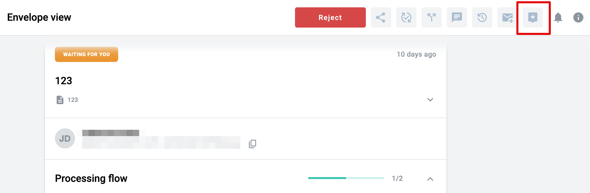
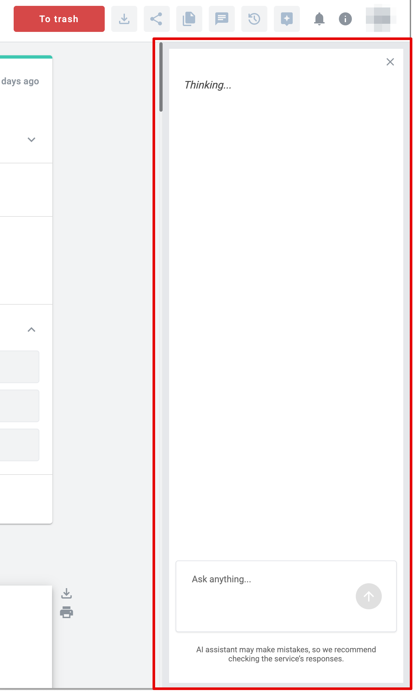
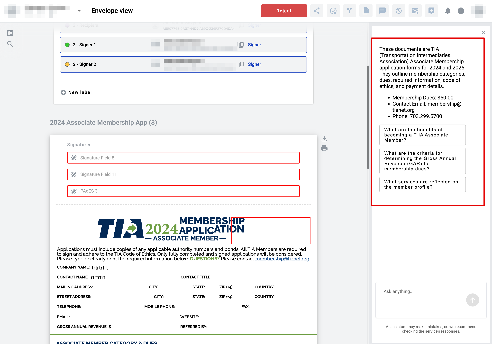
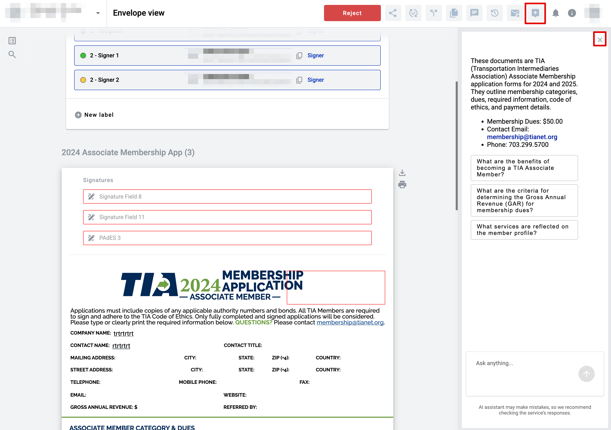
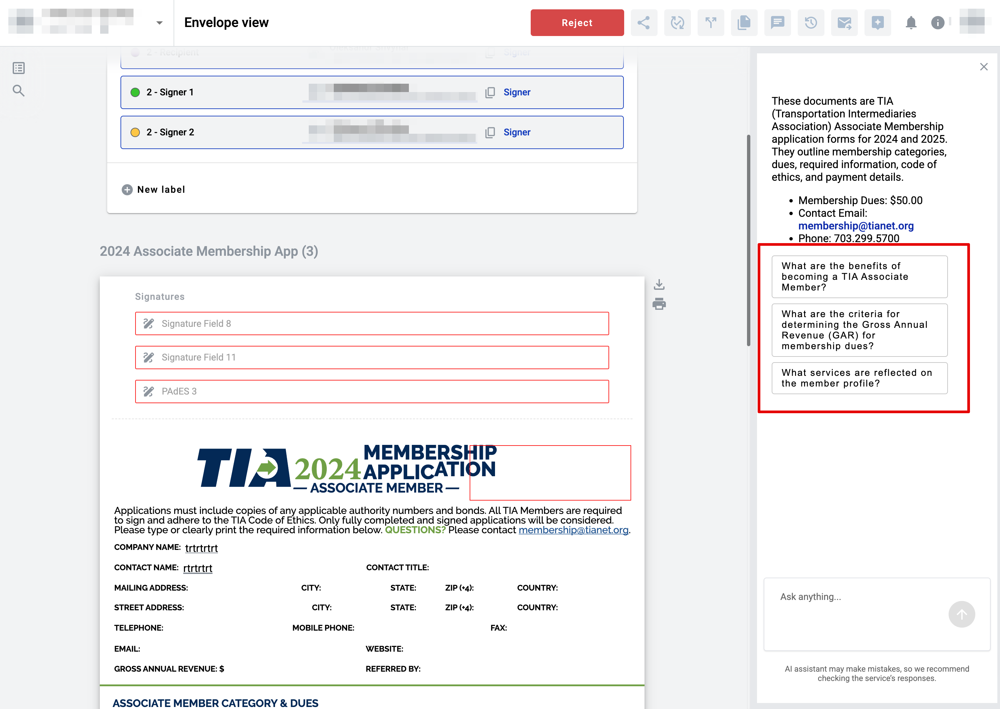
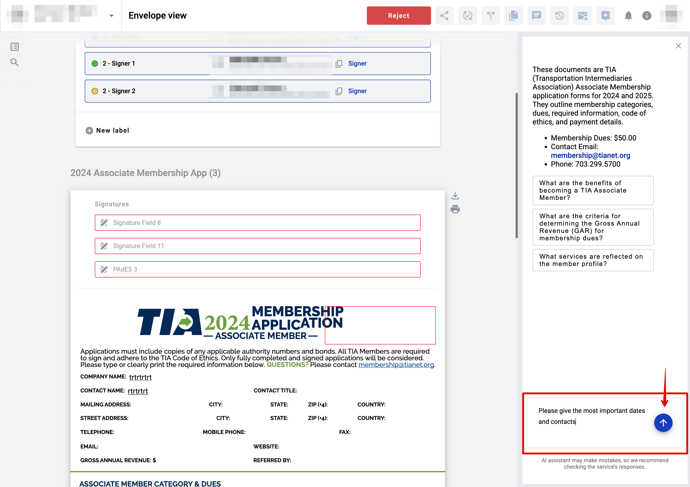

============
AI assistant 
============

How to toggle AI assistant section
==================================

.. note:: You can use the chat with the assistant in envelopes of any status, including both completed and incomplete ones.

1. Inside the envelope, click the AI assistant icon in the header.

2. AI assistant chat section appears

3. When you open the assistant for the first time, a brief summary of the documents in the envelope will be displayed, along with a few suggested questions based on their content — helping you quickly get started with the assistant.

4. You can close the assistant panel by clicking the assistant icon or the 'X' button.

.. note:: Please note that the AI assistant icon is visible only if the user has the appropriate permission and the instance is configured accordingly. Otherwise, the AI assistant will not be available.

How to communicate wit AI assistant
===================================

1. To start interacting with the assistant, you can click on one of the suggested questions.

2. You can also enter your own custom prompt and send it using the Send button.

.. note:: The assistant can only respond strictly within the scope of the documents and the information they contain. If you ask a question that is not relevant to the current envelope, the assistant will respond with the following message:
"I'm sorry, I can only assist with questions directly related to the content of the provided documents. The benefits of becoming a TIA Associate Member are not detailed in these documents."

3. If you have already communicated within the current envelope within the last 24 hours and initiate the assistant again, you will see the history of your conversation. If more than 24 hours have passed, the communication will start from scratch.

    