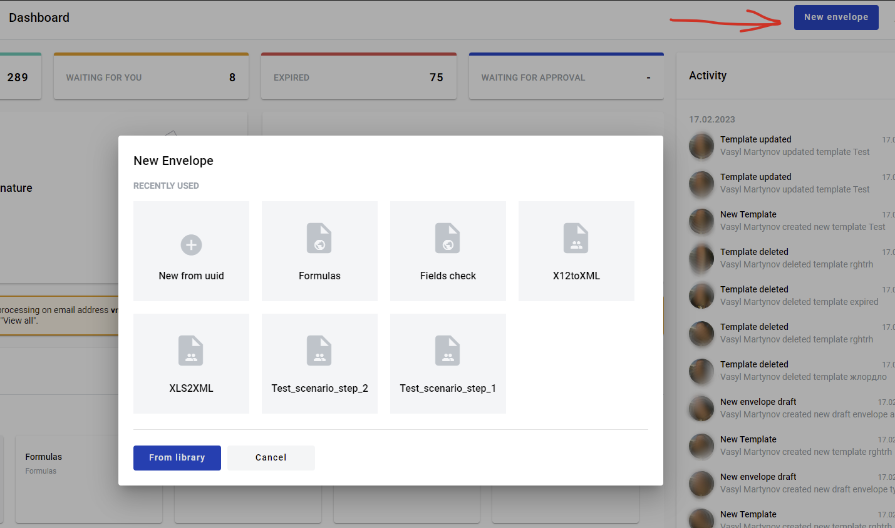
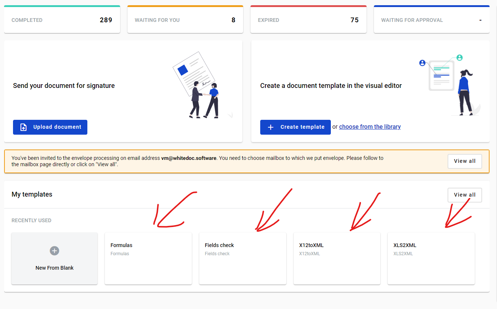
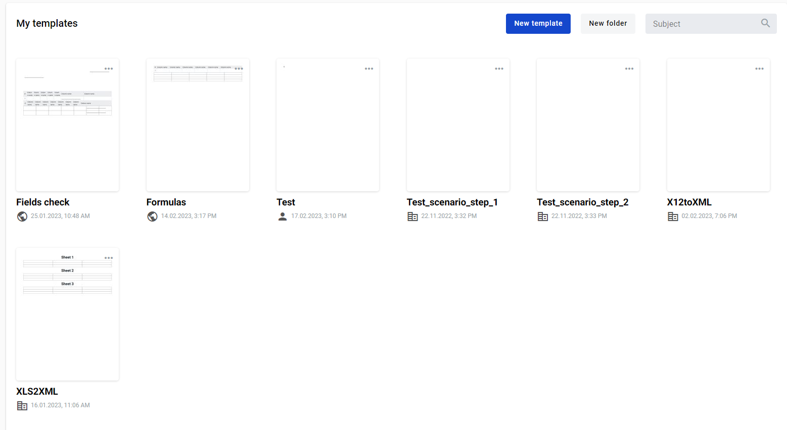
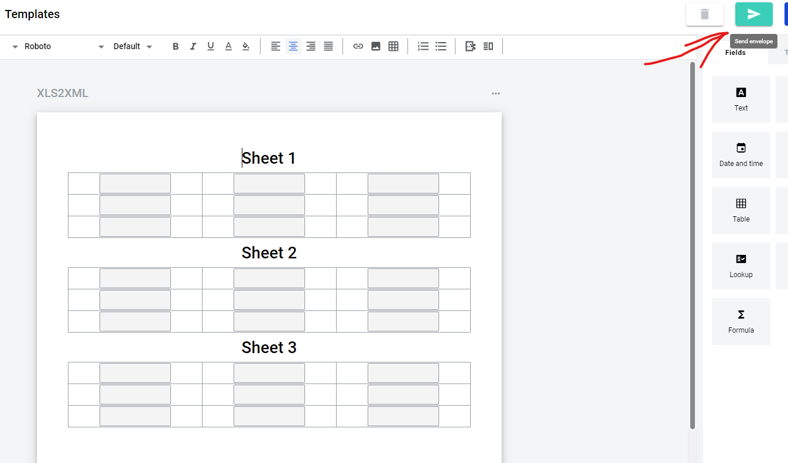
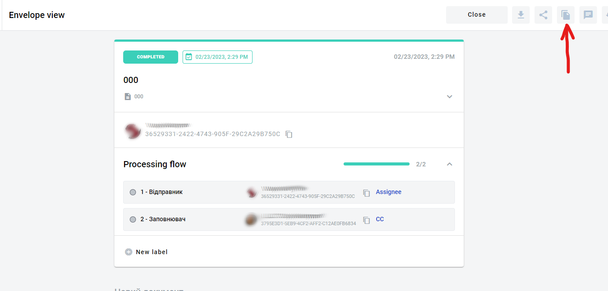
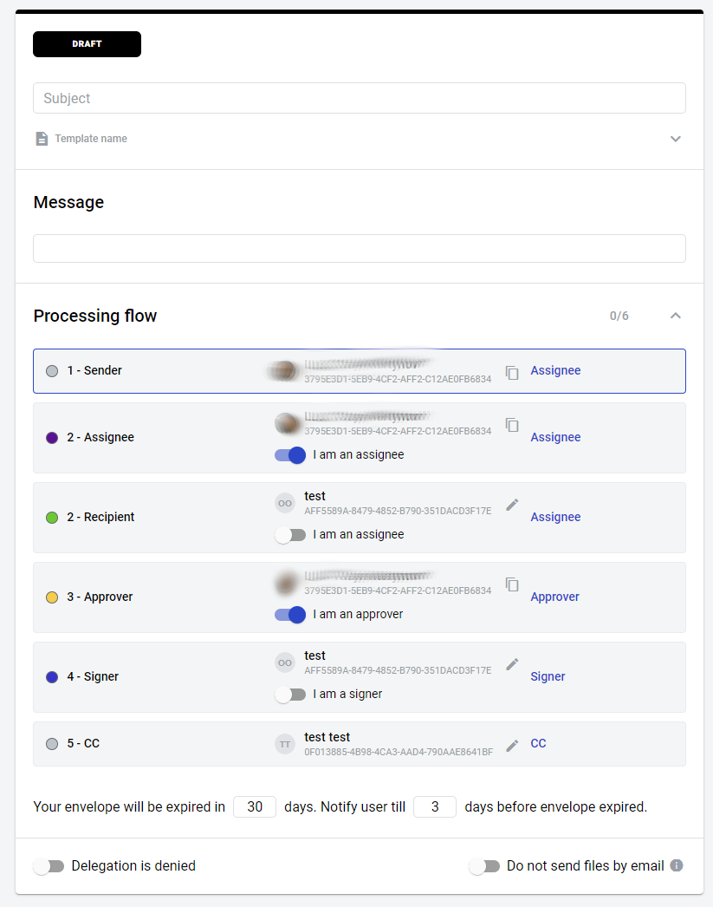

=================
Envelope creation
=================
    
There are several ways to create an envelope:

1. By clicking the :ref:`"Upload document" button on the dashboard <dashboard>`

2. By clicking the "New envelope" button on the dashboard

3. By clicking any template panel on the dashboard

4. By clicking any template panel on the templates list page

5. By clicking the "Send" button in the template editor

6. By cloning an existing envelope (if mailbox has no access to the template of origin or envelope is created via Quick-send, 'Clone' button will not be shown). Envelope draft will be opened

7. From this page you will have to fill all roles that take part in envelope processing flow (unless they are predifined on the template level). Note that you can enable "I am assignee/approver/signer" attribute to predefine your own mailbox for specified role. After all mandatory fields will be filled you can send envelope to the next participant of the flow

8. By following an :ref:`envelope initiation link <envelopeInitiation>`

9. By sending an :ref:`envelope form <envelopeForm>`

10. By using `API <https://docs.docstudio.com/en/latest/pages/api/openApi.html#tag/envelope-controller>`_ to create an envelope

.. note:: You can also save an envelope draft with some values filled in to send it later. You can do so by clicking "Save draft" button (not available for quick-send). After draft is saved, it will be automatically re-saved after any changes are made. Saving process is indicated by save icon near "Save draft" button. Same auto-save feature is also used in envelopes in "Waiting for you" status.

.. _envelopeMetadata:

Envelope metadata
=================

It is possible to `add <https://docs.docstudio.com/en/latest/pages/api/openApi.html#tag/envelope-controller/operation/updateEnvelopeMetadata>`_ and `delete <https://docs.docstudio.com/en/latest/pages/api/openApi.html#tag/envelope-controller/operation/deleteEnvelopeMetadata>`_ metadata from envelopes. It is only available for API users and this data will also only be visible to API users. Metadata can also be `added to envelope forms <https://docs.docstudio.com/en/latest/pages/api/openApi.html#tag/form-controller>`_ and will be used in all envelopes created from such forms.

1. Each key name should have 1 - 32 characters length
2. Each key value should have 0 - 128 characters length and can be a string, boolean or NULL
3. To delete certain metadata key-value pairs in the envelope, add them to the DELETE request as query parameters (&key=additionalProp1?key=additionalProp2)
4. To delete all metadata key-value pairs in the envelope, send the DELETE request without query parameters
5. To update or delete metadata in the form, use regular form update endpoint to overwrite the metadata