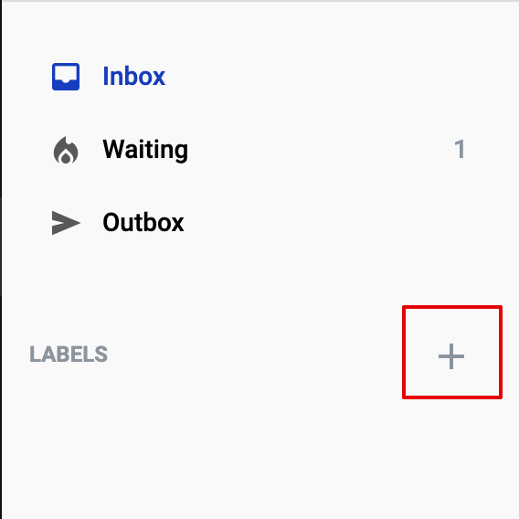

===================
Envelope management
===================
    
On the mailbox page, you can manage the display of the envelope list as well as perform various actions with the envelopes themselves.

Envelope list display configuration
===================================

1. You can modify the display of the envelope list by editing the visible columns, their order, and their width.

By default, the following columns are always displayed:
* "Subject"
* "Template"
* "Stage"
* "Status"
* "Sender"
* "Receive date"

Each column has a preset width, except for the "Subject" column, whose width is dynamic and depends on the width of your screen.

* "Subject" - depends on the width of your screen
* "Template" - 220 px
* "Stage" - 60 px
* "Status" - 125 px
* "Sender" - 170 px
* "Receive date" - 145 px
* "Sent Date" - 145 px
* "Custom Columns" - 190 px

Through the "Customize View" menu you can add the "Sent date" column, and there is also the option to add custom columns using the field name search. Simply start typing the field name in the search box to see the available fields.
Default size for added columns:

* "Sent Date" - 145 px
* "Custom Columns" - 190 px

   
.. note:: Any field with enabled Search attribute will be available as custom column.

Using same menu, you can configure which columns to display and their order. 
To show or hide columns, use the checkbox. Pay attentiont, that the "Subject" column is always displayed by default and cannot be hidden.

To change the order of the columns, click and hold the move icon, then drag the column name to your desired position. Columns in the envelope list will be arranged according to their order in the list, with the top column displayed first.

Additionally, you can adjust the width of the displayed columns in the envelope list.
If you want to make some columns narrower and others wider, you can adjust their size by dragging the column border. When you hover over the column border in the table header, you will see the corresponding icon.

.. note:: Please note that once the width of any column is changed or a custom column is added, the Subject column retains its current size, and the last column becomes dynamic. Its display and adjustment will depend on your screen size and the width settings of the other columns. The last column can be any column, depending on your settings.

Each column has its own minimum width, which cannot be reduced further.

* "Subject" - 150 px
* "Template" - 150 px
* "Stage" - 60 px
* "Status" - 60 px
* "Sender" - 150 px
* "Receive date" - 100 px
* "Sent Date" - 100 px
* "Custom Columns" - 60 px

**Сolumns behaviour:**
In the default view, the width of the "Subject" column is dynamic and depends on the screen size, regardless of whether it is the first, middle, or last column.
Once the width of any column is changed or a custom column is added, the "Subject" column retains its current size, and the last column becomes dynamic and next logic is applied.

If there is no scroll on your screen (i.e., the total width of all columns is less than or equal to the screen width):

* The last column can only be expanded to the right.
* If the width of any column is reduced, the last column expands to fill the screen width.
* If the width of any column is increased, the last column narrows to its minimum width, after which a scroll bar appears.

If there is a scroll on your screen (i.e., the total width of all columns exceeds the screen width):

* The size of the last column can be changed in either direction, but not below the minimum size or until the scroll disappears.

The column display settings are saved and remain unchanged during further interactions with the envelope list and it is saved at the mailbox level.

2. You can reset all custom settings to default using the "Reset default settings" button in the "Customize View" menu. 
Setting that will be reset: columns sorting, arrangement, widths, displaying custom columns.

.. image:: picEnvelopeManagement/restoredefault.png
   :width: 400
   :align: center

Envelope list settings
======================

1. You can select how many envelopes are shown on the page in "Items per page" menu

2. On the left side of the page you can navigate through your mailbox folders

.. image:: picEnvelopeManagement/folders.png
   :width: 400
   :align: center

.. note:: Empty folders can be hidden from list if such setting is enabled by system administrator.

3. Also on the left side of the page you can manage labels

You can add new label by clicking the "+" icon

After that you can add label name, choose color and save label or cancel adding.

All added labels will be displayed under the "Labels" menu. If there are more than 4 labels in the list, you can display the entire list by clicking the "More" button, and hide the list by clicking the "Less" button.

You can edit a label (name and color) or delete it through the additional context menu.

4. There is an option to filter displayed envelopes by specific parameters, such as status, date range, sender, or template

Additionally, you can filter shown envelopes by adding filters or envelope fields from the "Add filter" menu.

.. image:: picEnvelopeManagement/filters.png
   :width: 400
   :align: center
   
.. note:: Configured filters can be saved by clicking Save filter button.

5. Using the search bar, you can find a specific envelope by subject or mailbox UUID

6. New envelope can be created from this page by clicking "New envelope" button near your profile icon in the upper right corner

.. image:: picEnvelopeManagement/page.png
   :width: 400
   :align: center