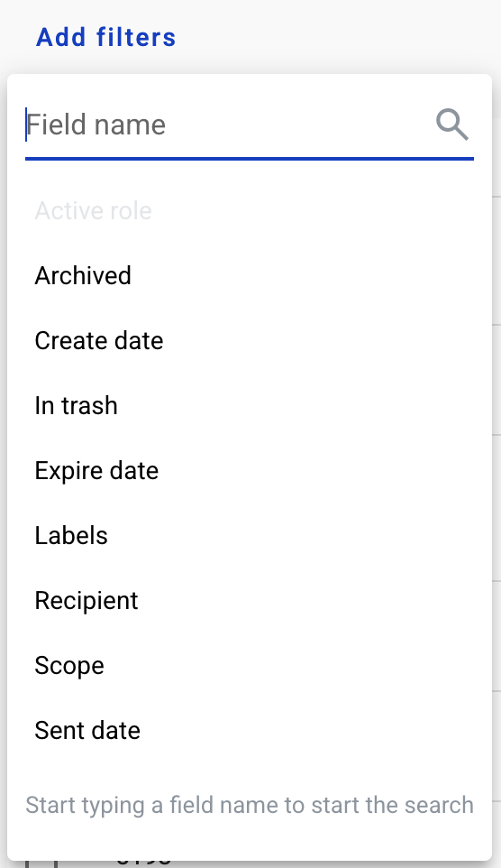

===================
Envelope management
===================
    
You can view and manage your envelopes on Mailbox page. Also you can create new envelope from this page by clicking 'New envelope' button near your profile icon in the upper-right corner.

.. image:: picEnvelopeManagement/page.png
   :width: 400
   :align: center

You can select how many envelopes are shown on the page in 'Items per page' menu.

.. image:: picEnvelopeManagement/paginator.png
   :width: 400
   :align: center
   
Custom columns can be added to the envelope list from 'Customize view' menu. Start typing field name in search box to list available fields.

.. image:: picEnvelopeManagement/view.png
   :width: 400
   :align: center
   
.. note:: Any field with enabled Search attribute will be available as custom column.
   
Also you can filter shown envelopes by adding filters or envelope fields from same menu.

   
.. note:: Configured filters can be saved by clicking Save filter button.
   
On the left side of the page you can navigate through your mailbox folders.

.. image:: picEnvelopeManagement/folders.png
   :width: 400
   :align: center

.. note:: Empty folders can be hidden from list if such setting is enabled by system administrator.

Envelopes can be moved to Archive folder by selecting them and clicking on 'Archive' button.

.. note:: Only envelopes in Completed, Expired and Cancelled statuses or Drafts can be archived.

Later such envelopes can be unarchived from 'Archived' folder by 'Unarchive' button.

.. image:: picEnvelopeManagement/unArchive.png
   :width: 400
   :align: center

Envelopes can be moved to 'Trash' folder by selecting them and clicking on 'To trash' button.

.. image:: picEnvelopeManagement/trash.png
   :width: 400
   :align: center

.. note:: Only envelopes in Completed, Expired and Cancelled statuses or Drafts can be deleted.

.. warning:: Envelopes will be automatically erased from our servers in 30 days (by default, configured by system administrator) if all processing flow participants move them to trash. Please note that if envelope has deleted mailbox in it`s processing flow which hasn`t moved it to trash before being deleted, such envelope will never be erased completely and remain in trash folder for remaining flow participants indefinetly.

Later such envelopes can be restored from 'Trash' folder by 'Restore envelopes' button.

.. image:: picEnvelopeManagement/restore.png
   :width: 400
   :align: center