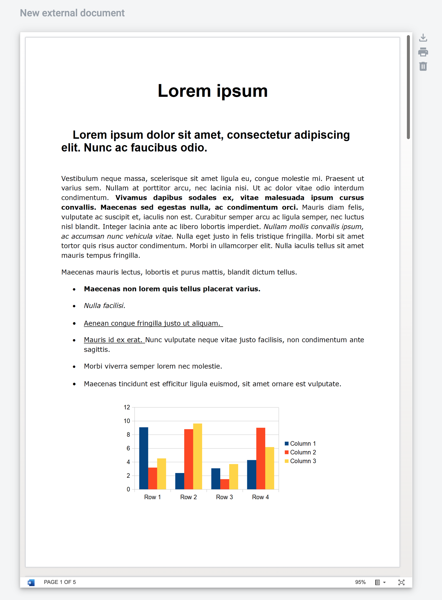
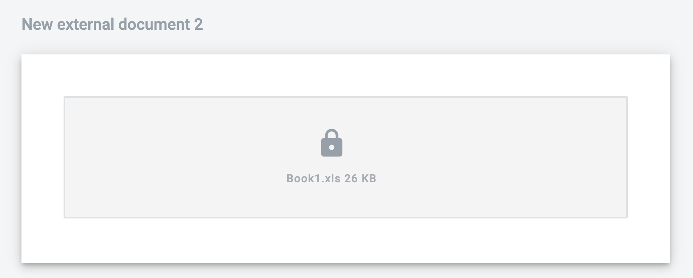

=================
External document
=================

How to upload an external document
==================================

1. Click the upload zone

2. Select a file
3. When the upload is finished you will see name of file inside uploading section (or file itself it it was in .pdf format). Also you can choose another file before you send envelope

4. To send envelope you should fill all other mandatory fields and upload all external documents assigned to your role

How to upload an external document with embedded fields
=======================================================

1. Click the upload zone

2. Select a file
3. Depending on the type of built-in fields you will see a modal window with different options:

- Keep signatures and fields = Preserve editable fields embedded in the document in read-only state, signature, and/or encryption.
- Keep editable fields data = Preserve editable fields embedded in the document in read-only state, remove signature and/or encryption.
- Remove editable fields = Remove embedded signatures, encryption, editable fields in the document.

.. note:: If the external document contains E-ink signature the option "Keep signatures and fields" will be unavailable. In this case, it is impossible to retain built-in signatures.

4. Depending on the selected option, the PDF document will be rendered, and you can continue working with the envelope in the usual manner

External document signing process
=================================

Electronic digital signature and e-ink signatures can be used to sign external documents. According signatures should be added to the documents on the template.

.. note:: Electronic ink signatures can be applied only to .pdf format external documents. Please note that if you will add e-ink signature to external document in the template, only .pdf files will be accepted for this documents in following envelopes.

Process of signing external documents with QES has one difference from signing internal document. When signing external document electronic digital signature is applied only to .pdf file version (not to .xml file). Signature interface is same as for structured documents.

How to add an e-ink signature to external document
==================================================

1. To add e-ink signature to the external document click the signature field

.. image:: pic_externalDocument/ExternalDocumentEink.png
   :width: 600
   :align: center

2. After this place signature where you want it to be and click. The signature can be changed by clicking it

3. When this is done you can finish filling all mandatory fields and send the envelope - all signatures will be shown on it

Viewing external documents through MS viewer
============================================

To view external documents with MS viewer you need to turn on functionality, :ref:`MS viewer configuration<msViewerConfiguration>`

.. note:: the following files will be displayed though MS viewer .doc, .docx, .xls, .xlsx, .ppt, .pptx

1. Upload one of the files which will be processed by MS viewer
2. Iframe with size of the default document size will be displayed (f.e.: default document size in DocStudio is US letter)
3. Uploaded document in iframe will be displayed

.. note:: Uploaded document will be transferred to the MS viewer and will be publicly available by specific link (which MS viewer generates)

Documents with restricted access
================================

Some documents in the envelope may be with restricted access for some role of the processing flow. :ref:`Document access configuration<documentAccessRestriction>`

Documents with restricted access have respective locker icon and doesn't have possibility to be downloaded

.. note:: documents with restriction, also will not be included to the envelope archive if archive downloaded by role for which restriction configured
