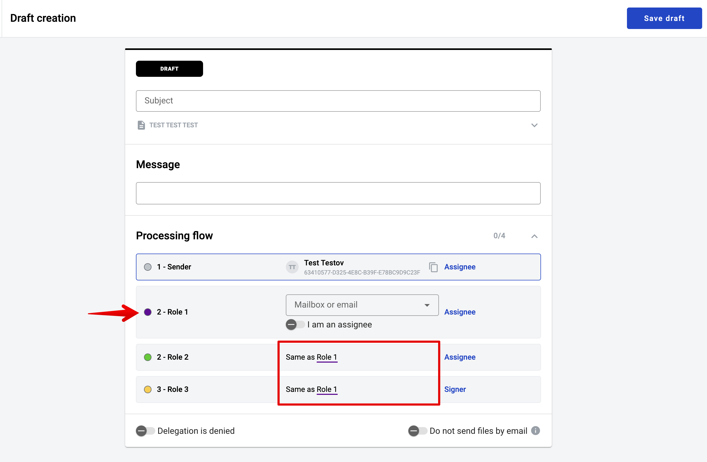
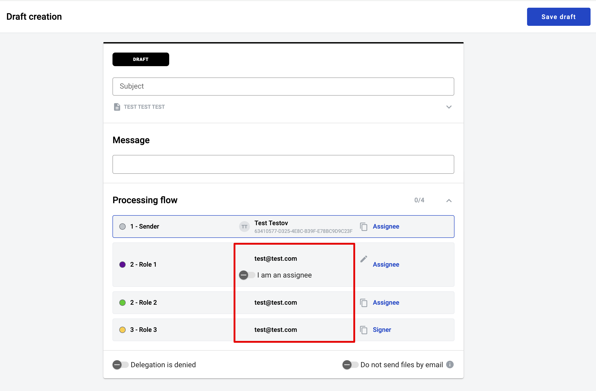
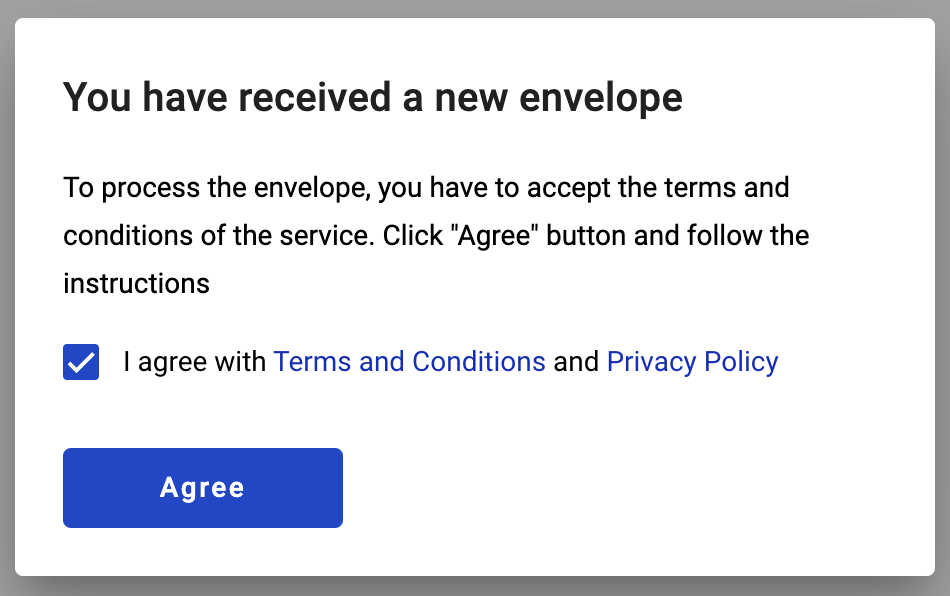
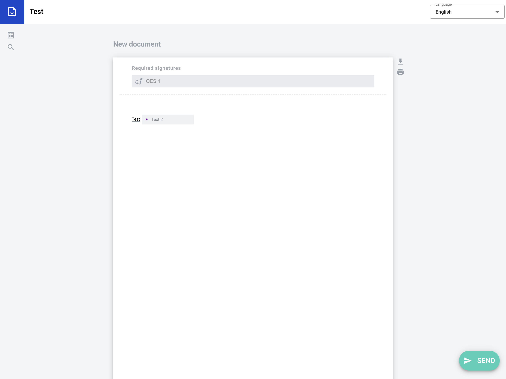
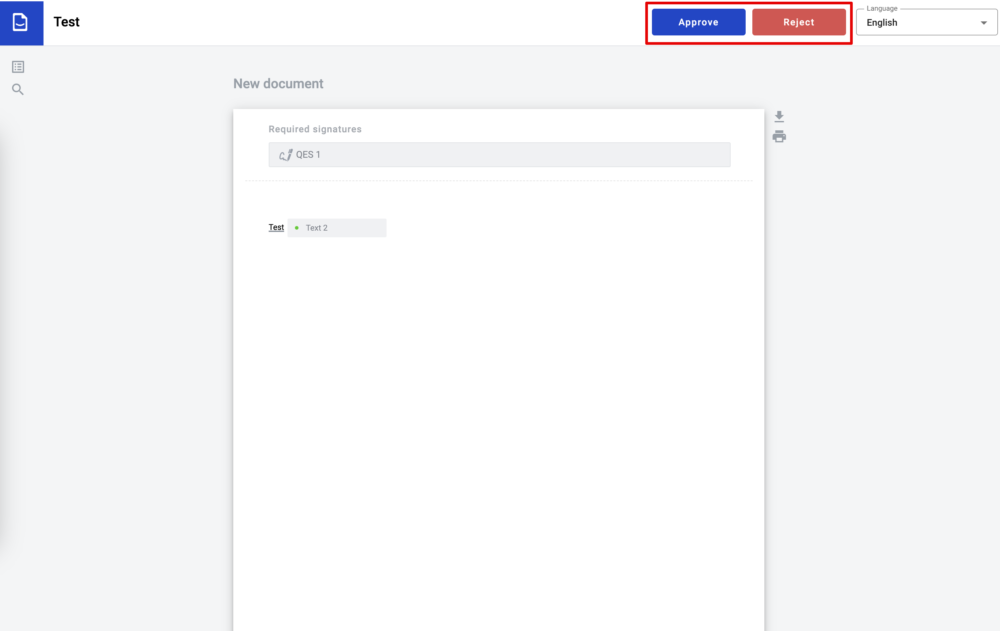
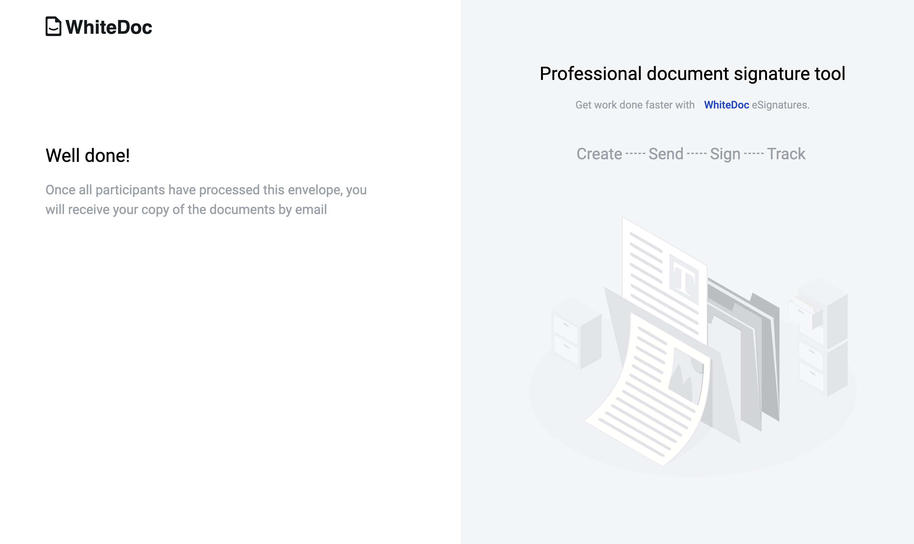
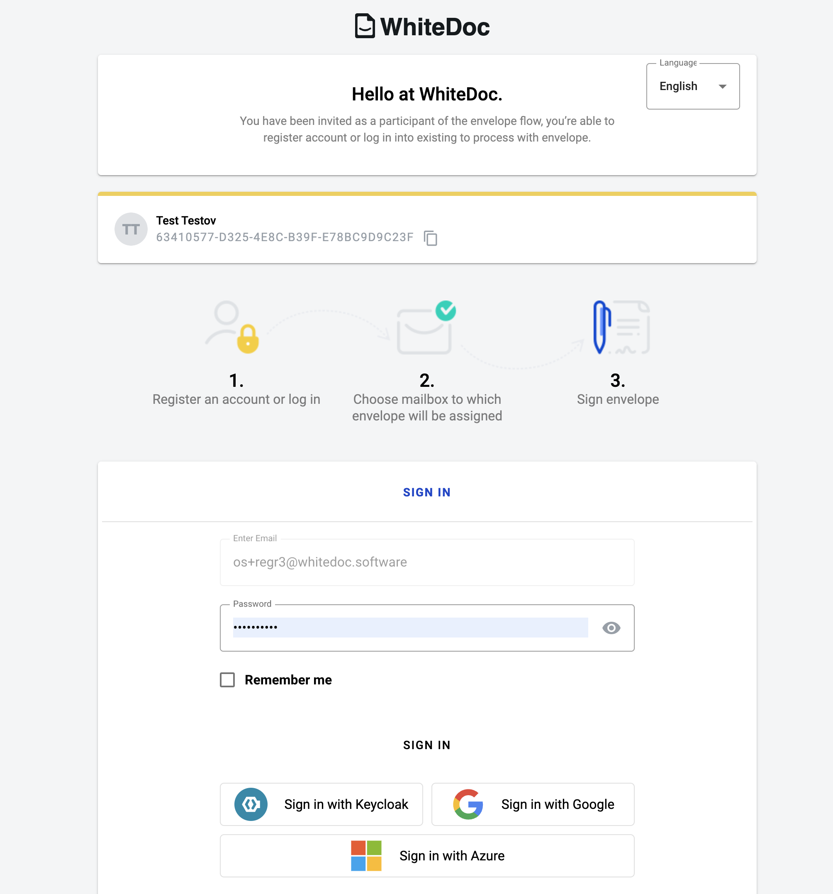
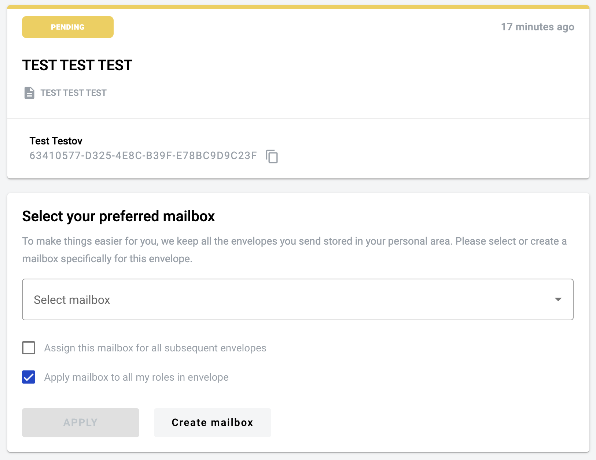
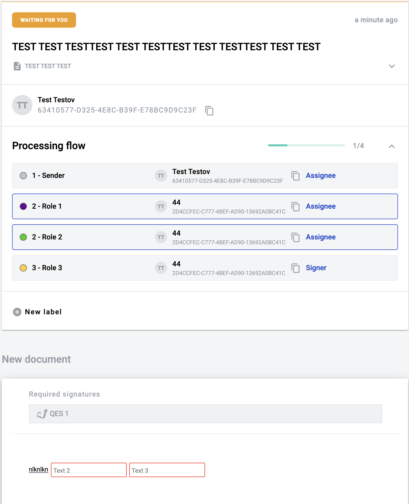
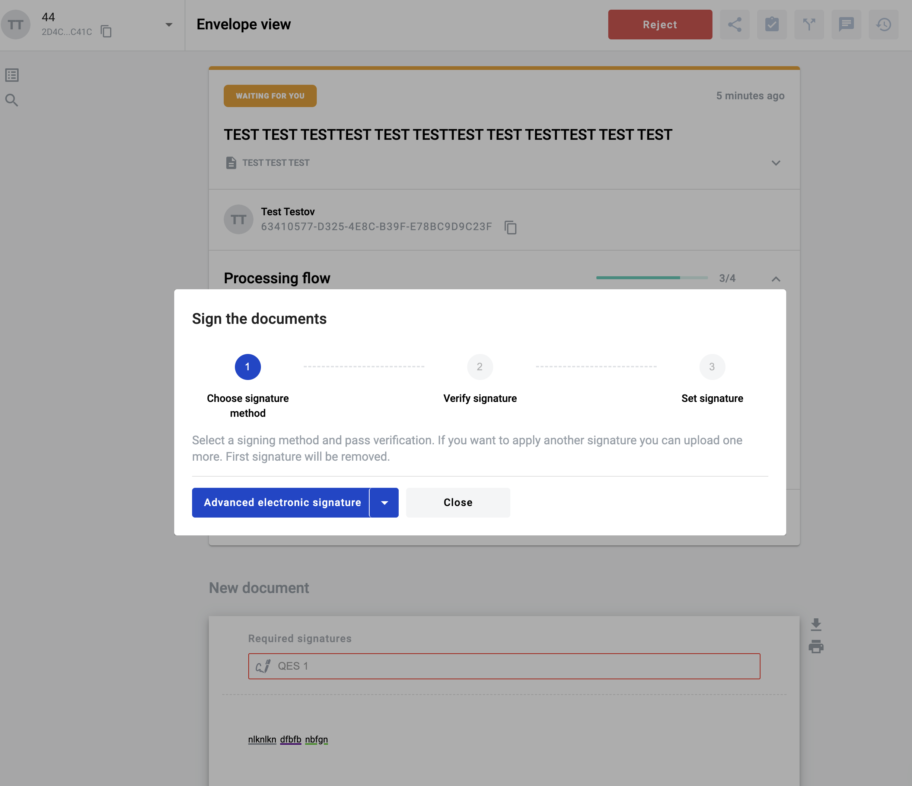

===================================
Invitation to the envelope by email
===================================

It is possible to invite participant of the envelope flow by email. Participants which invited by email have to follow the envelope invitation link from email.

Invite participant to envelope by email from the draft page
===========================================================

* Open draft of the envelope without predefined processing flow and participant there. 
You can also use a draft created based on the template where the "Same as" function was used during the flow setup.
This means that the flow is configured in such a way that one role can inherit another, allowing the same user to perform actions for two/three, etc., roles in a single step on the envelope.

* To the input of the particular role enter the participant email address (you're able to set the email address and do not choose the mailbox from drop-down list)
If there are roles in the flow that inherit from the role with the specified email address, then it will be automatically applied to all inherited roles.

* After completion of the envelope configuration you are able to send envelope
* At the modal window you will see the alert message which says that you try to send envelope to email
* Confirm it and envelope will be send

States of the envelope with invitation
======================================

Until participant does not do any action with invitation envelope stack at the step of the processing flow with particular role.
Envelope which has been sent directly to the email could be finished in three cases:

* If participant accept invitation to the envelope processing flow and complete or reject envelope
* If a participant does not accept the invitation, the envelope transitions to the expired state after the expiration date, if it was configured in the template.
* If sender or somebody from the processing flow reject the envelope

Participants which could be invited to an envelope
==================================================

We're able to invite to an envelope such as customers of the platform and non-registered users. The one difference is flow of the envelope invitation acceptence.

* If you leave the email address at the input at the processing flow, participant will be invited by email
* If you select the mailbox from the drop-down list at the processing flow, participant will get envelope as usual

Auto Deposit Function
=====================

The envelope sent via email can be automatically assigned to a mailbox with the Auto Deposit function.

* Open 'User Profile'
* Select proper mailbox in 'Auto Deposit Mailbox'
* All envelopes will go to this mailbox automatically without invitations
* By default 'Auto Deposit Mailbox' is set to user's personal mailbox

.. note:: The user has the option to select an auto-deposit mailbox in the invitation email under the mailbox selection menu.

How to accept invitation and send envelope without authorisation (for guests)?
==============================================================================

1. To accept the invitation to the envelope, the user must follow the link sent to their email address. You have received a new envelope message will be displayed. 
Click on "Agree button".

2. The user observes limited functionality within the envelope.
3. Only fields assigned to this user can be filled. If the next recipient's roles where assigned as same as the particular user, the user can simultaneously see recipient's fields as active for completion.
Fill in all required fields (button "Edit" changes to "Send")

4. Click on "Send" button
5. If there are roles in the envelope flow that inherit from the current role, then the envelope with the functionality of the next role (Approver/Signer) will be displayed.

6. Perform the necessary actions depending on the role funcrionality and then complete (send) the envelope. 
If there are no roles in the flow that inherit from the current one, then the envelope will be sent further along the flow and success page will be displayed.

How to accept invitation and send envelope without authorisation for registered users?
======================================================================================

1. To accept the invitation to the envelope, the user can follow the link sent to their email address. 
Enter valid credentials and sign in. Authorization through third-party services is also available.

.. note:: If you enable autodeposit mailbox, the configured mailbox will be automatically used and the envelope will be sent after this step. 

2. If you do not have autodeposit mailbox enabled, you will be prompted to choose one of your mailboxes for each role.

3. Only fields assigned to this role can be filled. If the next recipient's roles where assigned as same as the particular mailbox, the user can simultaneously see recipient's fields as active for completion.
Fill in all required fields (button "Edit" changes to "Send")

4. Click on "Send" button.
5. If there are roles in the envelope flow that inherit from the current role, then the envelope with the functionality of the next role (Approver/Signer) will be displayed.

6. Perform the necessary actions depending on the role and then complete (send) the envelope.
If there are no roles in the flow that inherit from the current one, then the envelope will be sent further along the flow or displayed as completed.
