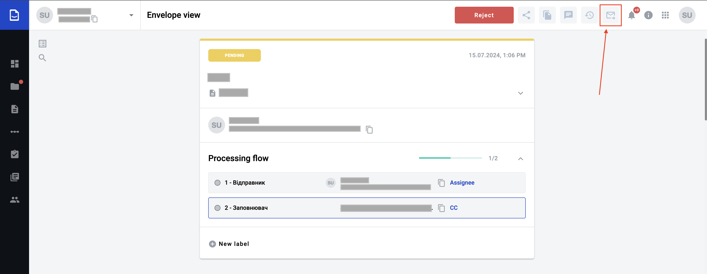
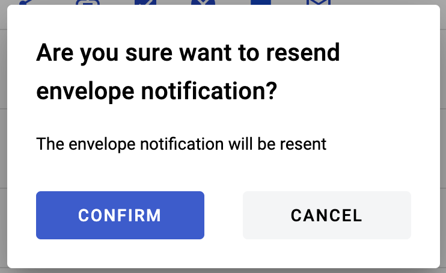
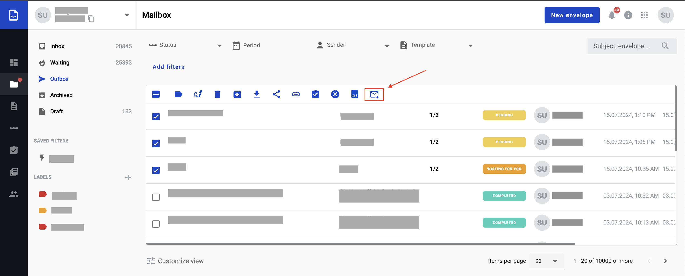
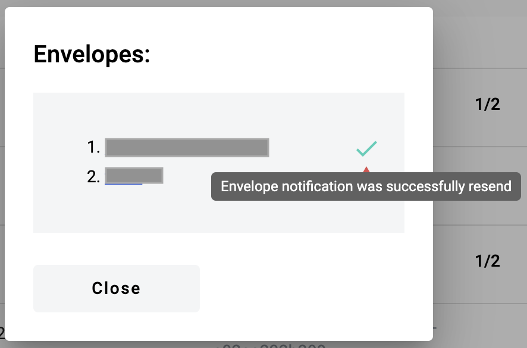

========================================================
Resend envelope invite and income envelope notifications
========================================================

Sender of envelope is able to resend envelope notification to all recipients who have active roles at the moment of performing resend action.

The following notifications can be resend:

1. Envelope received on platform
2. Envelope invite received on platform

.. note:: Resend notifications functionality has timing restrictions. For one envelope you can request notifications resend 1 time per 1 hour

You can resend notifications in two ways: from envelope page and from envelope list.

Notification resend from envelope
=================================

This approach allows you to resend envelope notifications from envelope view page, to do that follow the instructions

1. Open an envelope you want to resend notifications for

2. Click on the resend notification button in the header of the page

3. Confirm action in modal window that appears

4. If resend has been successful respective success message will be displayed, if not you will observe error message with details

Notification resend from envelope list
======================================

This approach allows you to resend envelope notifications from envelope list page

1. Open envelope list (page called Mailbox)
2. Follow to specific folder with envelope(s) you want to resend notifications
3. Select envelope(s) you want to resend notifications for
4. Click on resend notification button in the envelopes table header

5. Confirm action in modal window that appears

6. You will observe results of resending notifications in the results modal window

