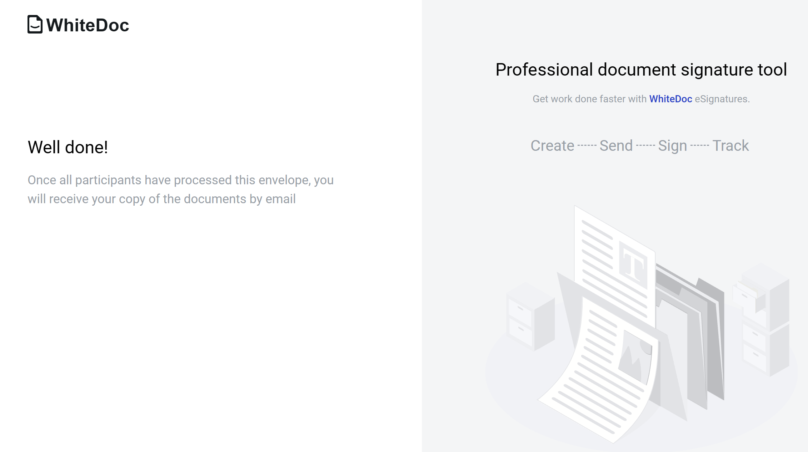

===================================
Send envelope without authorization
===================================

User is able to send envelope without authorization. To use this functionality user has to do get special link (create link as authorized user or receive link from somebody).

Flow of the initiation envelope without authorization
=====================================================

There are 2 ways to create a flow in the envelope template to generate a link for filling out the envelope:
* Specifying a particular mailbox for the role
* Using functionality - "Same as"

1 way - Specifying a particular mailbox for the role.

1. Create template with public access, filled in envelope subject and all roles except sender

2. Generate special link, which unathorised users can use
3. Follow the link without authorization
4. Fill in all required fields assigned to sender role
5. Send envelope and follow the instructions

2 way - "Same as" functionality.

This functionality allows configuring the flow without specifying particular mailboxes for roles in which actions should be performed by the same mailbox, including the Sender. 
This allows a specific user, after initiating the envelope, to complete actions for all of his roles in a single step.
A role can inherit any other role in the flow, except for the one that already inherits another role. The same role can be inherited by an unlimited number of roles.

1. Create a template with public access, filled in envelope subject
2. Set up roles in flow, except the sender

3. Generate special link, which unathorised users can use
4. Follow the link without authorization
5. Fill in all required fields assigned to the sender role and roles that inherit the sender role.
6. Send the envelope and follow the instructions

How to create share template link?
==================================

1. Create a template
2. Fill in envelope subject and fill in all roles in the flow with mailboxes or use "Same as" functionality
3. Set template access level to public

.. note:: If template uses dictionary access level of each dictionary used in template should be public or official access level.

4. Save template
5. Follow to template list
6. Open particular template menu and select option "Get link"

.. image:: pic_sendEnvelopeAsGuest/getLinkOption.png
   :width: 400
   :align: center

7. Generate new share template link

.. image:: pic_sendEnvelopeAsGuest/getLinkModal.png
   :width: 400
   :align: center

8. Copy link and send it to anybody who wants to initiate envelope with shared template

.. note:: In same window you can find Embed code - it can be used to integrate envelope creation process to 3rd party services via iframe. Please note that you can add redirect url to the embed code, this page will open in a new browser tab after envelope is sent.

You are able to revoke current link and code, just click on "Revoke link" button. This action removes possibility to create envelopes using shared template link and code. Also you are able to create new template shared link and code by click on "Generate new link". Link and code are unique every time and revoked ones can not be recovered.

How to send envelope without authorization (for guests)?
========================================================

To send envelope without authorization user has to have template shared link or embedded iframe.

1. Follow the template shared link (or to the iframe). The user observes limited functionality within the envelope.
2. Only fields assigned to the sender role can be filled. If the recipient's roles are the same as the sender, the user can simultaneously see recipient's fields as active for completion.
Fill in all required fields (button "Edit" changes to "Send")

.. image:: pic_sendEnvelopeAsGuest/simpleEnvView.png
   :width: 400
   :align: center

3. Click on "Send" button
4. Enter your email (user with this email shouldn't be active)

.. image:: pic_sendEnvelopeAsGuest/enterEmail.png
   :width: 400
   :align: center

5. Click to "Continue" button. The window for entering the code sent to the specified email address will be displayed.

.. image:: pic_sendEnvelopeAsGuest/confirmationCode.png
   :width: 400
   :align: center

6. Enter the code received at the email address and press the "Send" button.
7. If there are roles in the envelope flow that inherit from the current role, then the envelope with the functionality of the next role (Approver/Signer) will be displayed.

.. image:: pic_sendEnvelopeAsGuest/sameAsRoles.png
   :width: 400
   :align: center

8. Perform the necessary actions depending on the role and then complete (send) the envelope. 
If there are no roles in the flow that inherit from the current one, then the envelope will be sent further along the flow and success page will be displayed.

How to send envelope without authorization (for registered users)?
==================================================================

To send envelope without authorization user has to have template shared link or embedded iframe.

1. Follow the template shared link (or to the iframe).  The user observes limited functionality within the envelope.
2. Only fields assigned to the sender role can be filled. If the recipient's roles are the same as the sender, the user can simultaneously see recipient's fields as active for completion.
Fill in all required fields (button "Edit" changes to "Send")

.. image:: pic_sendEnvelopeAsGuest/simpleEnvView.png
   :width: 400
   :align: center

3. Click on "Send" button.
4. Enter your email (user with this email should be registered on platform)

.. image:: pic_sendEnvelopeAsGuest/enterEmail.png
   :width: 400
   :align: center

5. Enter valid credentials and sign in. Authorization through third-party services is also available.

.. image:: pic_sendEnvelopeAsGuest/authForm.png
   :width: 400
   :align: center

.. note:: If you are already logged in on another browser tab and have "Default mailbox"" enabled, the configured mailbox will be automatically used and the envelope will be sent after this step. 

6. If you do not have "Default mailbox" enabled, you will be prompted to choose one of your mailboxes for each role or apply mailbox to all your roles in envelope.

.. image:: pic_sendEnvelopeAsGuest/chooseMailbox.png
   :width: 400
   :align: center

7. Choose one of your mailboxes and click "Apply" button
If there are roles in the envelope flow that inherit from the current role, then the envelope with the functionality of the next role (Approver/Signer) will be displayed.

.. image:: pic_sendEnvelopeAsGuest/sameAsRoles.png
   :width: 400
   :align: center

8. Perform the necessary actions depending on the role and then complete (send) the envelope.
If there are no roles in the flow that inherit from the current one, then the envelope will be sent further along the flow and success page will be displayed.

