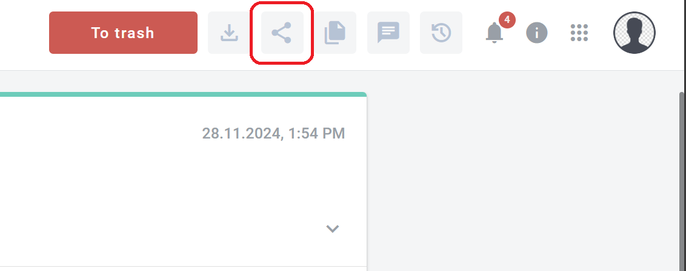
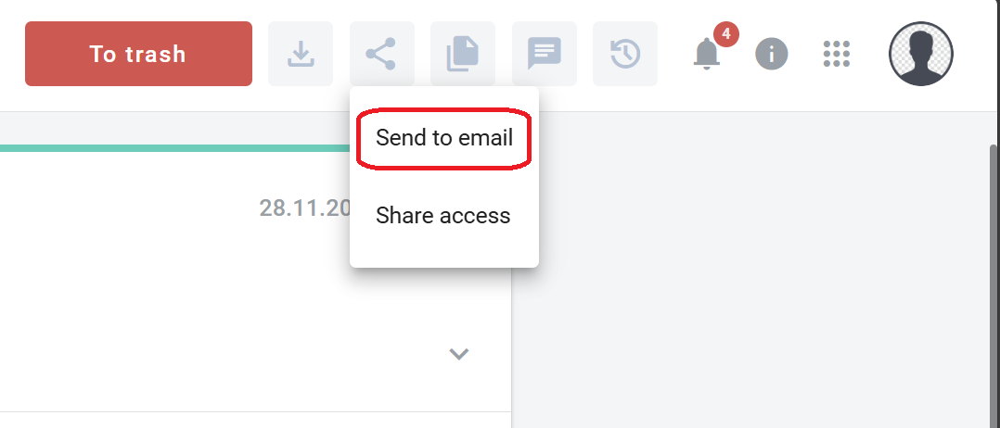
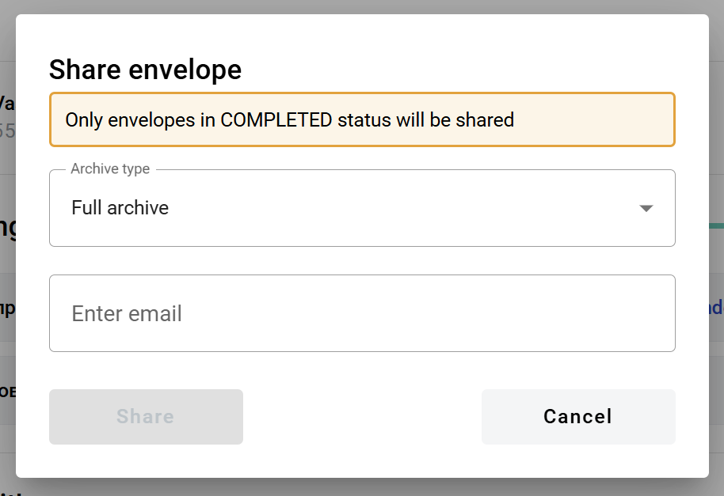
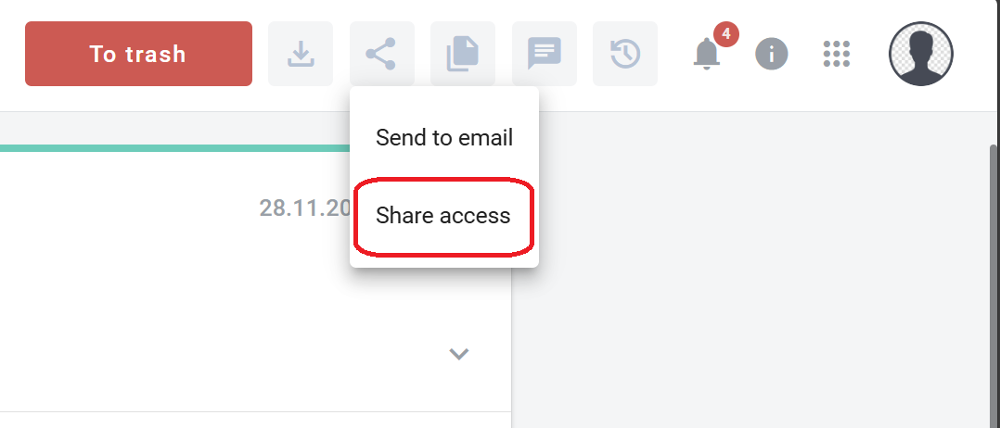
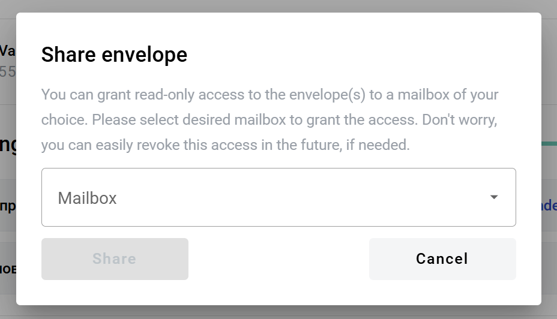

========================
Envelope sharing process
========================

Envelope sharing is a process that allows you to send envelope documents by email or share access to the envelope with other mailboxes.

How to send envelope documents by email?
========================================

1. Click the "Share envelope" button

2. Click the "Send to email" option in the dropdown menu

.. note:: Sharing envelope files by email can be restricted on the envelope or template level. This option will be disabled for such envelopes.

.. note:: Sharing envelope files by email is only available for the completed envelopes.

3. In the opened window select the type of archive, enter recipient email and confirm your action. Note that you can enter several email addresses by pressing Enter after each one

How to share envelope access with other mailboxes?
==================================================

1. Click the "Share envelope" button

2. Click the "Share access" option in the dropdown menu

3. In the opened window select a mailbox and confirm your action. Note that you can select several mailboxes

