=========================================
Envelope processing without authorization
=========================================

Our platform allows users to process envelopes without registration and perform quick envelope processing actions without needing to register immediately.

How to process a received envelope without registration?
========================================================

1. Participants have to be defined by the envelope initiator. To do that, the initiator of the envelope has to fill this role with the email address of the recipients
2. When the envelope processing flow reaches the recipient, an email with instructions is sent
3. Follow the instructions in the email and click on the "Review document" button

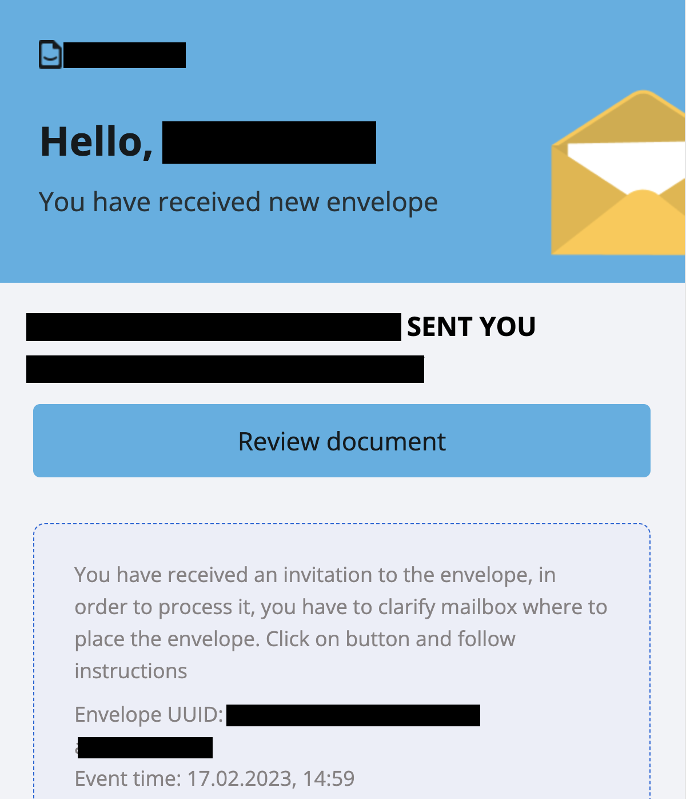

4. A window requesting to accept the Terms and Conditions and Privacy Policy will be displayed. It is mandatory to accept it for further envelope processing
5. The next step is envelope processing according to role in the flow. The assignee has to fill in the fields assigned to him. The signer has to sign documents with QES or PAdES signatures. The approver has to approve or reject the envelope. CC receives a copy and has no required actions
6. As soon as the role finishes all required actions, the "Send" button will appear. Click it to send the envelope according to the rest of the flow
7. The "Success page" with an option to authorize on the platform to watch envelopes processing will be displayed as a last step

======================================
Envelope sending without authorization
======================================

Envelopes can also be sent without authorization. This is done via an envelope initiation link created by a registered user.

How to generate an envelope initiation link?
============================================

1. Create a template
2. Fill in the envelope subject on the template level
3. Specify a mailbox or email address for all roles (except sender) on a template level

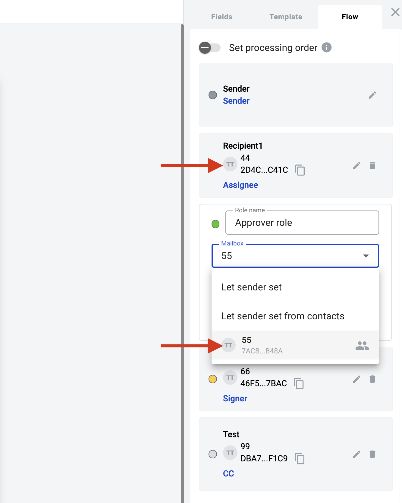

4. Note that you also can specify anu roles with the "Same as" feature instead of using a mailbox or email address

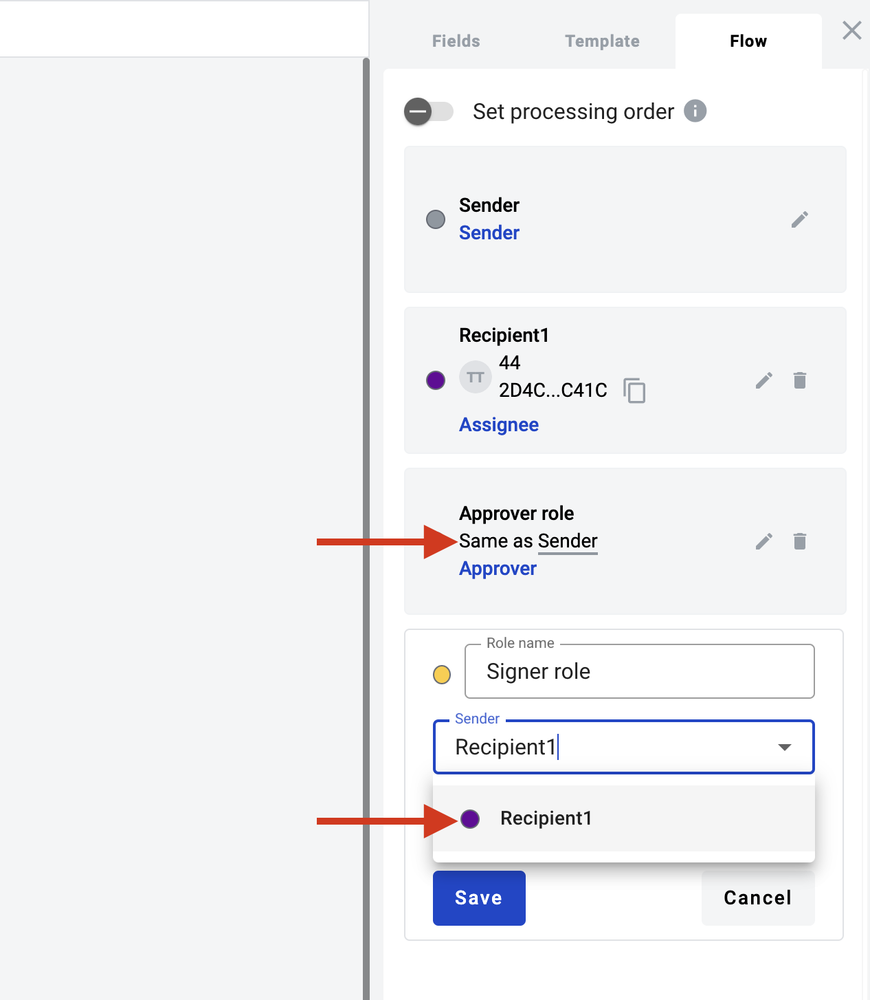

5. Set template access level to Public

.. note:: If the template uses a dictionary, the access level of each dictionary used in the template should be public or official access level.

6. Save template
7. Follow the template list
8. Open the template action menu and click on "Get link"

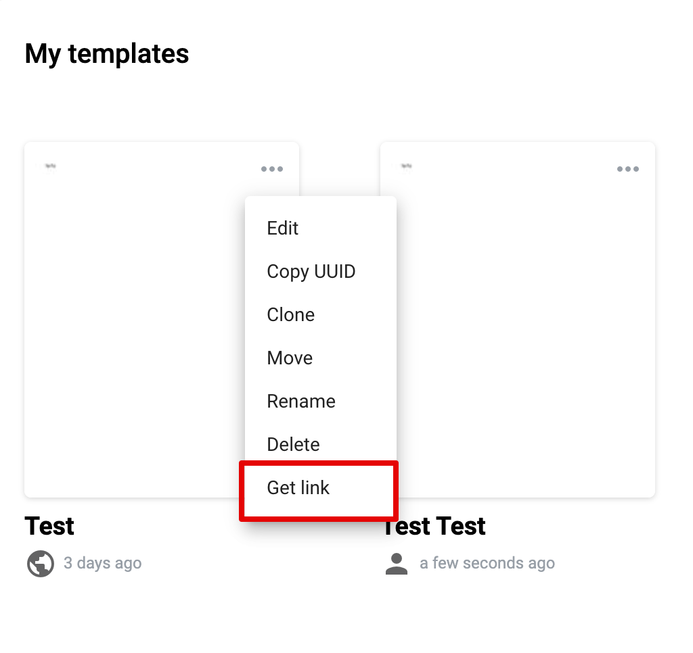

9. Generate a new envelope initiation link

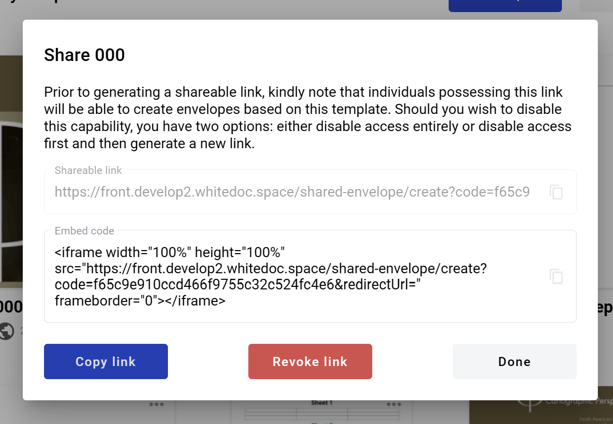

10. Copy the link and send it to a person who should initiate an envelope without authorization

.. note:: In the same window, you can find the Embed code. It can integrate the envelope creation process with third-party services via iframe. Please note that you can add a redirect URL to the embed code. This page will open in a new browser tab after sending the envelope.

11. You can revoke the current link and code by clicking the "Revoke link" button. This action disables the previously generated link. Also, you can create a new link and code by clicking on "Generate new link" (note that this revokes the previously generated link). Link and code are unique every time, and revoked ones can not be restored

How to send an envelope without registration?
=============================================

1. Follow the envelope initiation link (or to the iframe). Limited envelope processing functionality will be available there
2. Only fields assigned to the sender role can be filled. If the recipient's roles are the same as the sender's, the user can simultaneously see the recipient's fields as active. Fill in all required fields (the "Edit" button will change to "Send")

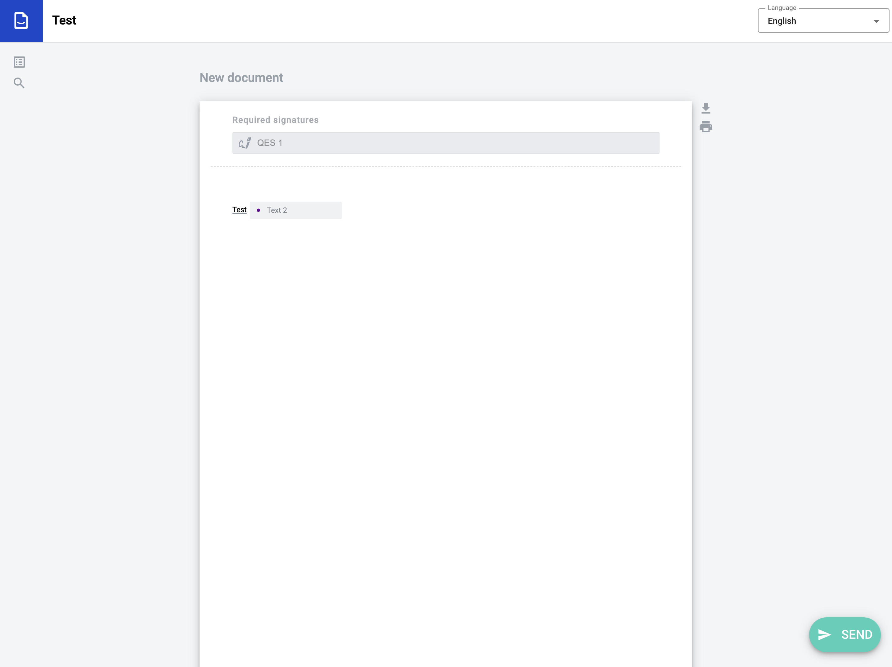

3. Click on the "Send" button
4. Enter your email (the user with this email shouldn't be registered or active)

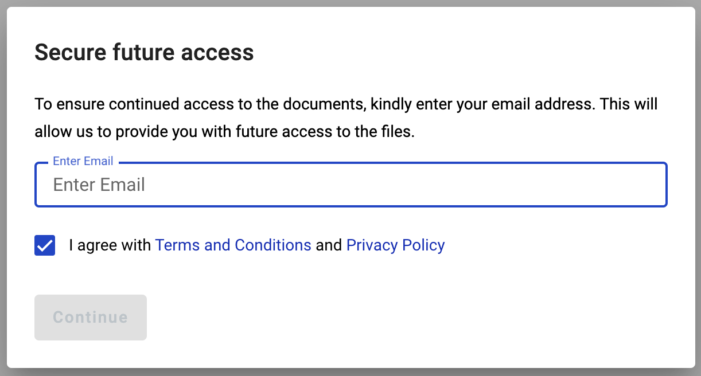

5. Click the "Continue" button. The window with the code input field will be displayed

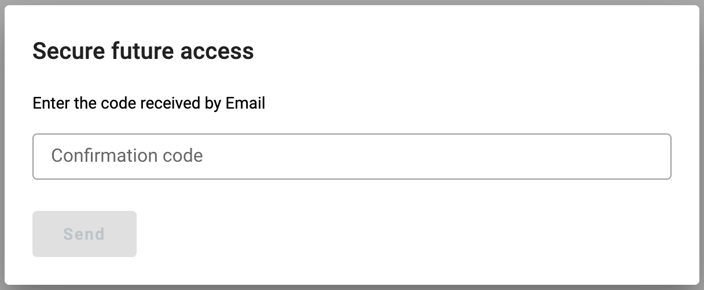

6. Enter the code received in the email and press the "Send" button
7. If the next role in the flow inherits the current one, the envelope with the functionality of the next role (Approver/Signer) will be displayed

.. image:: pic_unregisteredUserProcessing/sameAsRoles.png
   :width: 600
   :align: center

.. note:: If you do not complete all the subsequent inherited roles, you will receive an email reminder with a link to complete your envelope processing steps. Authorized users also receive the same notification if they do not finish all consequent role actions. It is important to note that all registered users with access to the mailbox will receive this notification.

8. Perform all necessary actions depending on the role and send the envelope. If there are no roles in the flow that inherit the current one, the envelope will be sent to the next flow participant, and the success page will be displayed

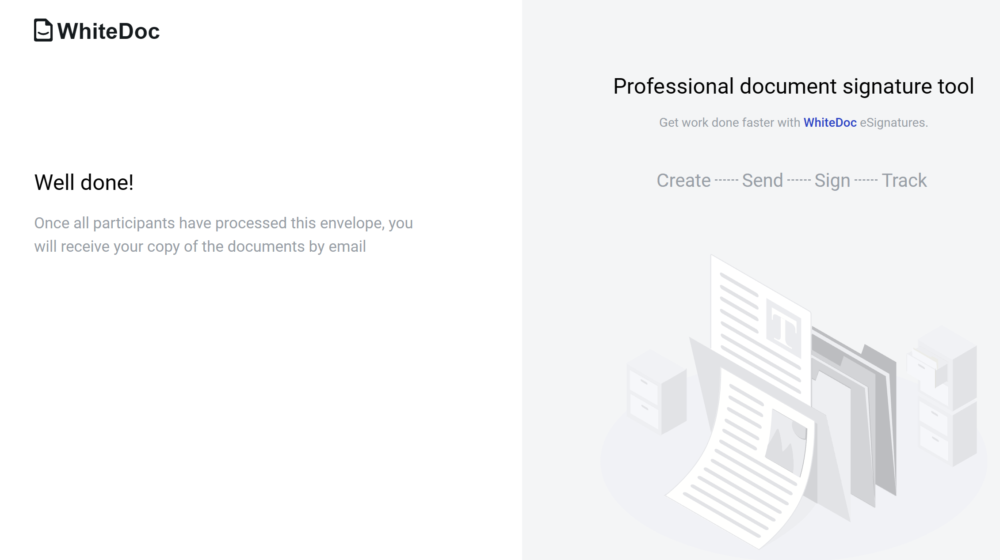

How to send an envelope without authorization as a registered user?
===================================================================

1. Follow the envelope initiation link (or to the iframe). Limited envelope processing functionality will be available there
2. Only fields assigned to the sender role can be filled. If the recipient's roles are the same as the sender's, the user can simultaneously see the recipient's fields as active. Fill in all required fields (the "Edit" button will change to "Send")

3. Click on the "Send" button
4. Enter your email (the user with this email should be registered and active)

5. Enter valid credentials and sign in. Authorization through third-party services is also available

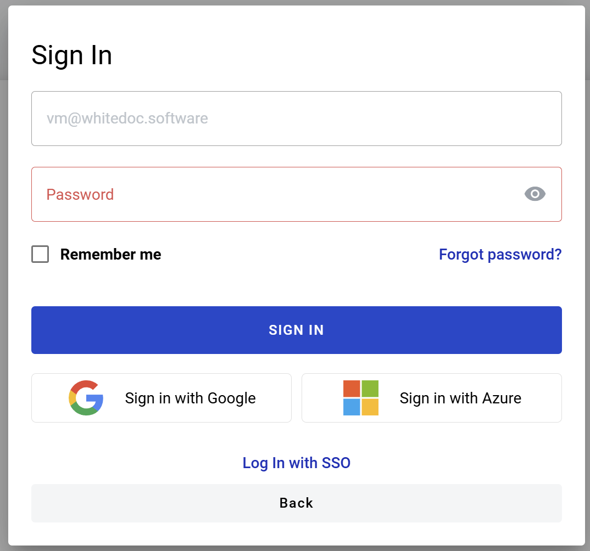

.. note:: If you are already authorized in another browser tab and have "Default mailbox" enabled, the configured mailbox will be automatically used, and the envelope will be sent after this step. 

6. If you do not have "Default mailbox" enabled, you will be prompted to choose one of your mailboxes for each role or apply mailbox to all your roles in the envelope

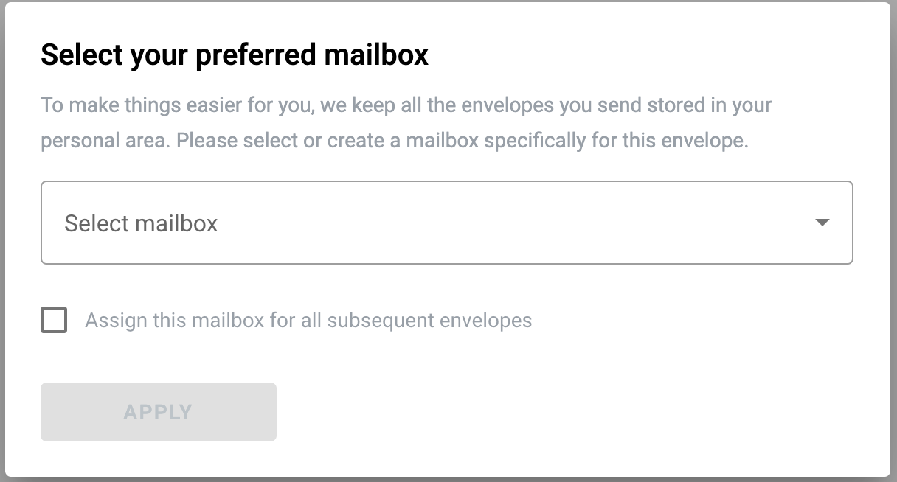

7. Choose one of your mailboxes and click the "Apply" button
8. If the next role in the flow inherits the current one, the envelope with the functionality of the next role (Approver/Signer) will be displayed

.. image:: pic_unregisteredUserProcessing/sameAsRoles.png
   :width: 600
   :align: center

.. note:: If you do not complete all the subsequent inherited roles, you will receive an email reminder with a link to complete your envelope processing steps. Authorized users also receive the same notification if they do not finish all consequent role actions. It is important to note that all registered users with access to the mailbox will receive this notification.

9. Perform all necessary actions depending on the role and send the envelope. If there are no roles in the flow that inherit the current one, the envelope will be sent to the next flow participant, and the success page will be displayed

