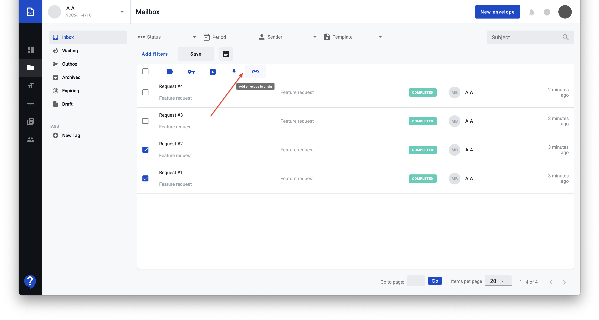
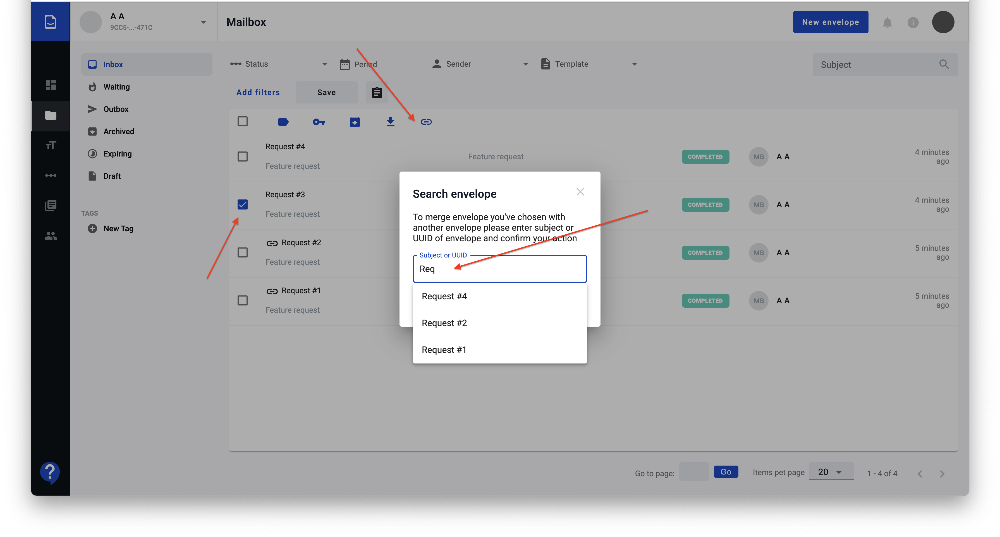
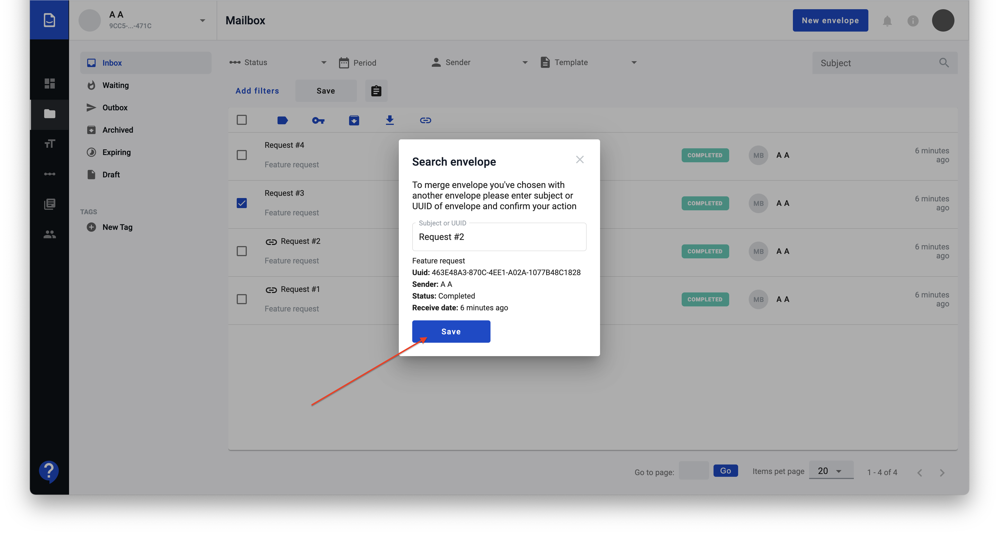
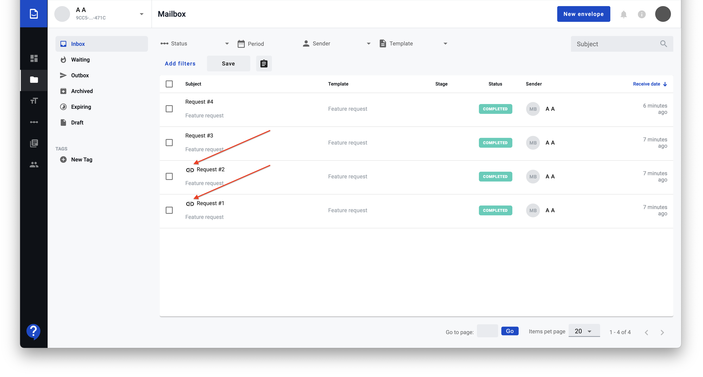
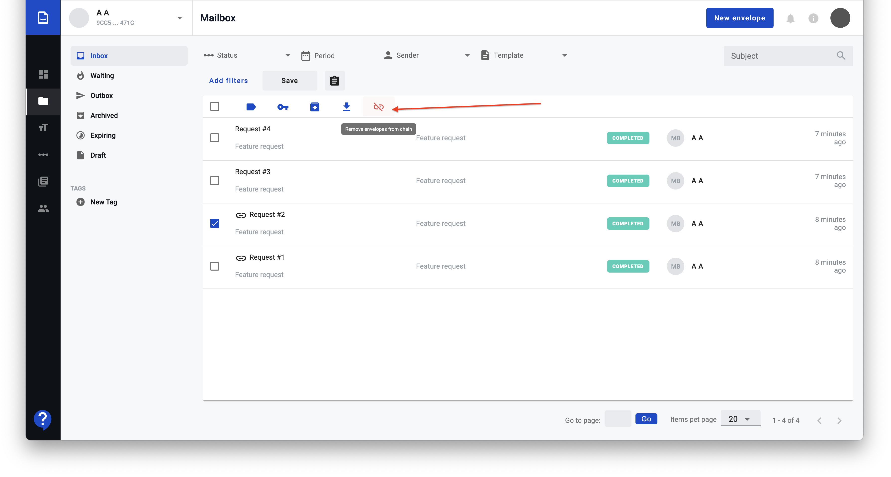
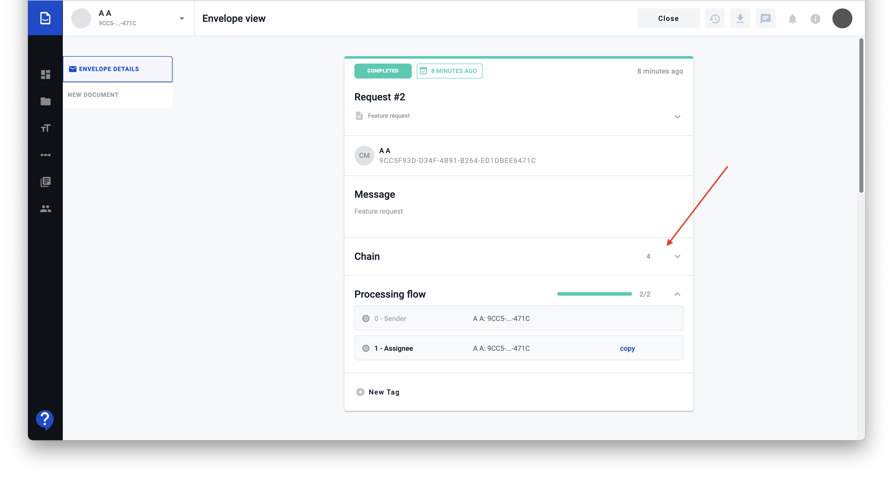
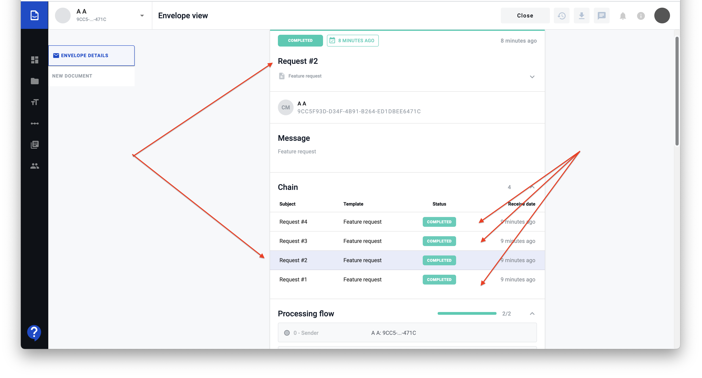
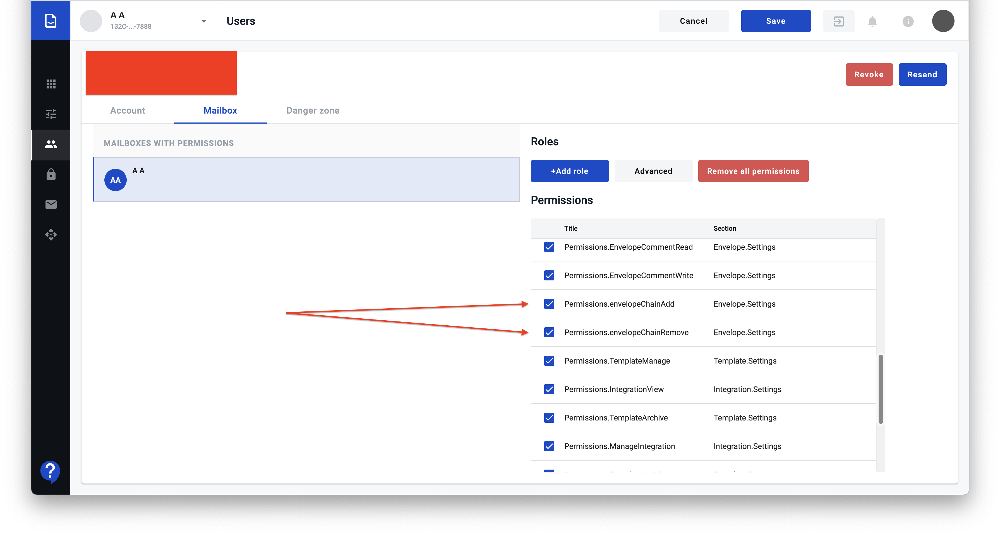

.. _envelopeChain:

===============
Envelope chains
===============

User can creat envelope chains by linking several envelopes into chain or by adding envelope to existing chain. Envelopes also can be removed from the chain. Chain contents are visible on envelope view page. Adding and removing envelope from chains requires specific permissions.

How to add an envelope to a chain?
==================================

1. Select envelopes you want to chain and press "Add to chain" button

2. In case you need to add envelope to existing chain or combine envelope which can't be filtered to be shown on one page you can select envelope and press "Add to chain" button. Combine envelopes modal window will be shown and you can search envelope you want to be chained with selected by subject or by UUID

3. After choosing right one press "Save" button

How to remove an envelopes from a chain?
========================================

1. To remove envelopes from chain select chained envelopes on envelopes list

2. and press "Remove from chain" button

How to see envelopes in a chain?
================================

1. When you open chained envelope you will see "Chain" section in the header with count of envelopes in this chain

2. In opened section you can find complete list of envelopes from this chain ordered by receive date in descending order. Current envelope highlighted with color. Click on other envelopes will open desired envelope in new tab

What permissions are required to chain envelopes?
=================================================

You can find adding to chain and removing from chain permissions on user settings page from admin section.

