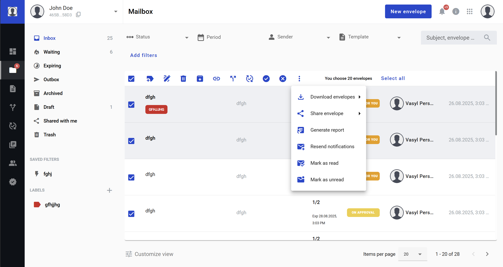
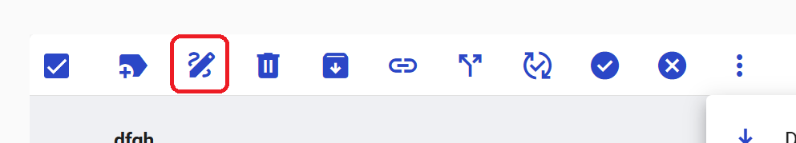
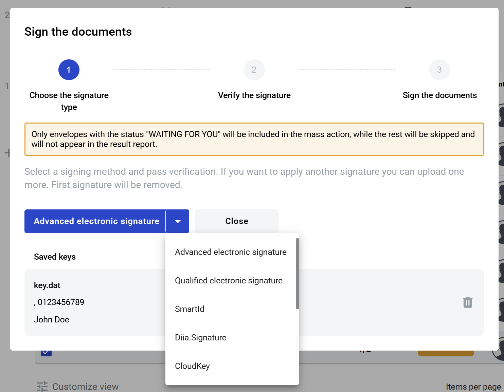
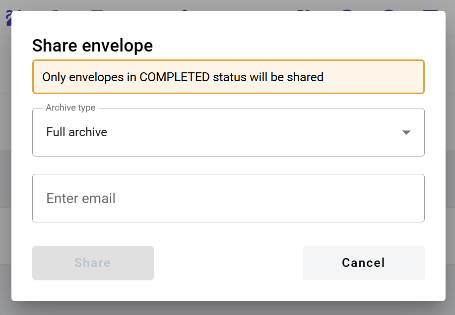
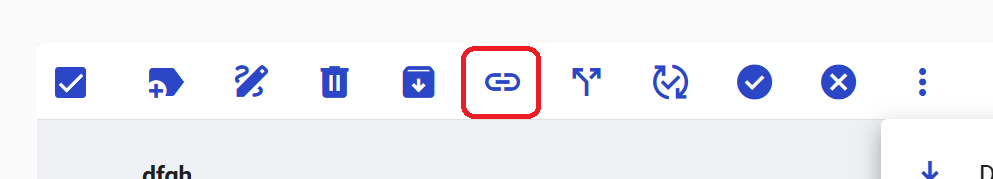
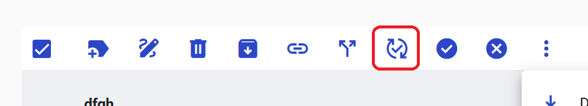
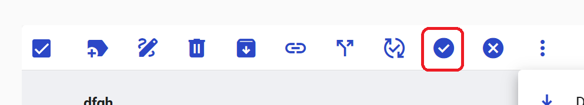

============
Mailbox page
============

Mailbox page contains envelope list divided by folders according to the envelopes statuses. It also allows you to apply next mass action to envelopes:

1. Assigning labels to envelopes *(also available in mobile version)*
2. :ref:`Signing envelopes with QES and Signature <qualifiedElectronicSignature>` 
3. Envelope deletion and restoring
4. Envelope archiving and unarchiving
5. Downloading completed envelopes *(also available in mobile version)*
6. Sharing envelopes *(also available in mobile version)*
7. Envelopes chaining and unchaining
8. Envelopes delegation *(also available in mobile version)*
9. :ref:`Adding envelopes for approval <approval>` *(also available in mobile version)*
10. Approving envelopes *(also available in mobile version)*
11. Rejecting envelopes *(also available in mobile version)*
12. Envelopes report generation
13. Envelopes notification resend

.. image:: pic_mailbox/buttons.png
   :width: 400
   :align: center

.. note:: Note for API users: if envelope scope is not defined in envelope search request, only inbox envelopes will be returned.

How to sign envelopes?
======================

You can select envelopes and sign them with specific signing method if selected envelopes contain signature fields.

1. Select required envelopes (envelopes in "Waiting for you" status are eligible for signing)
2. Click the "Sign envelopes" button

3. In the opened modal window select a signature type

4. If you have selected any type of AES signature please follow the the signing instructions from :ref:`here <electronicSignature>`
5. If you have selected any type of QES signature please follow the the signing instructions from :ref:`here <qualifiedElectronicSignature>`
6. If you have selected Simple electronic signature please follow the the signing instructions from :ref:`here <simpleElectronicSignature>` (starting from step 3)
7. Follow to third step of the signing modal window to sign all required documents
8. After a successful process you will see a modal window with the results

Next errors can occur during the mass signing process:

1. Active role is different from the Assignee
2. Envelope contains fields except signature fields for active role
3. Envelope contains signature without coordinates (signature the place of which is define by Signer instead of template owner)
4. Signature is placed in an uncompleted dynamic table (table field the assignee of which has not defined final rows quantity yet)

How to share envelopes?
=======================

You can select envelopes and share access to them with other mailboxes or send envelope archive by email.

1. Select required envelopes (envelopes in any status are eligible for sharing access with other mailboxes, envelopes in "Completed" status are eligible for sharing the documents archive)
2. Click the "Share envelopes" button

.. image:: pic_mailbox/shareButton.png
   :width: 400
   :align: center

3. From the opened menu select a sharing option

.. image:: pic_mailbox/shareMenu.png
   :width: 400
   :align: center

4. If you have selected "Send to email" option, in the opened window select the type of archive, enter recipient email and confirm your action. Note that you can enter several email addresses by pressing Enter after each one

.. note:: Sharing envelope files by email is disabled if more envelopes then shown on one page are selected due to technical constraints.

.. note:: Sharing envelope files by email can be restricted on the envelope or template level. Such envelopes will not be shared when using this option.

5. If you have selected "Share access" option, in the opened window select a mailbox and confirm your action. Note that you can select several mailboxes

.. _envelopeChain:

How to chain and unchain envelopes?
===================================

You can create envelope chains by linking several envelopes or by adding an envelope to an existing chain.

1. Select required envelopes
2. Click the "Add envelope to chain" button

3. All selected envelopes will be chained after this
4. If you need to add an envelope to existing chain or chain envelope which can't be filtered to be shown on one page, you can select this single envelope and click "Add envelope to chain" button. Modal window will be shown where and you can search for envelope you want to be chained with selected envelope by subject or UUID

.. image:: pic_mailbox/chainModal.png
   :width: 400
   :align: center

5. After selecting an envelope click the "Save" button. Two envelopes will be chained after this

6. To remove envelopes from a chain select chained envelopes from the list

7. After selecting envelopes click the "Remove envelopes from chain" button

8. To see a list of envelopes in a chain, open a chained envelope and look for the "Chain" section in the header

9. You can expand it by clicking it to see a list of envelopes in this chain ordered by receive date in a descending order. Current envelope is highlighted. Each envelope in the list can be clicked to open it

How to delegate envelopes?
==========================

You can delegate your role in envelopes to other mailbox.

.. note:: If you select more envelopes than displayed on the screen, asynchronous mass action operation will start and you will receive operation start notification in System and on Email, as well as finish operation notification in System and on Email. Finish email notification contains detailed information related processed envelopes: envelope subject, envelope UUID, envelope link, status and error message if exists

1. Select required envelopes (envelopes in "Waiting for you" status are eligible for delegation)
2. Click the "Delegate envelopes" button

3. In the opened modal window select a mailbox or enter an email of a user to whom you want to delegate envelopes

4. Confirm the modal window
5. After a successful process you will see a modal window with the results

How to add envelopes for approval?
==================================

You can request an approval of envelopes from a mailbox which does not participates in the envelope processing flow.

.. note:: If you select more envelopes than displayed on the screen asynchronous mass action operation will start and you will receive operation start notification in System and on Email, as well as operation finish notification in System and on Email. Finish email notification contains detailed information related processed envelopes: envelope subject, envelope UUID, envelope link, status and error message if exists

1. Select required envelopes (envelopes in "Waiting for you" and "Draft" statuses are eligible for adding for approval)
2. Click the "Add envelopes for approval" button

3. Following modal window will open:

4. Follow the instructions from :ref:`here <approval>`
5. After a successful process you will see a modal window with the results

How to approve envelopes?
=========================

You can complete your active approver role in envelopes.

.. note:: If you select more envelopes than displayed on the screen asynchronous mass action operation will start and you will receive operation start notification in System and on Email, as well as operation finish notification in System and on Email. Finish email notification contains detailed information related processed envelopes: envelope subject, envelope UUID, envelope link, status and error message if exists

1. Select required envelopes (envelopes in "Waiting for you" status with active approver role are eligible for approval)
2. Click the "Approve envelopes" button

3. Confirm the following modal window:

5. After a successful process you will see a modal window with the results

How to reject envelopes?
========================

You can reject envelopes if they are not completed yet.

.. note:: If you select more envelopes than displayed on the screen asynchronous mass action operation will start and you will receive operation start notification in System and on Email, as well as operation finish notification in System and on Email. Finish email notification contains detailed information related processed envelopes: envelope subject, envelope UUID, envelope link, status and error message if exists

1. Select required envelopes (envelopes in "Waiting for you" and "Pending" statuses are eligible for rejection)
2. Click the "Reject envelopes" button

3. Following modal window will open:

4. Enter a cancellation reason anc click the "Reject" button
5. After a successful process you will see a modal window with the results

How to generate an envelopes report?
====================================

You can generate a .xlsx report by envelopes.

1. Select required envelopes
2. Click the "Generate report" button

3. Confirm the following modal window:

4. Envelopes report will be sent to your email after this. Note that this can take some time depending on the number of envelopes in the report
5. Filter details is the first tab of the report. It contains the filter configuration of the envelope selection
6. Report data is the second tab of the report. It contains envelope list with details

.. note:: Note for API users: single envelope search request (POST /api/v1/envelope/search) used for mass actions is limited up to 10000 envelope UUIDs and will fail if more UUIDs are sent. Assign label, delete, archive and share mass action requests have a limit of 1000 UUIDs. The rest of mass actions have 10000 UUIDs limit in single request.