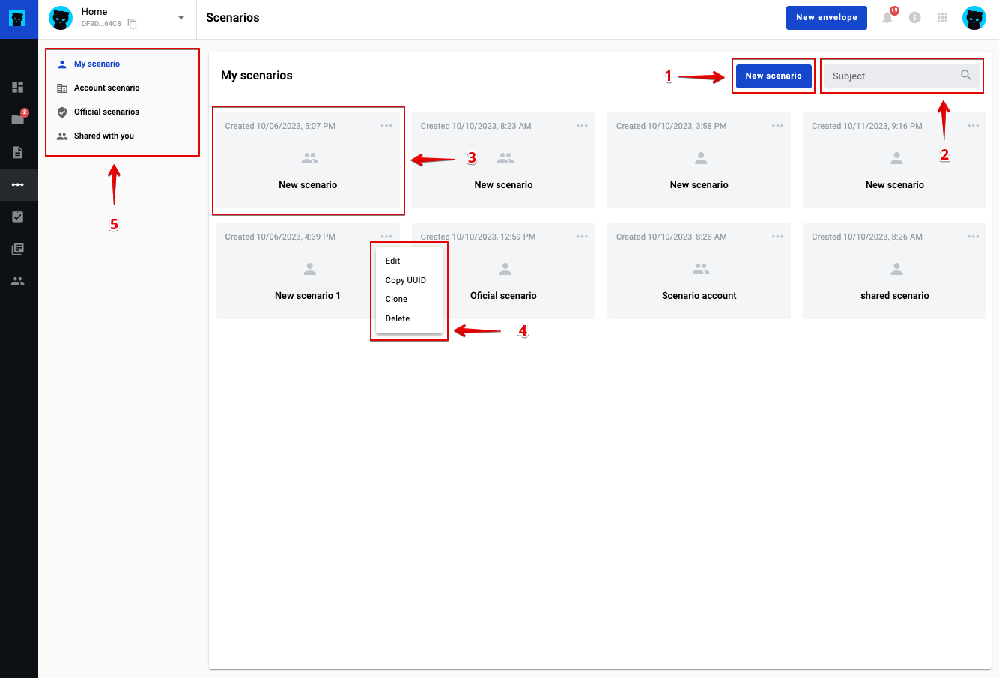

========
Scenario
========

Scenario functionality allows to create chains of the envelopes and transmit data from one envelope to antoher if needed. To manage scenario you have to follow scenario page which you can find at the left side menu with respective icon and tooltip or follow the directly. You can create, edit, clone and delete scenarios. Also you can add, edit, delete steps where specify source template, destination template, xslt conversion rule, condition rule for scenario. To create scenario you have to open scenario page and click the "New scenario" button.

Scenario list and scenario concept
==================================

1. Navigate to https://platform_address_here/scenario

2. Create new scenario button
3. Field to filter scenario list
4. Scenario list item (Run scenario when click)
5. Scenario item actions menu
6. Scenario access level menu

How to manage scenario you can find follow the :ref:`link <scenario-management>`. How to run scenario you can find follow the :ref:`link <scenario-run>`.

**Content list**

.. toctree::

    scenarioManagement/scenarioManagement.rst
    scenarioManagement/scenarioRun.rst