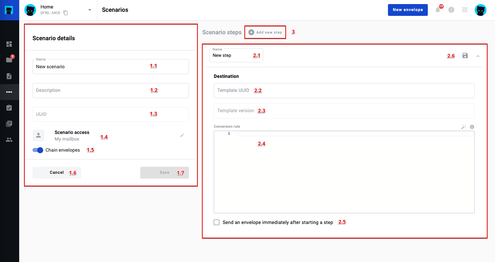
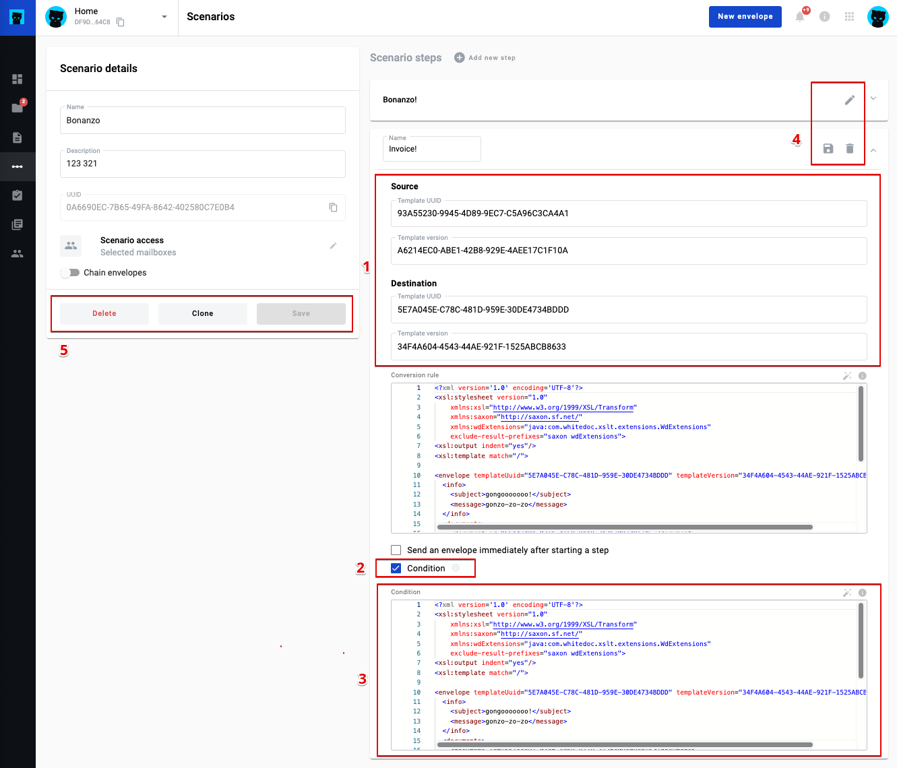

.. _scenario-management:

=======================
How to manage scenarios
=======================

Scenario includes the following information: name, description, UUID, scenario access and steps of the scenario. Steps include name, source and destination (where source and destination include template UUID and template version UUID) and conversion rule.

How to create a scenario
========================

To create scenario you have to click on button "New scenario" on the scenario list. And after that fill in required details.

.. note:: First step of the scenario does not contain source. It contains only destination.

Scenario creation form presented below:

**1 - Scenario main info form**

|    1.1 Scenario name. (required)
|    1.2 Scenario description. (required)
|    1.3 Scenario UUID (always disabled)
|    1.4 Access level select. (required)
|    1.5 Chain envelope toggle.
|    1.6 Cancel button (go to list)
|    1.7 Save button (save scenario form changes). (disabled if scenario form invalid or at least one step is not saved)

**2 - Step expanded panel with step form**

|    2.1 Scenario step name. (required)
|    2.2 Scenario destination template UUID. (required)
|    2.3 Scenario destination template version. (required)
|    2.4 Scenario step conversation rule. (required)
|    2.5 Scenario step to send immediately.
|    2.6 Scenario step save action.

**3 - Scenario step add button**  

How to configure a scenario step
================================

1. In Scenario steps form set the name of the scenario step
2. Fill the destination with template UUID and template version UUID of template you need
3. You have to enter xslt conversion rule which will create envelope after run
4. You can set checkbox "Send an envelope immediately after starting a step" if you need this action
5. Click on "Save" icon in the right top corner of the step

.. note:: The latest template version UUID automatically applies in the field after template UUID entered

To create second, third and the rest of the following steps you have to click on "+ Add new step" button near "Scenario steps" title. After that new form will appear, but you will need to fill new field "source" and may check "condition". Source it's two field with template UUID and template version UUID of the previous step of the scenario.

How to edit scenario?
=====================

1. Open scenario list
2. Click on three dots in the right corner of the scenario you need to edit
3. Click on "Edit" option from the list
4. Add your changes if needed and save scenario

**Description of the scenario edit form below**

| 1. Source and destination UUIDs
| 2. Condition for step
| 3. Condition xslt field (if condition step is checked) (required)
| 4. Step form action buttons
|     4.1 Save step button. (if edit step mode, disabled if step form invalid)
|     4.2 Delete step button. (first step cannot delete)
|     4.3 Edit step button. (if no edit step mode)
| 5. Step form action buttons
|     5.1 Delete scenario button
|     5.2 Clone scenario button
|     5.3 Save scenario button

How to edit a scenario step
===========================

If you need edit scenario step you have to click on "edit" button (pencil icon) on the scenario step you have to edit, add changes and click on "Save" button in the top right corner of the edited scenario step. After that click on "Save" scenario button.

How to clone a scenario
=======================

1. Open scenario list
2. Click on three dots in the right corner of the scenario you need to edit
3. Click on "Clone" option from the list
4. If scenario cloned successfully you will get respective message and will see cloned scenario in the list

.. note:: You can also clone a scenario using the "Clone" button inside the edit form for a specific scenario.

How to delete a scenario
========================

1. Open scenario list
2. Click on three dots in the right corner of the scenario you need to edit
3. Click on "Delete" option from the list
4. If scenario deletes successfully you will get respective message and scenario disappear from the list

You can also delete a scenario using the "Delete" button inside the edit form for a specific scenario.

What is option send envelope immediately after step run
=======================================================

If you want to send envelope after step run, mark the respective checkbox.

.. note:: To send envelope you have to fill all required fields in the envelope for Sender role and you have to set all recipient and signer mailboxes or emails in the flow

If you any required data is missed on the step (at the conversion rule) you will get an error while saving scenario.

What is condition and how to use it
===================================

On the platform presented two types of the conditions:

1. A condition based on some fields to create different branches of the script, for example, if in the certificate of completion the amount of service is more than 1000, then give the opportunity to launch one branch of the script, if more then another
2. Condition that creates several envelopes based on values in the source. But at the same time, if the value is "Yes", then create envelope(s) that respond to "Yes" value, and if the value is "No", then create envelope(s) that respond to "No" value

Condition is optional and may or may not be in the request or could be null.

**Additional logic**

If after checking the execution "condition" = false, then check the next steps, if all steps are false, then run the step in order in which condition = null. If there are no conditions, then we run the next steps with the null parameter condition and respective source value. If several steps meet the conditions, then the user in the envelope will display several buttons for starting different steps (in the rest, several steps will be received in the response).

Simple condition
================

Condition is a XSLT map which will be applied to the source envelope of the step. A simple condition has to return "true" or "false" in xml format:

.. code:: xml

    <result>
        true
    </result>

A condition XSLT example:

.. code:: xml

    <?xml version="1.0" encoding="UTF-8"?>
    <xsl:stylesheet version="1.0" xmlns:xsl="http://www.w3.org/1999/XSL/Transform">
        <xsl:template match="/">
            <result>
                <xsl:choose>
                    <xsl:when test="envelope/documents/document[@id='document_id']/field[@name='field_name'] &gt; 0">
                        true
                    </xsl:when>
                    <xsl:otherwise>
                        false
                    </xsl:otherwise>
                </xsl:choose>
            </result>
        </xsl:template>
    </xsl:stylesheet>

One to Many condition
=====================

This type of condition can be applied ONLY to a table inside a document. Condition has to return "true" or "false" for every row in the table in the following format:

.. code:: xml

    <result>
      <rows>
        <row index='0'>true<row>
        <row index='1'>false<row>
        <row index='2'>false<row>
        <row index='3'>true<row>
      </rows>
    </result>

Index attribute has to match index attribute in "fieldset" node. A condition XSLT example:

.. code:: xml

    <?xml version="1.0" encoding="UTF-8"?>
    <xsl:stylesheet version="1.0" xmlns:xsl="http://www.w3.org/1999/XSL/Transform">
        <xsl:template match="/">
            <result>
                <rows>
                    <xsl:for-each select="envelope/documents/document[@id='document_id']/fieldgroup[@name='table_name']/fieldset">
                        <row index="{@index}">
                            <xsl:choose>
                                <xsl:when test="field[@name='field_name']='Yes'">
                                  true
                                </xsl:when>
                                <xsl:otherwise>
                                    false
                                </xsl:otherwise>
                            </xsl:choose>
                        </row>
                    </xsl:for-each>
                </rows>
            </result>
        </xsl:template>
    </xsl:stylesheet>

For every row where result = "true" a new envelope will be created. To provide "xslt" map with a proper row index, this map has to be modified accordingly. The following parameter has to be added:

.. code:: xml

    <xsl:param name="row_index"/>

And it can be used in following way:

.. code:: xml

    <field name="field_name">
        <xsl:value-of select="envelope/documents/document[@id='document_id']/fieldgroup[@name='table_name']/
            fieldset[@index=$row_index]/field[@name='field_name']/@value"/>
    </field>

Attachment re-use
=================

You can re-use attachments uploaded on previous step of scenario. To do that you need to get attachment UUID from source envelope and set it in respective attachment in target envelope.

.. note:: You can not use one attachment with same UUID more than one time in the envelope. Attachment re-use functionality allowed only for envelopes created through scenario functionality

**Source envelope**

Imagine that source envelope looks like example below

.. code:: xml

    <envelope templateUuid="bd6c94c9-715f-4611-bcb0-cc4114cff83d" templateVersion="bd6c94c9-715f-4611-bcb0-cc4114cff83d">
	    <info>
		    <subject>envelope subject</subject>
		    <message/>
		    <forwarding delegation="true" sharing="true"/>
	    </info>
	    <flow>
		    <roles>
			    <role id="e1bcbffa-aed6-4022-baef-40dee2da8cef" mailboxUuid="8dcde243-a918-444a-ac7d-44ac88554769"/>
			    <role id="bc749581-1685-4650-8e91-f2c7187d7223" mailboxUuid="8dcde243-a918-444a-ac7d-44ac88554769"/>
		    </roles>
	    </flow>
        <documents>
		    <document id="aa620e04-852b-4ae4-85d4-833f5fdfc79f">
			    <field name="File 1" attachmentUuid="5c03bf5e-b2f3-44bb-b313-eb432830189d">zipFileName.zip</field>
		    </document>
		    <document id="fc246044-bfa5-4224-8329-7656280ac45c">
			    <field name="b70d61fa-4805-4e7b-9561-aa1f4f5c653f" attachmentUuid="e3760a4e-4c7b-4323-aa7b-60a4351ba8ef">pdfFileName.pdf</field>
		    </document>
	    </documents>
    </envelope>

**Target conversion rule example**

To re-use envelope attachments from source you can use one of the following constructions below

.. code:: xml

    <?xml version="1.0" encoding="UTF-8"?>
    <xsl:stylesheet version="1.0" xmlns:xsl="http://www.w3.org/1999/XSL/Transform">
        <xsl:template match="/">
            ...
            <field name="File 1">
                <xsl:attribute name="attachmentUuid" select="envelope/documents/document/field[@name='b70d61fa-4805-4e7b-9561-aa1f4f5c653f']/@attachmentUuid"/>
            </field>
            ...
        </xsl:template>
    </xsl:stylesheet>

OR

.. code:: xml

    <?xml version="1.0" encoding="UTF-8"?>
    <xsl:stylesheet version="1.0" xmlns:xsl="http://www.w3.org/1999/XSL/Transform">
        <xsl:template match="/">
            ...
			<xsl:variable name="att1Uuid" select="envelope/documents/document/field[@name='b70d61fa-4805-4e7b-9561-aa1f4f5c653f']/@attachmentUuid"/>
            <field name="File 1" attachmentUuid="{$att1Uuid}"></field>
            ...
        </xsl:template>
    </xsl:stylesheet>

.. run-scenario-from-integration:

Run scenario from integration
=============================

Customer is able to run specific scenario through integration functionality. As soon as customer creates scenario, it possible to run through integration, to do that customer should define scenario UUID inside envelope XML in integration rule.

.. note:: Integration data has highest priority and will replace all scenario data if it's defined in integration rule

Defined scenario UUID should be inside <envelope> tag as attribute scenarioUuid="uuidOfScenario"

.. code:: xml

    <?xml version="1.0" encoding="UTF-8"?>
    <xsl:stylesheet version="1.0" xmlns:xsl="http://www.w3.org/1999/XSL/Transform">
        <xsl:template match="/">
            <envelope templateUuid="19089ab8-a828-4447-9129-44b1da1cbc9d" templateVersion="f2e1a1c5-15ac-4bfb-bf31-f1ddba652b89" scenarioUuid="e17db760-580a-4192-bc96-a91683123bea">
	            ...
            </envelope>
        </xsl:template>
    </xsl:stylesheet>

.. note:: You may run scenario from any step you want through integration. System automatically define first step which match template and version and create envelope using data you've provided in integration rule.
