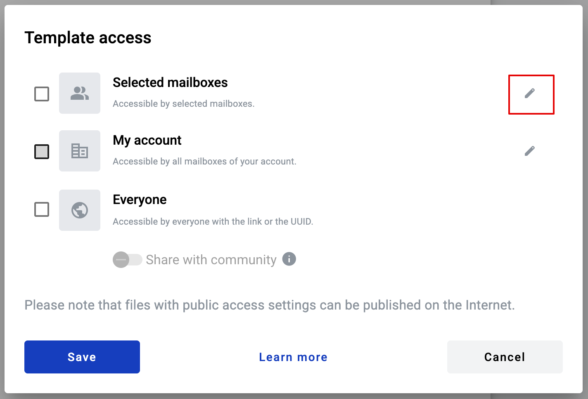
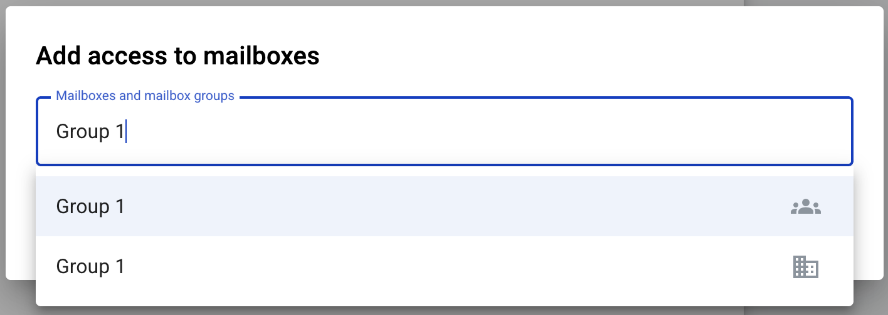
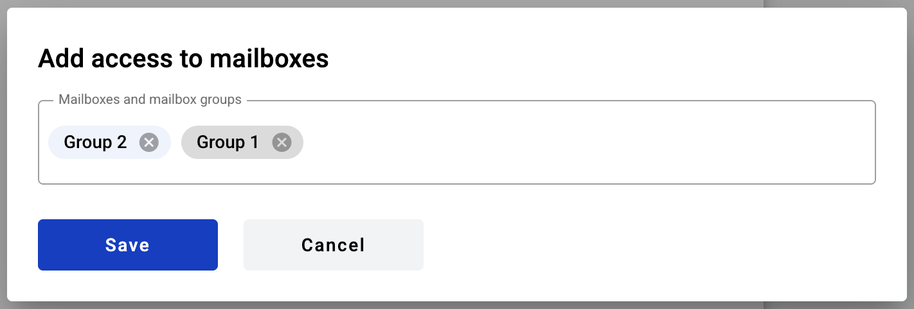
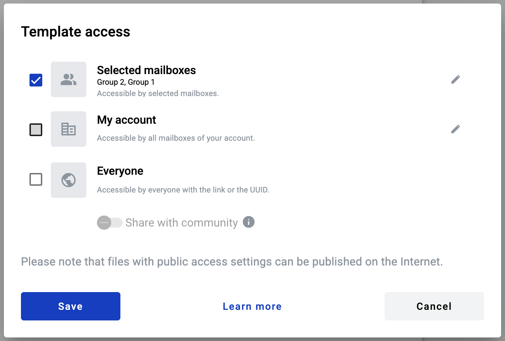
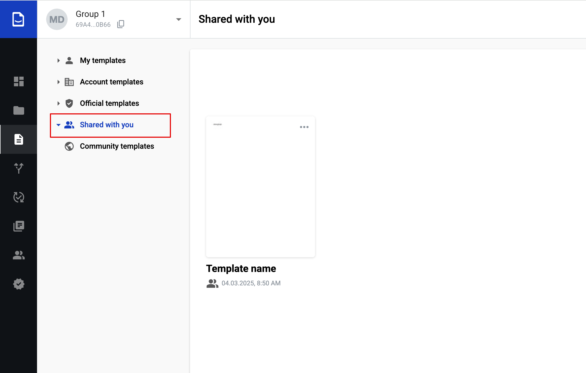
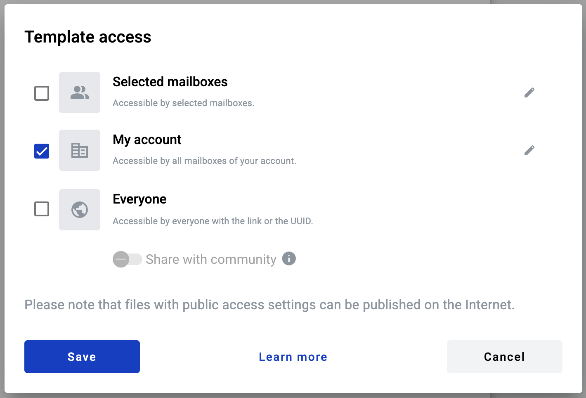

.. _templateAccessLevel:

===============
Template access
===============

User can specify access level of the template when creating or editing it. There are four types of access on the platform:

- access for your mailbox only
- access for selected mailboxes (Selected mailboxes)
- access for all mailboxes in your account (My account)
- access for everyone on the platform (Everyone)

How to share template with mailbox or mailboxes group
=====================================================

1. In order to set access level of template you need to go to "Template" tab and click the "Template access"

.. image:: picTemplateAccess/templateAccess1.png
   :width: 400
   :align: center

2. You can grant access to specific mailboxes or mailboxes groups. To choose this option you need to click the edit button

3. In the modal window you can enter mailbox name, mailbox UUID, alias, contact name, mailboxes group name or group UUID.

.. note:: Search results are displaying in the following order: 1. Groups and 2. Mailboxes. In Search results displays max 10 Groups and 10 Mailboxes. If expected results are not displaying you need to do more precise query.

4. When mailbox or group is added you'll observe chips list with groups and mailboxes. To save share configuration click "Save" as soon as you add required mailboxes and group.

.. note:: Group chips are listed first (with a blue background), and Mailbox chips go after them (with a grey background).

5. Save сhanges

6. After saving the template it will be available for mailboxes and for mailboxes included into the groups specified by you in the folder "Shared with me"

   
How to share a template with mailboxes within the account
=========================================================

1. You can grant access to this template for all mailboxes within your account. To do this, set the checkbox next to the "My Account" option

.. note:: Templates shared with "My Account" access level will be available for all mailboxes within the account to be viewed and used for envelope creation, but only the user with the access to the mailbox used for the template creation will be able to edit or delete it. If user has access to several mailboxes within the account, including the mailbox that created the template, he will be automatically switched to that mailbox when editing such template.

How to share a template with everyone
=====================================

1. You can grant access to the template to all users of the platform.
2. If you set the checkbox next to "Everyone", users will only be able to access this template via a direct link or by knowing its UUID

3. If you set the checkbox next to "Everyone" and also enable the "Share with community" toggle, users who are part of this community will have access to the template. They will be able to find it by name, by UUID, or via a direct link.

.. image:: picTemplateAccess/templateAccess9.png
   :width: 400
   :align: center

.. note:: Public templates can be made accessible to users not registered on the platform via direct link. To generate this link first you need to make sure that such template includes only public dictionaries (or no dictionaries at all). Also such templates should have subject field filled and all participants of the flow should have specified mailbox adresses in the flow configuration tab. When this is done, click the template menu button in upper right corner of template on template list and click "Get link". Menu with sharing link will open where you can copy this link, generate new one to revoke access by previous link or remove access by link completely. Account on the platform will be created automatically for anyone who will create an envelope using such link.

Additional sharing access configurations
========================================

At the bottom of the template tab of envelope menu you can find "Do not send files by email" attribute

   
If you will enable it and save the template, all envelopes created from it will not contain any files from the envelope in notification emails. Also such envelopes can not be shared with other mailboxes. If set on template level, it's impossible to change it on envelope level later.