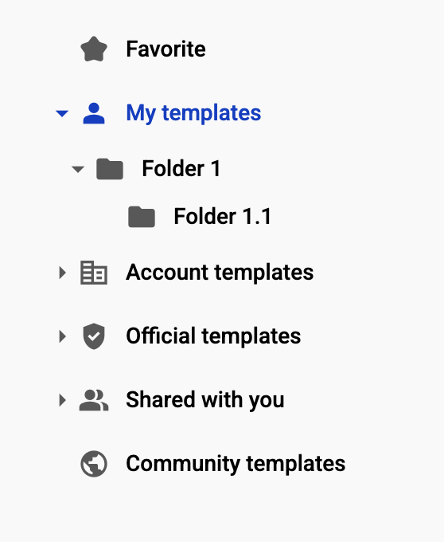
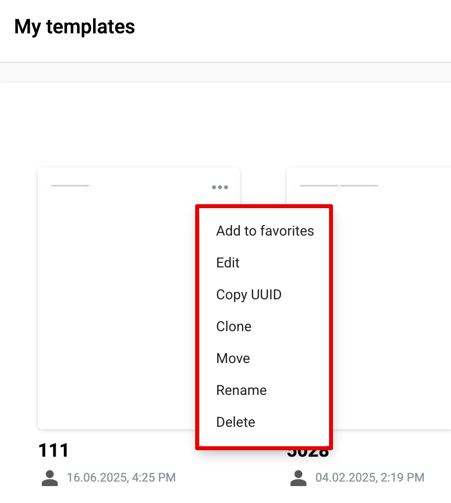

==================
Template list page
==================

What is a template list page
============================

Template list page is the library of the templates created by mailboxes. 

1. When navigating to the templates page, the "My Templates" category of the current mailbox will be opened by default. The page will display all existing templates as well as folders (if any exist within this category)


2. In addition, there are five other categories accessible via the menu on the left side of the page. Each category allows users to create folders and subfolders, which are displayed in an expandable tree structure



* The "Favorites" category displays all templates that were marked as favorite using the star icon or via the action menu on the template list.
* In the "Account templates" category, all templates with "Account" access level will be displayed
* In the "Official templates" category, all templates with "Official" access level will be displayed.
* In the "Shared with you" category, all templates that have been explicitly shared with the current mailbox will be displayed.
* In the "Community templates" category, it is possible to find templates with "Public" access via search.

3. Each folder can be renamed, deleted, or moved to any other existing folder or to a newly created folder


How template looks like
=======================

Template is the rectangle tile on the template list page with template name, access level, and creation date below the tile. Each template has a preview for better user experience when searching or choosing a template to use. A star icon is also available on each template tile, allowing the user to add or remove the template from the Favorite category. 
There are two types of template preview available:

1. Default image of the template. If template contains only external documents inside system can't use them as preview, so in this case preview of template would be default icon of template


2. First page of the document. A template that contains at least one structured document or a PDF file will display a preview. The system uses the first page of the first structured document or the attached PDF in the template as the preview


3. Custom image of the template. User is able to upload custom image for template preview. How to do that described in :ref:`respective section <templatePropertyTemplate>`

4. Each template has its own menu that allows the following actions:
- Add to favorites / Remove from favorites
- Edit the template
- Copy the template UUID
- Clone the template
- Move the template to another category/folder
- Rename the template
- Delete the template
- Get a direct link to the template (under specific template settings)



How to find a template
======================

1. The template search functions within each category separately. Templates can be searched by either their name or UUID. If you're looking for a specific template you created in your mailbox, you should perform the search within the "My templates" category. This applies to all other categories as well


2. To find a template with the "Public" access level, navigate to the "Community templates" category

.. note:: Please note that, depending on the template's access settings, it may be found by name, by UUID, or only by UUID. You can read more about template access settings :ref:`here <templateAccessLevel>`.


On template list you can create templates, clone, update and delete existing templates.

Templates view options
======================

The Templates page supports two view options: Grid and List.

* Grid view is the default on desktop and tablet devices.
* List view is the default on mobile devices.

To switch between views, click the Grid/List toggle button.
Once you change the view mode, your preference overrides the default setting and applies across all devices.

* To switch to list view click the icon "List view"


* To switch to grid view click the icon "Grid view"


.. note:: Icon changes automatically depends on current view.

Both views provide identical functionality and allow users to manage folders and templates, provided they have the necessary permissions.

Main elements of the Grid view
``````````````````````````````


1. **Folders block** - Represents a folder item in the Templates page. Folders are displayed first in the list. Clicking a folder tile opens the selected folder

  * **Folder icon** - Indicates that the item is a folder (1.1)
  * **Folder name** - The name of the folder (1.2)
  * **Folder properties** - Provides actions available for the folder: Move, Rename, and Delete (1.3)

2. **Template block** - Represents an individual template item. Clicking a template preview opens the Envelope Creation page

  * **Template properties** - Contains available actions: Edit, Copy UUID, Add/Remove from Favorites, Clone, Move, Rename, Delete, and Get Link (if configured) (2.1)
  * **Template preview** - Clicking opens the Envelope Creation page (2.2)
  * **Add to favorites icon** - Toggles whether the template is added to or removed from Favorites (2.3)
  * **Template name** - Displays the name of the template (2.4)
  * **Template creation date** - Shows the date when the template was created (2.5)
  * **Template access level icon** - Indicates the access level of the template (2.6)


Main elements of the List view
``````````````````````````````


1. **Folders block** - Represents a folder item in the Templates list. Folders are displayed first. Clicking a folder row opens the selected folder

  * **Folder icon** - Indicates that the item is a folder (1.1)
  * **Folder name** - The name of the folder (1.2)
  * **Folder description** - Shows the folder’s description, if provided (1.3)
  * **Folder creation date** - Shows the date when the folder was created (1.4)
  * **Folder access level** - Indicates the access level of the folder (1.5)
  * **Folder properties** - Provides actions available for the folder: Move, Rename, and Delete (1.6)

2. **Template block** - Represents a template item in the Templates list. Clicking a template row opens the Envelope Creation page

  * **Template icon** - Indicates that the item is a template (2.1)
  * **Template name** - Displays the name of the template (2.2)
  * **Template description** - Shows the template’s description, if provided (2.3)
  * **Template creation date** - Shows the date when the template was created (2.4)
  * **Template access level icon** - Indicates the access level of the template (2.5)
  * **Template edit icon** - Opens the Template Edit form (2.6)
  * **Add to favorites icon** - Adds or removes the template from Favorites (2.7)
  * **Template properties** Contains available actions: Edit, Copy UUID, Add/Remove from Favorites, Clone, Move, Rename, Delete, and Get Link (if configured) (2.8)
