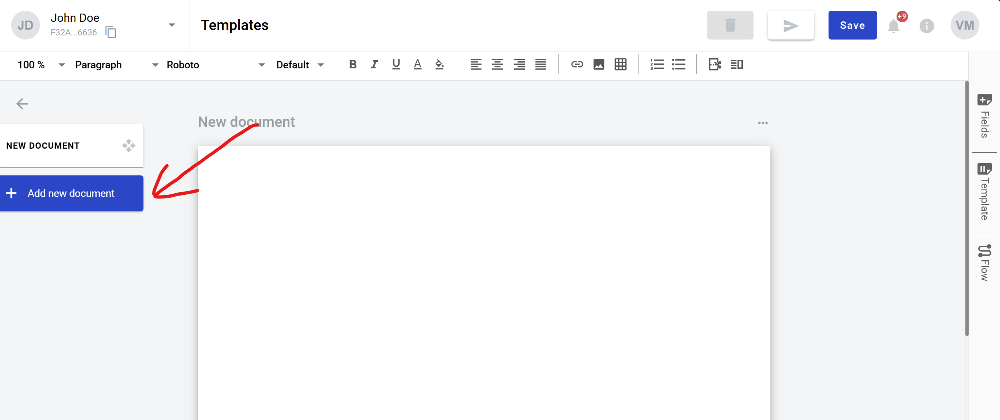
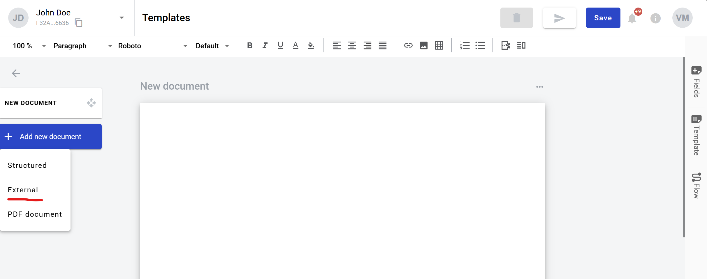

=================
External document
=================

What is an external document
============================

It is an external file upload form in the envelope created from template. It can be signed with QES or simple electronic signatures by envelope processing flow participants.

.. note:: Please note that maximum amount of external and PDF documents together per envelope is limited to 50 by default system configuration.

How to add an external document to template
===========================================

1. Click on the "Add new document" button on the left side (menu with it can be collapsed depending on your monitor resolution, just expand it by clicking "Documents" icon)

2. Click on "External" button. After this document will appear under default first structured document (assigned to Sender by default)

3. In the template editor you can edit document properties, such as role, optionality or allowed file extensions:

* All - .pdf, .doc, .docx, .xls, .xlsx, .xlsm, .xml, .dbf, .txt, .rtf, .csv, .xps, .eml, .msg, .emlx, .rpmsg, .png, .jpg, .jpeg, .tiff, .tif, .zip, .7z, .rar
* File - .pdf, .doc, .docx, .xls, .xlsx, .xlsm, .xml, .dbf, .txt, .rtf, .csv, .xps, .eml, .msg, .emlx, .rpmsg
* PDF document - .pdf
* Image - .png, .jpg, .jpeg, .tiff, .tif
* Archive - .zip, .7z, .rar

4. You also can add QES and Signature fields to such document

How to clone an external document
=================================

1. Click "More" button in the right upper corner of the document
2. Click "Clone" button in the menu

How to delete an external document
==================================

1. Click "More" button in the right upper corner of the document
2. Click "Delete" button in the menu