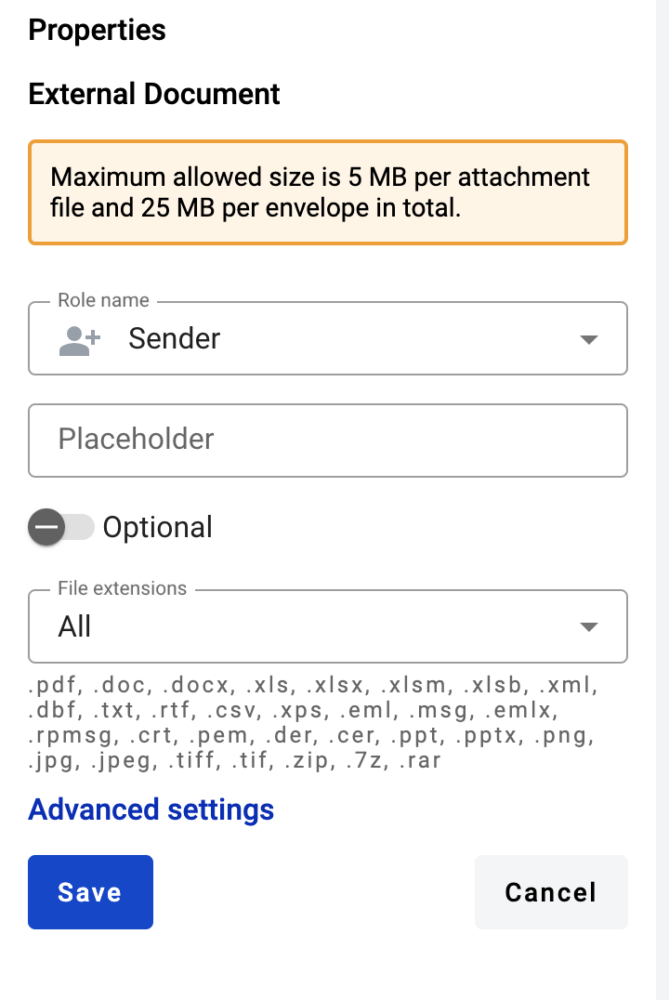
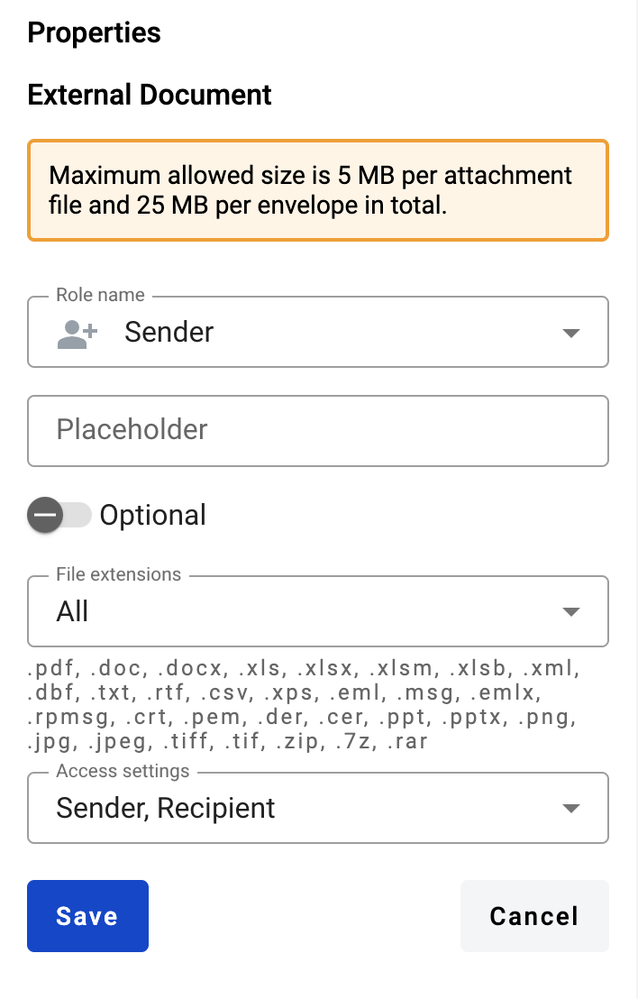
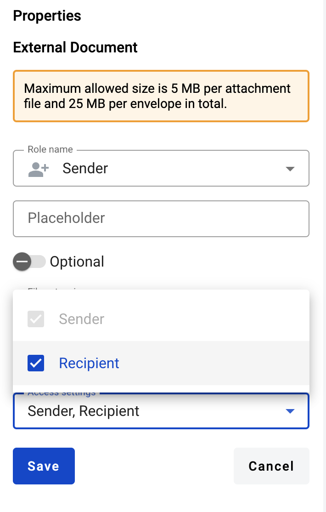
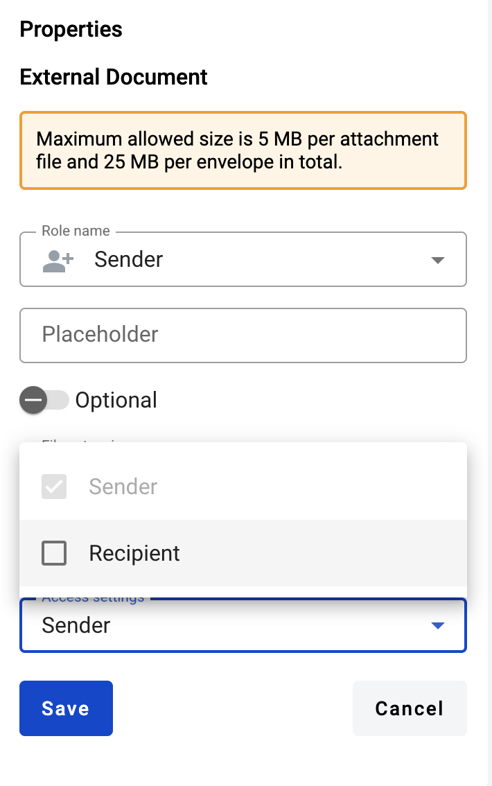
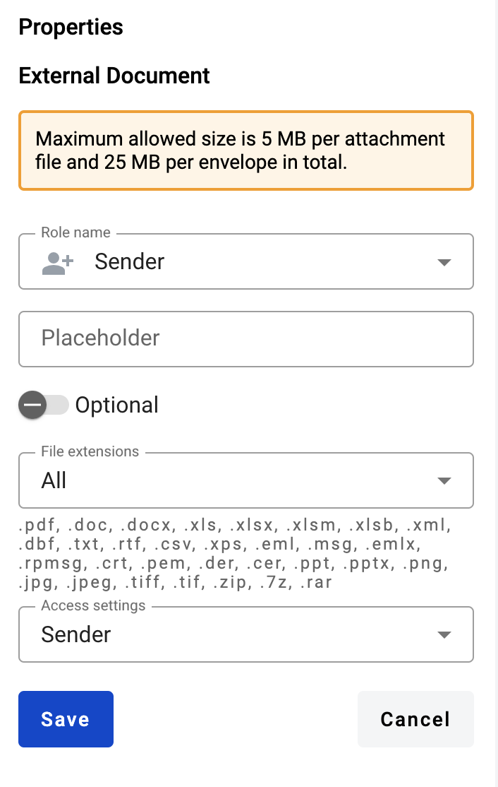

==================
External documents
==================

What is an external document
============================

It is an external file upload form in the envelope created from template. It can be signed with QES or simple electronic signatures by envelope processing flow participants.

.. note:: Please note that the maximum number of external and PDF documents per envelope is limited to 50 by the default system configuration.

.. _addExternalDocumentToTemplate:

How to add an external document to a template
=============================================

1. Click the "Add new document" button on the left side (menu with it can be collapsed depending on your monitor resolution, just expand it by clicking "Documents" icon)

.. image:: pic_externalDocument/newDocument.png
   :width: 600
   :align: center

2. Click the "External" button. After this document will appear under default first structured document (assigned to Sender by default)

.. image:: pic_externalDocument/external.png
   :width: 600
   :align: center

3. In the template editor you can edit document properties, such as role, optionality or allowed file extensions:

* All: .pdf, .doc, .docx, .xls, .xlsx, .xlsm, .xlsb, .xml, .dbf, .txt, .rtf, .csv, .xps, .eml, .msg, .emlx, .rpmsg, .crt, .pem, .der, .cer, .ppt, .pptx, .png, .jpg, .jpeg, .tiff, .tif, .zip, .7z, .rar, .asice
* File: .pdf, .doc, .docx, .xls, .xlsx, .xlsm, .xlsb, .xml, .dbf, .txt, .rtf, .csv, .xps, .eml, .msg, .emlx, .rpmsg, .crt, .pem, .der, .cer, .ppt, .pptx
* Document: .pdf
* Image: .png, .jpg, .jpeg, .tiff, .tif
* Archive: .zip, .7z, .rar, .asice

4. You also can add QES and Signature fields to such document

How to clone an external document
=================================

1. Click "More" button in the right upper corner of the document
2. Click "Clone" button in the menu

How to delete an external document
==================================

1. Click "More" button in the right upper corner of the document
2. Click "Delete" button in the menu

.. _documentAccessRestriction:

How to configure document viewing restrictions by role
======================================================

.. note:: Role that uploads documents to the envelope can not be restricted from viewing the document. Roles which has fields such as QES or signatures can not be restricted from viewing the document.

1. Add an external document to the template (:ref:`How to add external document to template<addExternalDocumentToTemplate>`)
2. Click the document to open its properties

3. Click "Advanced settings"

4. Click the role selector

5. Remove the selected checkboxes from the roles you want to restrict access

6. Save the changes by clicking "Save" button in the "Properties" of the external document

