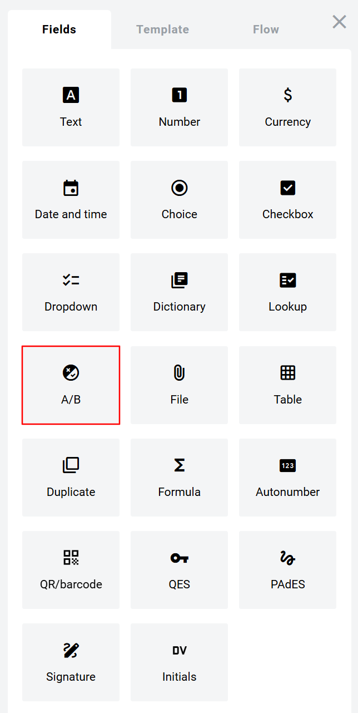
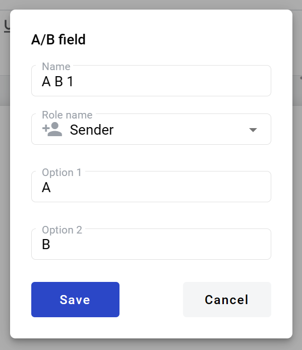
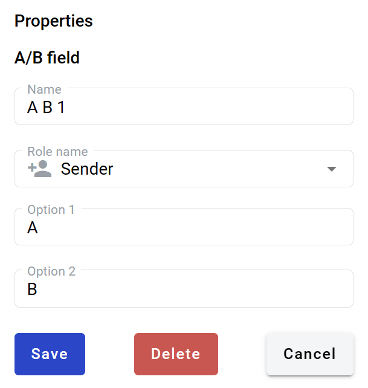

=========
A/B field
=========

This field allows you to create a selection from two predefined values. You can customize default "A" and "B" options. It looks like a button with two options. After selection it will change to regular text of selected value.

.. hint:: This field can be added to structured and PDF documents.

How to add A/B field to the document
====================================

1. To add field to the document, use one of field adding methods with field icon in the Fields tab of template editor menu

2. Field creation form will appear, where you should set field attributes

3. Name - this is a name of a field
4. Role name - this is a role which will be assgined to fill this field
5. Option 1 - first option available for selection
6. Option 2 - second option available for selection

When all attributes are set, you can click Save button and field will be added. You can click field to see its properties and update them. Also you can delete the field in same menu.

