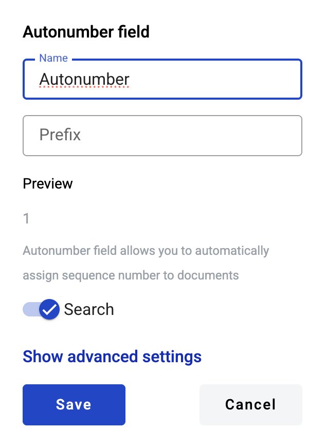
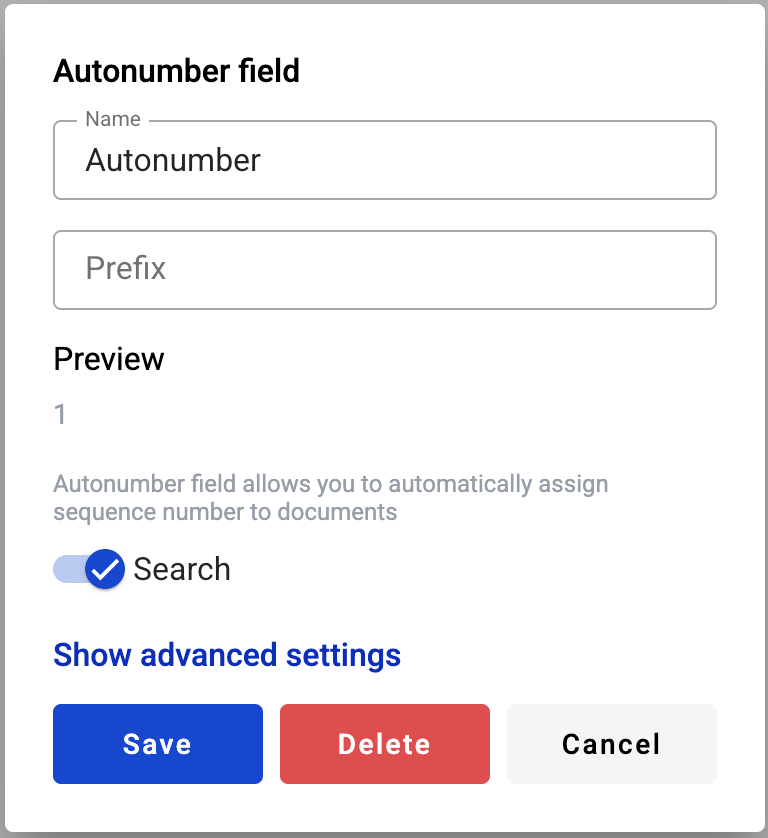

================
Autonumber field
================

This field allows you to create an automatic counter of envelopes created from a template.

.. hint:: This field can be added to structured and PDF documents.

How to add an autonumber field to the document?
===============================================

1. To add field to the document, use one of field adding methods with field icon in the Fields tab of template editor menu

2. Field creation form will appear, where you should set field attributes

3. Name - this is a name of a field
4. Prefix - this attribute indicates a string value which will be appended to the number
5. Search - this attribute specifies if this field should be eligible for mailbox page search

This field also includes additional attributes, which you can access by clicking the "Show advanced settings" button.

6. Tooltip - enables adding a custom tooltip that will be displayed for active fields in the envelope. If left blank, the default tooltip is shown

This field also includes additional attributes, which you can access by clicking the "Show advanced settings" button.

When all attributes are set, you can click the "Save" button and the field will be added. You can click the field to view or update its properties, and also delete it in the same menu.

Please note that the "Show advanced settings" option is available only while no additional attributes have been added to the field.
Once at least one additional attribute is added — either during creation or later in edit mode — this option will no longer appear, and all available attributes will be displayed for editing instead.

