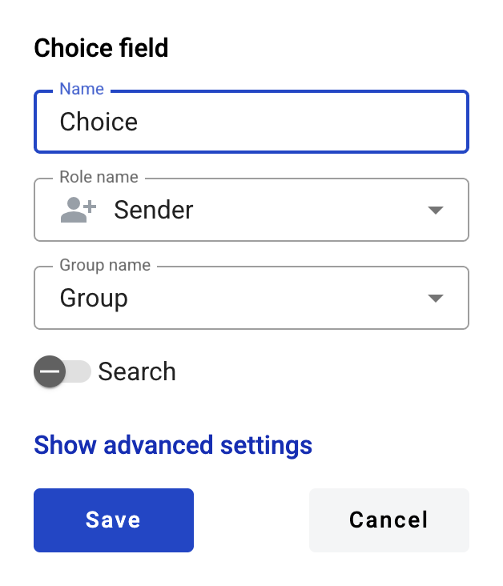
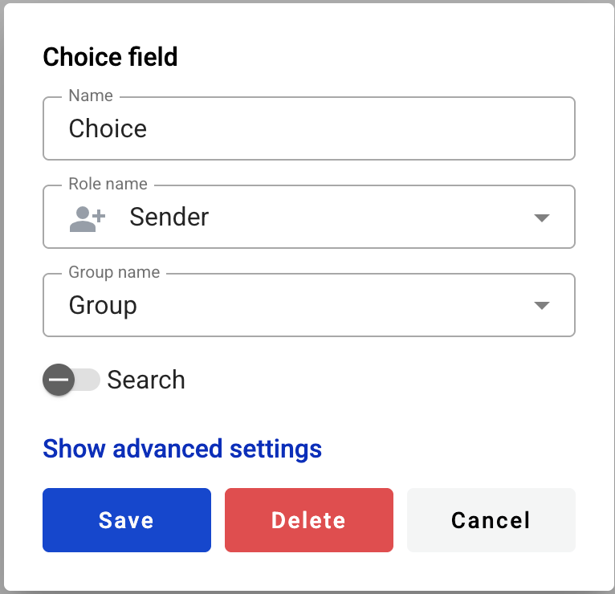

============
Choice field
============

This field allows you to create radio button selector from several predefined values.

.. hint:: This field can be added to structured and PDF documents.

How to add choice field to the document
=======================================

1. To add field to the document, use one of field adding methods with field icon in the Fields tab of template editor menu

.. image:: pic_choice/choiceIcon.png
   :width: 600
   :align: center

2. Field creation form will appear, where you should set field attributes

3. Name - this is a name of a value available for selection from a group (Group name)
4. Role name - this is a role which will be assgined to fill this field
5. Group name - this is a name of a group of values which has some options (Names) available for selection

.. note:: If filtering by role is enabled

6. Search - this attribute specifies if this field should be eligible for mailbox page search

When all attributes are set, you can click Save button and field will be added. You can click field to see its properties and update them. Also you can delete the field in same menu.

