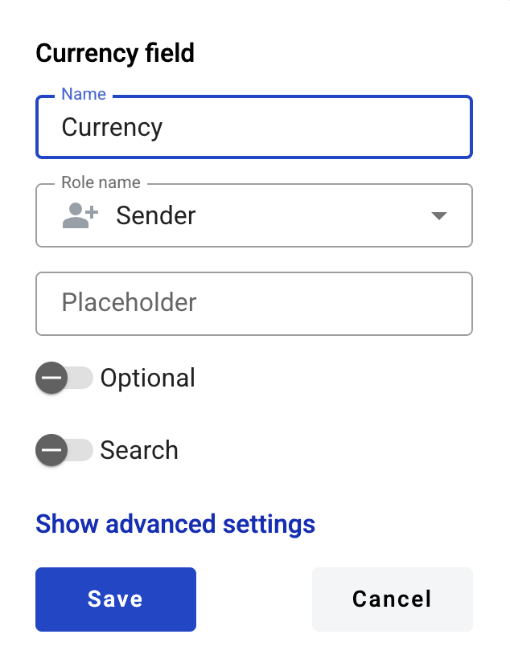
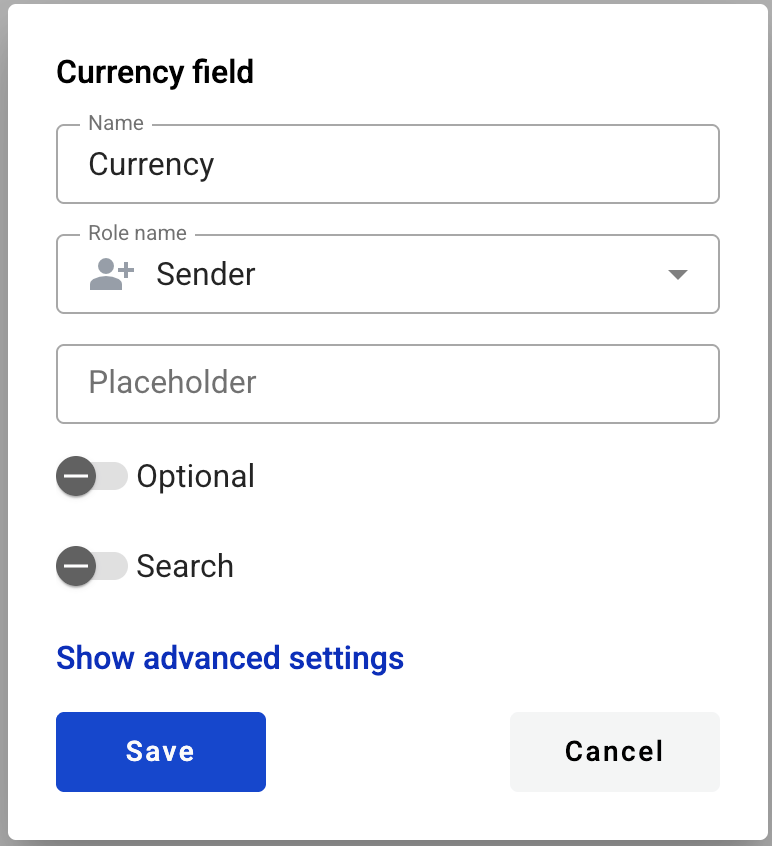

==============
Currency field
==============

This field allows you to create dynamic input box which will be filled by participants of the envelope processing flow.

.. hint:: This field can be added to structured and PDF documents.

How to add a currency field to the document?
============================================

1. To add field to the document, use one of field adding methods with field icon in the Fields tab of template editor menu

2. Field creation form will appear, where you should set field attributes

3. Name - this is a name of a field
4. Role name - this is a role that will be assigned to fill this field
5. Placeholder - this text will be shown inside the field before it is filled in (can be left empty; field`s name will be used instead)
6. Optional - this attribute specifies if this field is mandatory to fill
7. Search - this attribute specifies if this field should be eligible for mailbox page search

This field also includes additional attributes, which you can access by clicking the "Show advanced settings" button.

8. Tooltip - enables adding a custom tooltip that will be displayed for active fields in the envelope. If left blank, the default tooltip is shown
9. Adapt to the local format - this attribute specifies if numbers will be formatted according to regional standard

.. note:: Numbers in envelope view will be formatted according to standard of a region which is selected on User profile page. You can see formatting example under region selector on that page. Numbers in printable versions of the documents will always be formatted according to platform region standard.

10. Min - minimal value allowed in field (no limit is applied if left empty)
11. Max - maximal value allowed in field (no limit is applied if left empty)

.. warning:: Maximum allowed character count for currency field is 15 (according to `IEEE 754 <https://en.wikipedia.org/wiki/IEEE_754>`_). Please note this includes decimal places. This means that if you insert a value 999999999999999 or more characters, it will be converted to 9999999999999.00.

When all attributes are set, you can click the "Save" button and the field will be added. You can click the field to view or update its properties, and also delete it in the same menu.

Please note that the "Show advanced settings" option is available only while no additional attributes have been added to the field.
Once at least one additional attribute is added — either during creation or later in edit mode — this option will no longer appear, and all available attributes will be displayed for editing instead.

