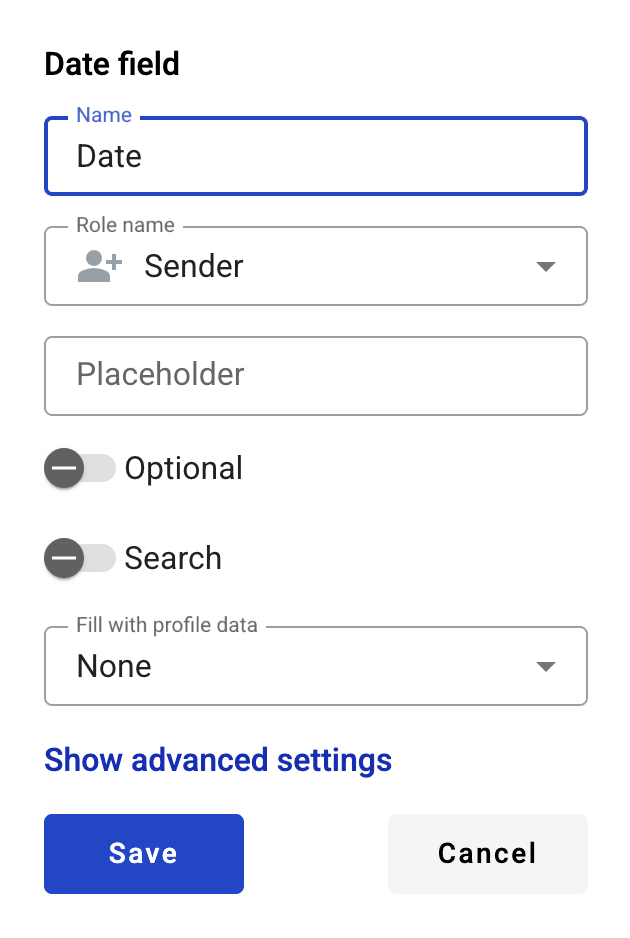

==========
Date field
==========

This field allows you to create calendar selector which will be filled by participants of the envelope processing flow.

.. hint:: This field can be added to structured and PDF documents.

How to add a date field to the document?
========================================

1. To add field to the document, use one of field adding methods with field icon in the Fields tab of template editor menu

2. Field creation form will appear, where you should set field attributes

3. Name - this is a name of a field
4. Role name - this is a role which will be assgined to fill this field
5. Placeholder - this text will be shown inside the field before it is filled in (can be left empty; field`s name will be used instead)
6. Optional - this attribute specifies if this field is mandatory to fill
7. Search - this attribute specifies if this field should be eligible for mailbox page search
8. Fill with profile data - this attribute specifies if this field should be filled with user profile data. If you will select any available option in this field, the according user profile data will be automatically filled in this field when the envelope is opened by the user (but it will still be possible to edit it with any allowed custom value)

.. hint:: Please note that if Fill with profile data is selected - Min and Max attributes will be applied to this field automatically according to the selected Profile data value if they were not provided manually after the template is saved.

This field also includes additional attributes, which you can access by clicking the "Show advanced settings" button.

9. Tooltip — enables adding a custom tooltip that will be displayed for active fields in the envelope. If left blank, the default tooltip is shown.
10. Time - this attribute specifies if time selector will be added to calendar
11. Min - minimal timestamp accepted by field (no limit is applied if left empty)
12. Max - maximal timestamp accepted by field (no limit is applied if left empty)

.. note:: Min and max fields only accept integers. They specify boundary dates offset in days. E.g. if min is 0 and max is 1, date interval from today to tomorrow will be available. If min is -1 and max is 0 then range from yesterday to today will be available. If min and max are both same, then only specified day will be available.

When all attributes are set, you can click Save button and field will be added. You can click field to see its properties and update them. Also you can delete the field in same menu.
Please note that the “Show advanced settings” option is available only when you add a field. In edit mode, all existing attributes of the field are displayed.

