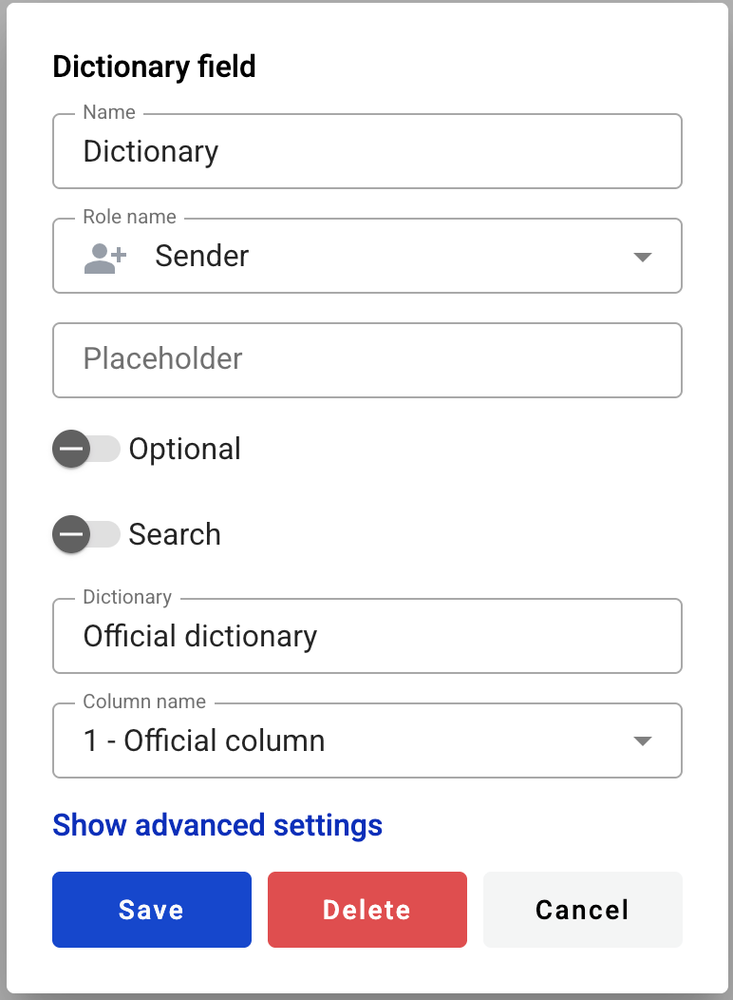

================
Dictionary field
================

This field allows you to create dropdown menu selector of records from dictionary (table), e.g. list of employees (First name, last name, age, address).

.. hint:: This field can be added to structured and PDF documents.

How to add a dictionary field to the document?
==============================================

1. To add field to the document, use one of field adding methods with field icon in the Fields tab of template editor menu

2. Field creation form will appear, where you should set field attributes

.. image:: pic_dictionary/dictionaryCreate.png
   :width: 600
   :align: center

3. Name - this is a name of a field
4. Role name - this is a role which will be assigned to fill this field
5. Placeholder - this text will be shown inside the field before it is filled in (can be left empty; field`s name will be used instead)
6. Optional - this attribute specifies if this field is mandatory to fill
7. Search - this attribute specifies if this field should be eligible for mailbox page search
8. Dictionary - input for desired dictionary selection. Start typing dictionary name and available dictionaries list will appear
9. Column name (appears after dictionary is selected) - dropdown selector of a desired column
10. Filtering (icon in dictionary name field) - opens filtered access options menu. Appears only if filtered access is allowed for selected dictionary

11. Column name - name of a column in a dictionary which will be used for filtering

.. note:: Value from this column will be used to find a matching row in a column selected in dictionary during envelope processing flow.

12. Filter by role mailbox - this attribute specifies if filtering should be applied by role (if enabled) or by field value (if disabled)
13. Field name (changes to role name if previous attribute is enabled) - field which will be used to specify a row by value from column selected in column name (13)

.. note:: If filtering by role is enabled and field becomes role name selector, it selects a role mailbox UUID of which will be used to find a matching row in dictionary. In this case, column with mailbox UUIDs should be selected in column name (13) field for matching.

This field also includes additional attributes, which you can access by clicking the "Show advanced settings" button.

14. Tooltip - enables adding a custom tooltip that will be displayed for active fields in the envelope. If left blank, the default tooltip is shown
15. Allow custom values - this attribute specifies if field will allow free text input besides selection from predefined values

When all attributes are set, you can click the "Save" button and the field will be added. You can click the field to view or update its properties, and also delete it in the same menu.

Please note that the "Show advanced settings" option is available only while no additional attributes have been added to the field.
Once at least one additional attribute is added — either during creation or later in edit mode — this option will no longer appear, and all available attributes will be displayed for editing instead.

.. hint:: If this field contains a link in the envelope, it will be rendered a standard link in the browser (blue font with an underline). You can follow this link from the right-click context menu (any role) or directly click it (only if the field is inactive).