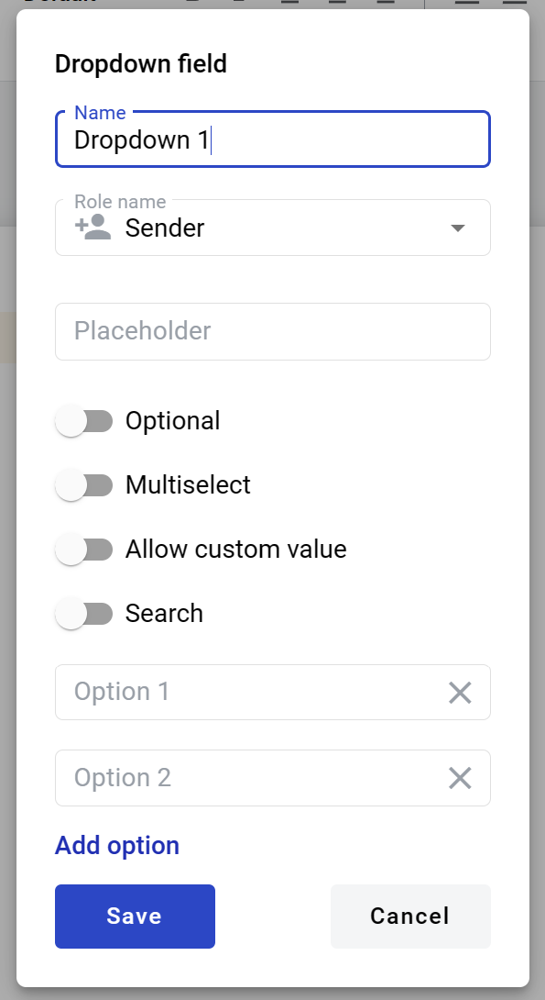
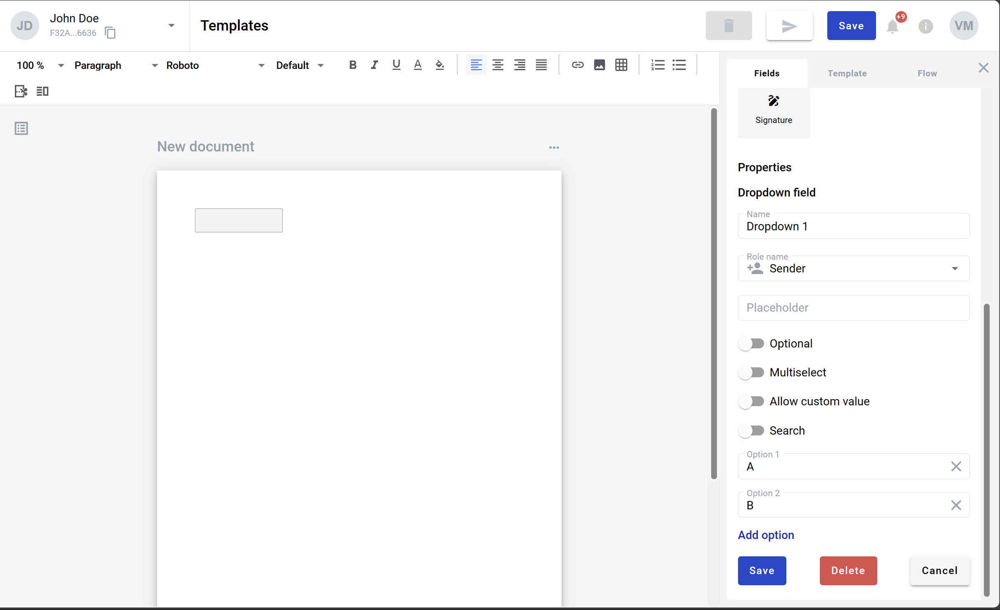

==============
Dropdown field
==============

Dropdown is a field which allows you to create a selection from several predefined values. You can customize default option values. Minimum of 1 option is required, up to 100 options per dropdown are allowed. It looks like a dropdown menu in the envelope. After selection it will change to regular text of selected value.

How to add dropdown field to the document
=========================================

1. To add field to the document, use one of field adding methods with field icon in the Fields tab of template editor menu

.. image:: pic_dropdown/dropdownIcon.png
   :width: 600
   :align: center

2. Field creation form will appear, where you should set field attributes

3. Name - this is a name of a field
4. Role name - this is a role which will be assgined to fill this field
5. Placeholder - this text will be shown in the input box before anything is filled in (can be left empty, field name will be used instead)
6. Optional - this attribute specifies if this field is mandatory to fill
7. Multiselect - this attribute specifies if multiple values can be selected (can not be enabled together with Allow custom value attribute)
8. Allow custom values - this attribute specifies if field will allow free text input besides selection from predefined values (can not be enabled together with Multiselect attribute)
9. Search - this attribute specifies if this field should be eligible for mailbox page search
10. Option 1, 2, etc. - option available for selection. Can be deleted with 'X' button. Note that at least 1 option is mandatory and options can not be blank (min 1 max 50 characters per option)
11. Add option - allows to add new options. 100 options max are allowed per field 

When all attributes are set, you can click Save button and field will be added. You can click field to see its properties and update them. Also you can delete the field in same menu.

