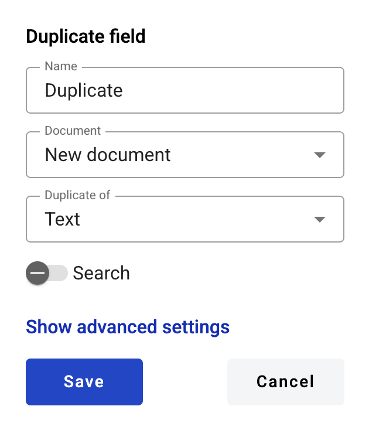

===============
Duplicate field
===============

This field allows you to create a static duplicate of other field. Please note that it will not be possible to delete parent field of a duplicate untill the duplicate field is removed.

.. hint:: This field can be added to structured and PDF documents.

How to add a duplicate field to the document?
=============================================

1. To add field to the document, use one of field adding methods with field icon in the Fields tab of template editor menu

2. Field creation form will appear, where you should set field attributes

3. Name - this is a name of a field
4. Document - document where parent field is placed
5. Duplicate of - field which will be duplicated
6. Search - this attribute specifies if this field should be eligible for mailbox page search

.. note:: If duplicate is placed inside of a dynamic table, only fields from the same table (or outside of all tables) will be available for duplication.

This field also includes additional attributes, which you can access by clicking the "Show advanced settings" button.

7. Tooltip - enables adding a custom tooltip that will be displayed for active fields in the envelope. If left blank, the default tooltip is shown

When all attributes are set, you can click Save button and field will be added. You can click field to see its properties and update them. Also you can delete the field in same menu.
Please note that the “Show advanced settings” option is available only when you add a field. In edit mode, all existing attributes of the field are displayed.

.. hint:: If this field contains a link in the envelope, it will be rendered a standard link in the browser (blue font with an underline). You can follow this link from the right-click context menu.