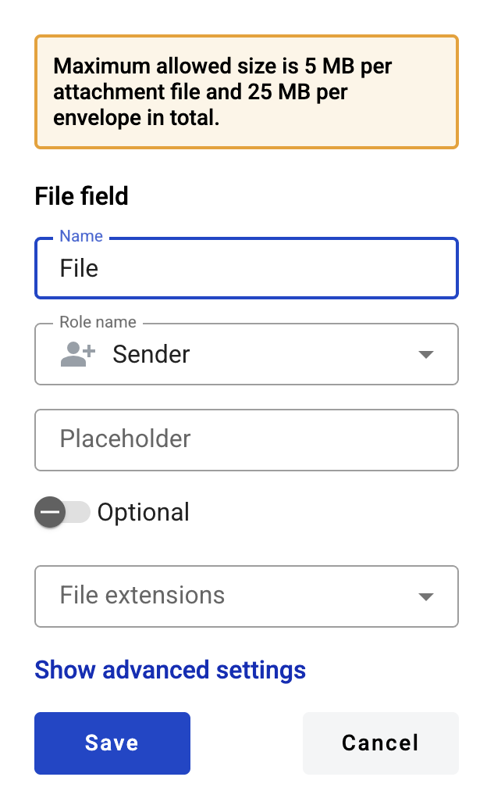
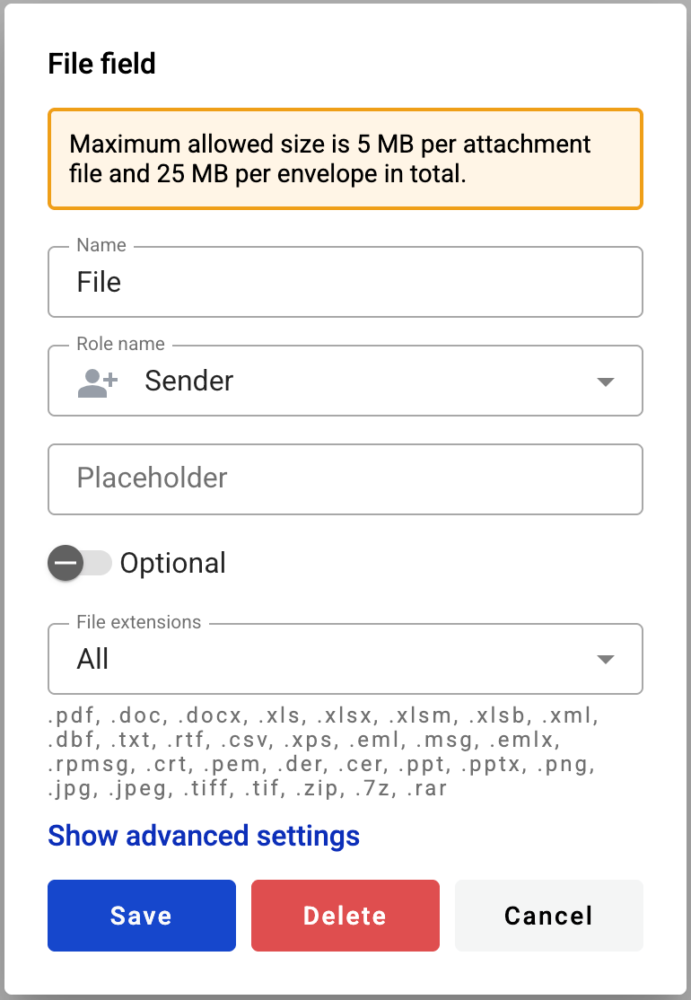

==========
File field
==========

This field allows you to create an upload box for external files. Participants of the envelope processing flow will be able to upload and download a file with it.

.. hint:: This field can be added to structured documents only.

How to add a file field to the document?
========================================

1. To add field to the document, use one of field adding methods with field icon in the Fields tab of template editor menu

2. Field creation form will appear, where you should set field attributes

3. Name - this is a name of a field
4. Role name - this is a role which will be assigned to fill this field
5. Placeholder - this text will be shown inside the field before it is filled in (can be left empty; field`s name will be used instead)
6. Optional - this attribute specifies if this field is mandatory to fill
7. File extension - this attribute specifies file extensions which will be allowed by field. Next options are available:
   1. All: .pdf, .doc, .docx, .xls, .xlsx, .xlsm, .xml, .dbf, .txt, .rtf, .csv, .xps, .eml, .msg, .emlx, .rpmsg, .png, .jpg, .jpeg, .tiff, .tif, .zip, .7z, .rar
   2. File: .pdf, .doc, .docx, .xls, .xlsx, .xlsm, .xml, .dbf, .txt, .rtf, .csv, .xps, .eml, .msg, .emlx, .rpmsg
   3. PDF document: .pdf
   4. Image: .png, .jpg, .jpeg, .tiff, .tif
   5. Archive: .zip, .7z, .rar

This field also includes additional attributes, which you can access by clicking the "Show advanced settings" button.

8. Tooltip - enables adding a custom tooltip that will be displayed for active fields in the envelope. If left blank, the default tooltip is shown

When all attributes are set, you can click the "Save" button and the field will be added. You can click the field to view or update its properties, and also delete it in the same menu.

Please note that the "Show advanced settings" option is available only while no additional attributes have been added to the field.
Once at least one additional attribute is added — either during creation or later in edit mode — this option will no longer appear, and all available attributes will be displayed for editing instead.

How to fill a file field in the envelope?
=========================================

To upload a file to the file field you should click it and select a file in opened file explorer window. You can upload only one file in one field. Maximum file size and size of all uploaded files in one envelope is set on instance but typical default value is 5MB and 25MB respectively.