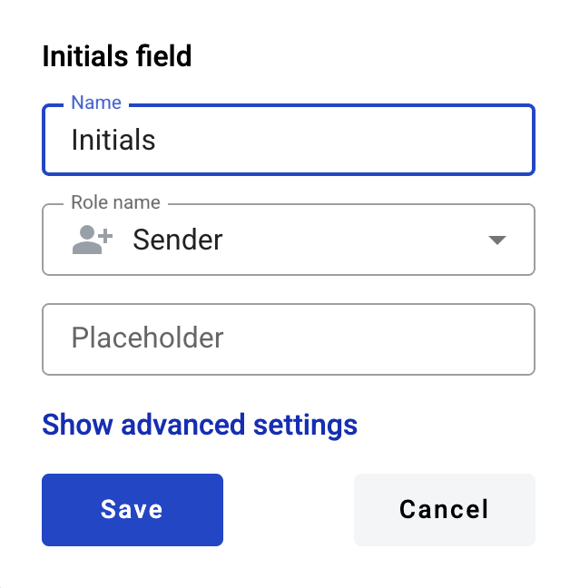

==============
Initials field
==============

This field allows you to place your initials on the document.

.. hint:: This field can be added to structured and PDF documents.

How to add an initials field to the document?
=============================================

1. To add field to the document, use one of field adding methods with field icon in the Fields tab of template editor menu

2. Field creation form will appear, where you should set field attributes

3. Name - this is a name of a field
4. Role name - this is a role which will be assgined to fill this field
5. Placeholder - this text will be shown inside the field before it is filled in (can be left empty; field`s name will be used instead)

When all attributes are set, you can click "Save" button and field will be added. You can click field to see its properties and update them. Also you can delete the field in same menu.

How to fill an initials field in the envelope?
==============================================

1. Open envelope where initials field is located
2. Click the initials field
3. Initials will be automatically generated from your first and last name specified in your user profile and set in the field (if you already specified your initials before, they will be used)

.. note:: If you want to edit your initials, you can click the filled in initials field. Initials drawing window similar to signature drawing window will open.