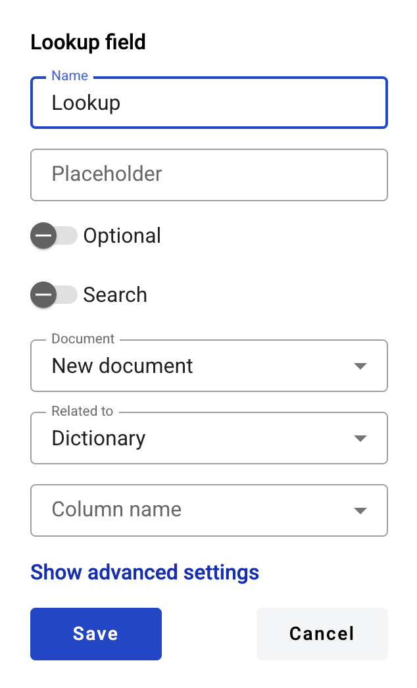
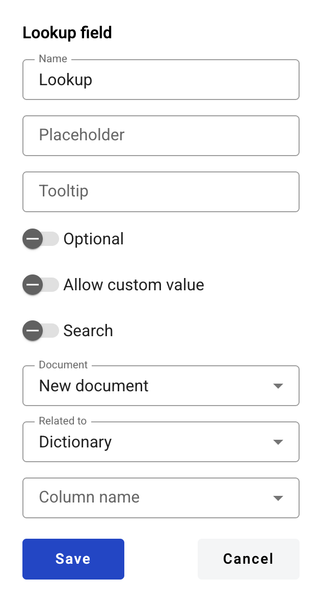

============
Lookup field
============

This field allows you to create an automatically populating field which will return a value from a specified column of a row of parent dictionary field value.

.. hint:: This field can be added to structured and PDF documents.

How to add a lookup field to the document?
==========================================

1. To add field to the document, use one of field adding methods with field icon in the Fields tab of template editor menu

.. image:: pic_lookup/lookupTile.png
   :width: 600
   :align: center

2. Field creation form will appear, where you should set field attributes

3. Name - this is a name of a field
4. Placeholder - this text will be shown inside the field before it is filled in (can be left empty; field`s name will be used instead)
5. Optional - this attribute specifies if this field is mandatory to fill
6. Search - this attribute specifies if this field should be eligible for mailbox page search
7. Document - dropdown selector of a document, where desired parent dictionary is located
8. Related to - dropdown selector of a desired parent dictionary
9. Column name - dropdown selector of a desired column in a parent dictionary

This field also includes additional attributes, which you can access by clicking the "Show advanced settings" button.

10. Tooltip - enables adding a custom tooltip that will be displayed for active fields in the envelope. If left blank, the default tooltip is shown
11. Allow custom values - this attribute specifies if field will allow free text input besides selection from predefined values

.. note:: If dictionary has optionality or custom values attributes enabled, same attributes will also be enforced on all related lookups.

When all attributes are set, you can click the "Save" button and the field will be added. You can click the field to view or update its properties, and also delete it in the same menu.

Please note that the "Show advanced settings" option is available only while no additional attributes have been added to the field.
Once at least one additional attribute is added — either during creation or later in edit mode — this option will no longer appear, and all available attributes will be displayed for editing instead.

.. hint:: If this field contains a link in the envelope, it will be rendered a standard link in the browser (blue font with an underline). You can follow this link from the right-click context menu (any role) or directly click it (only if the field is inactive).