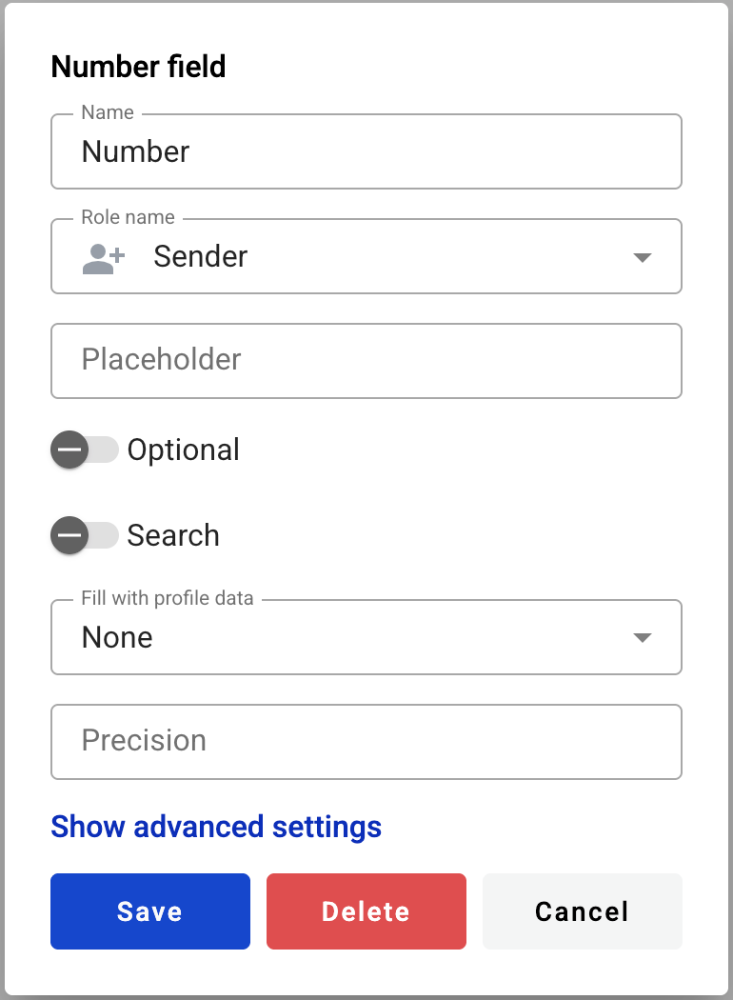

============
Number field
============

This field allows you to create dynamic input box which will be filled by participants of the envelope processing flow.

.. hint:: This field can be added to structured and PDF documents.

How to add a number field to the document?
==========================================

1. To add field to the document, use one of field adding methods with field icon in the Fields tab of template editor menu

2. Field creation form will appear, where you should set field attributes

3. Name - this is a name of a field
4. Role name - this is a role which will be assgined to fill this field
5. Placeholder - this text will be shown inside the field before it is filled in (can be left empty; field`s name will be used instead)
6. Optional - this attribute specifies if this field is mandatory to fill
7. Search - this attribute specifies if this field should be eligible for mailbox page search
8. Fill with profile data - this attribute specifies if this field should be filled with user profile data. If you will select any available option in this field, the according user profile data will be automatically filled in this field when the envelope is opened by the user (but it will still be possible to edit it with any allowed custom value)

.. hint:: Please note that if Fill with profile data is selected - Min and Max attributes will be applied to this field automatically according to the selected Profile data value if they were not provided manually after the template is saved.

9. Precision - number of decimal places allowed in field (no limit is applied if left empty)

.. note:: If value inside the field has more decimal places then allowed by precision attribute, all extra places will be trimmed. No rounding will be applied. E.g. if original value is 1.99 it will be changed to 1.9 if precision is set to 1 and will be changed to 1 if precision is set to 0.

This field also includes additional attributes, which you can access by clicking the "Show advanced settings" button.

10. Tooltip — enables adding a custom tooltip that will be displayed for active fields in the envelope. If left blank, the default tooltip is shown.
11. Adapt to the local format - this attribute specifies if numbers will be formatted according to regional standard

.. note:: Numbers in envelope view will be formatted according to standard of a region which is selected on User profile page. You can see formatting example under region selector on that page. Numbers in printable versions of the documents will always be formatted according to platform region standard.

12. Show decimal zeroes (becomes editable if precision is set) - if enabled, zeroes will be added to fill all empty decimal places of field value
13. Min - minimal value allowed in field (no limit is applied if left empty)
14. Max - maximal value allowed in field (no limit is applied if left empty)

.. warning:: Maximum allowed character count for number field is 15 (according to `IEEE 754 <https://en.wikipedia.org/wiki/IEEE_754>`_). Please note this includes decimal places. This means that if your field has precision attribute set to 3 and you insert a value 999999999999999 or more characters, it will be converted to 999999999999.000.

When all attributes are set, you can click Save button and field will be added. You can click field to see its properties and update them. Also you can delete the field in same menu.
Please note that the “Show advanced settings” option is available only when you add a field. In edit mode, all existing attributes of the field are displayed.

