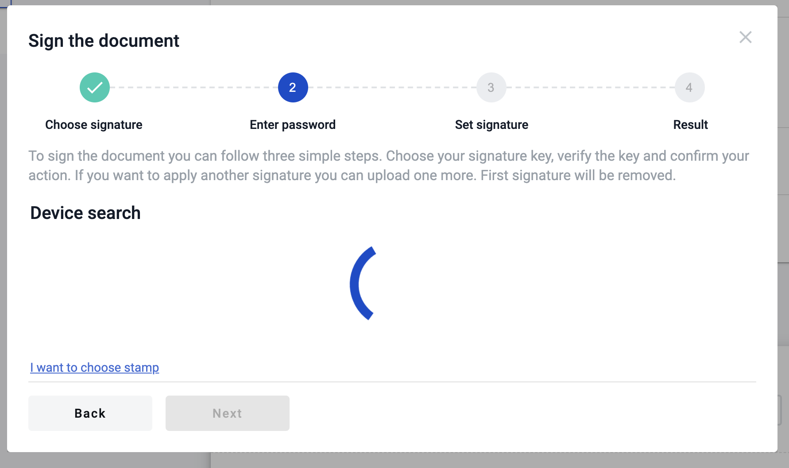
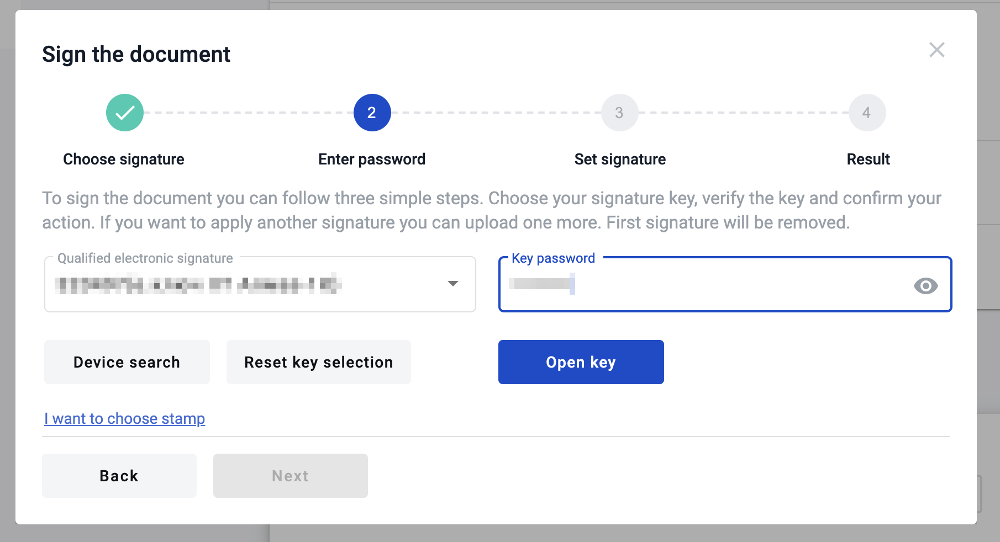
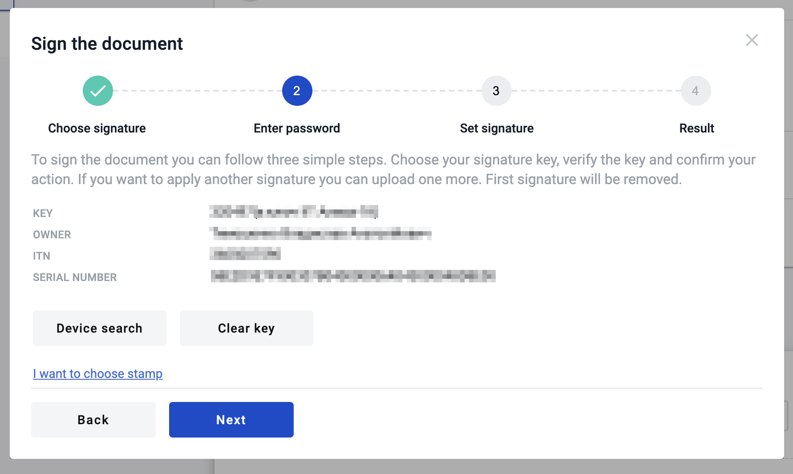
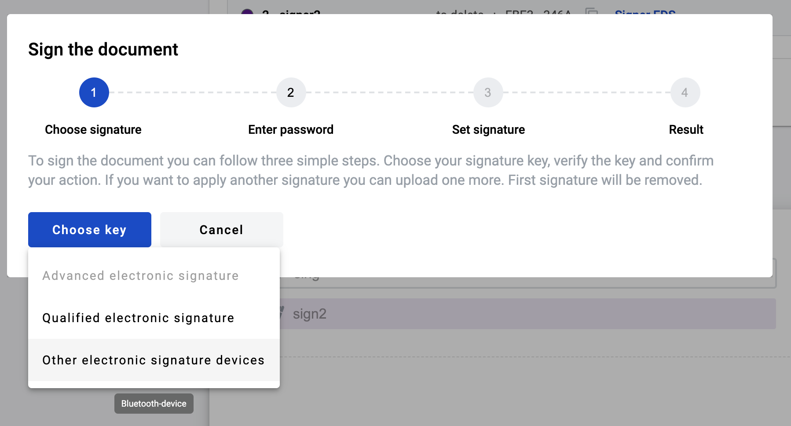
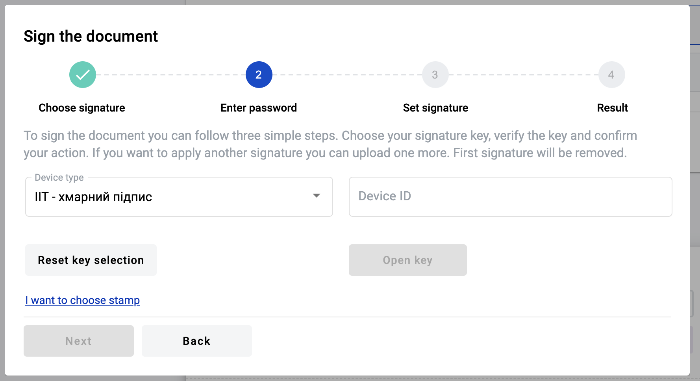
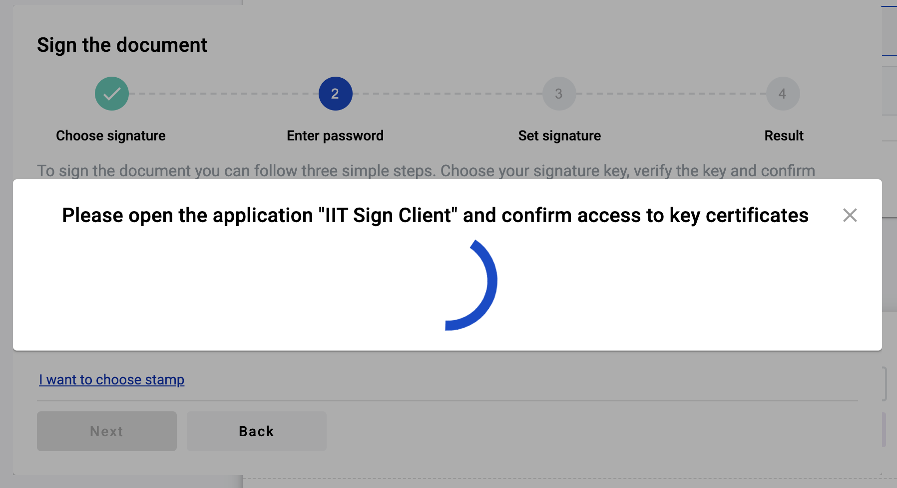
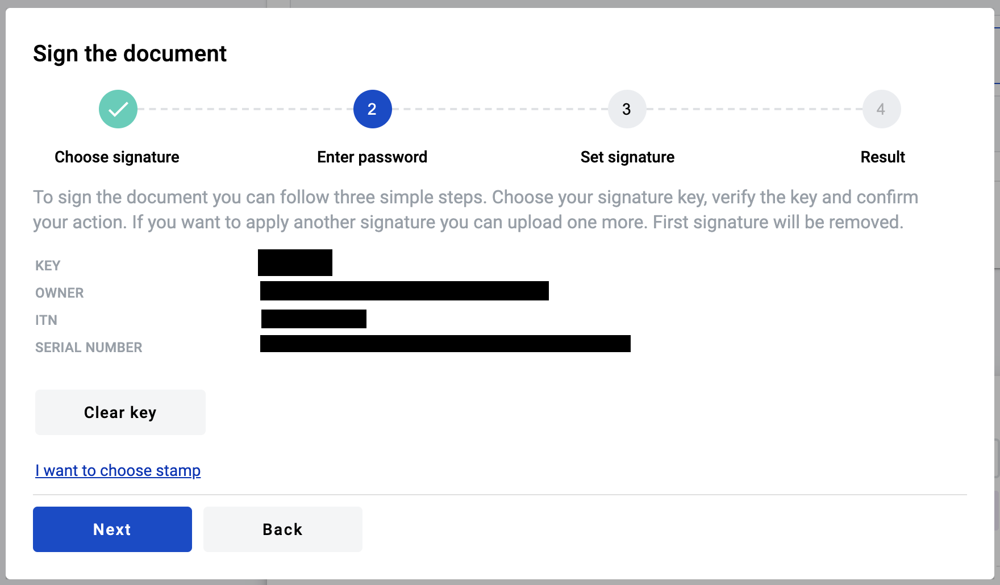
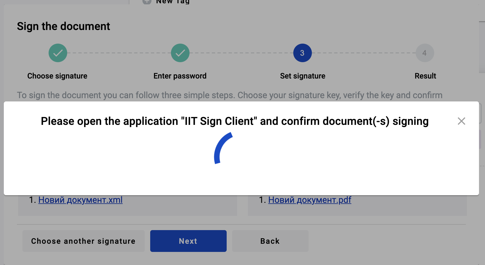

.. _qualifiedElectronicSignature:

How to read a qualified electronic signature?
=============================================

To use qualified electronic signature you should install special software manually on your PC.

**Installation**

.. warning:: Update your OS and browser to the latest version before proceeding.

1. Download and install crypto library (`MacOS <https://iit.com.ua/download/productfiles/EUSignWebInstall.pkg>`_ , `Windows <https://iit.com.ua/download/productfiles/EUSignWebInstall.exe>`_) to access your qualified keys
2. Add `browser extension <https://chrome.google.com/webstore/detail/%D1%96%D1%96%D1%82-%D0%BA%D0%BE%D1%80%D0%B8%D1%81%D1%82%D1%83%D0%B2%D0%B0%D1%87-%D1%86%D1%81%D0%BA-1-%D0%B1%D1%96%D0%B1%D0%BB/jffafkigfgmjafhpkoibhfefeaebmccg?utm_source=chrome-app-launcher-info-dialog>`_ to access crypto library from browser
3. Reboot your PC

**Reading key**

1. Wait until process of a device search is finished

2. Select your hardware key, enter the key password and click the "Read key" button (if you entered the valid password and key is valid you will see the signature details and the next form of the modal window, if not you will see the error message)

3. As soon as you entered the valid data you will see the information related to key with which you want to sign the document

How to read an electronic signature using a bluetooth token?
============================================================

To use qualified electronic signature located on a bluetooth token produced by IIT you should install special software manually on your mobile device.

**Installation**

.. warning:: Update your OS and browser to the latest version before proceeding.

1. Download and install sign client for your OS (Sign client for iOS - https://apps.apple.com/ua/app/iit-sign-client/id1467005893 / Sign client for Android - https://play.google.com/store/apps/details?id=ua.com.iit.signclient) to access your qualified keys
2. Open the "Sign client" app and register new user using a bluetooth token (as described above)
3. Click the "+" icon in the app
4. Select the key type (if you use a bluetooth token of a Almaz-1K productin, select option "Key media")
5. Click the "Read" option and click the "Key media" again
6. Turn on the bluetooth device and wait until it is displayed in the app
7. Click it and enter the key password
8. Wait for the registration  to complete and you will be able to connect to your key, where you can get the key identifier

**Reading a key**

1. Select "Other electronic signature devices" option

2. Enter you key identifier to the respective input and click the "Read key" button

3. Modal window with confirmation will appear and you will have to confirm you action in "Sign client" app

4. After the key reading confirmation you will see detailed information about the signer. Click the "Next" button to proceed with signing

5. Pay attention to the documents you want to sign. If everything is fine click the "Next" button and modal window with instructions will appear again

6. Confirm the signing requests (quantity of requests will depend on the documents quantity) in the "Sign client" app