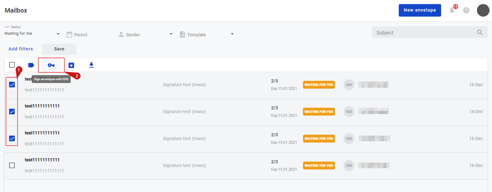
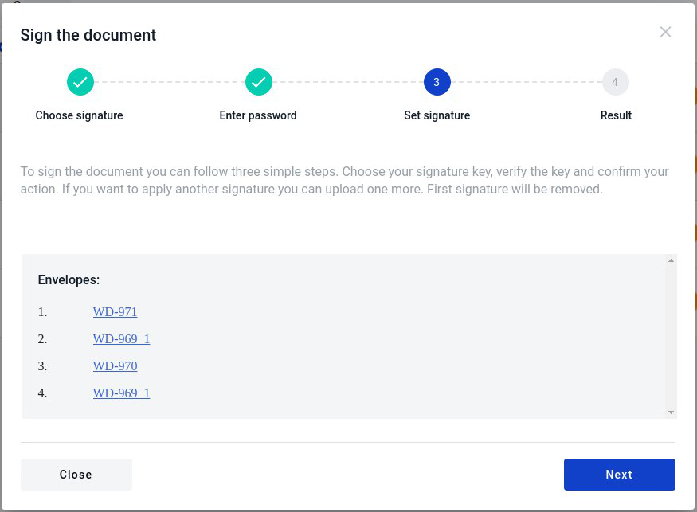
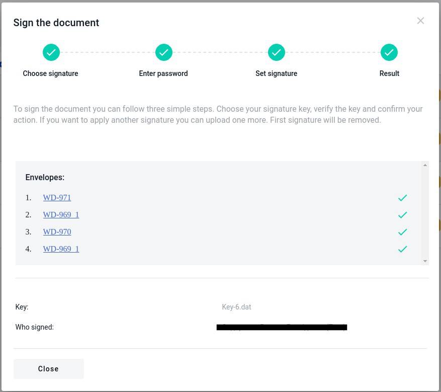
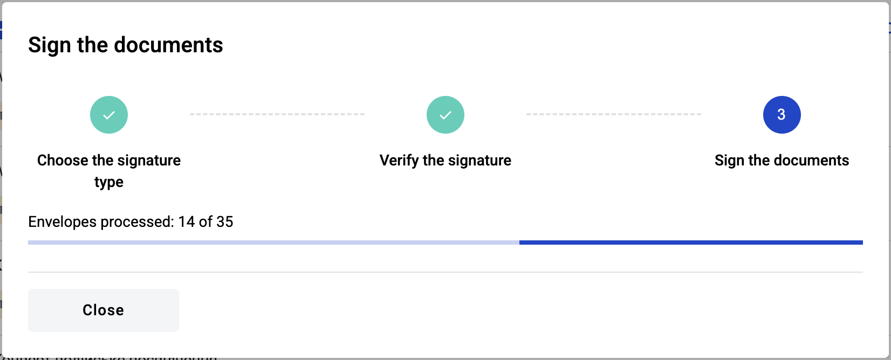
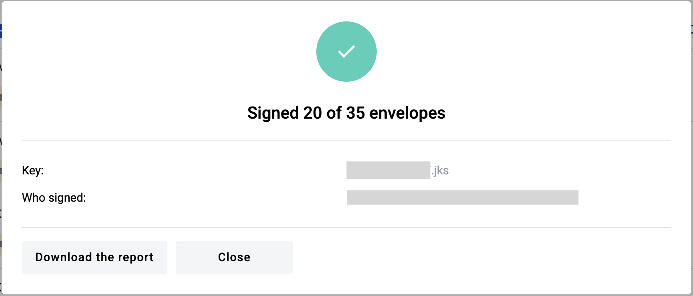

====================================
Electronic mass signing of envelopes
====================================

You are able to sign as mane envelopes which contain QES inside as you need. How to do this you can read below.

How to sign several envelopes at once
=====================================

.. note:: The steps described below apply to all signature types except AES and QES. If the chosen key is AES or QES and the stamp is not, the logic will follow the steps described below and vice versa. However, if both the key and the stamp are AES or QES, the logic will be as described in :ref:`How to sign several envelopes at once with AES or QES <howToSignAESOrQES>`

.. _selectEnvelopes:

To mass sign the envelopes you have to do the following:

1. Press button "Mailbox" on the left sidebar
2. Choose envelopes which you want to sign
3. Find icon "key". Hover your mouse over the icon and you will see tooltip "Sign envelopes with QES". Press this button

After clicking it, a modal window will appear

4. The first two steps are similar with signing of the single document. How to do this you can read :ref:`here <electronicSignature>`
5. In the third step you will see a list of envelopes that will be signed. You can click any envelope to see its` content. Envelopes open in a new window

6. Click the "Next" button and wait for the envelopes to sign. While you are waiting you will see progress bar of the envelopes signing process. You can close the window if needed, process will not stop
7. In the end you will see the results of the mass signing. If any error occured you will see special icon with error. To check the cause of error hower the mouse cursor over an icon

.. _howToSignAESOrQES:

How to sign several envelopes at once with AES or QES
=====================================================

You can sign multiple envelopes from the mailbox page. To do so, follow steps 1, 2, 3, and 4 from :ref:`instruction above <selectEnvelopes>`. You will observe signing modal window with as described above and only difference you see it's processing of the envelopes and results.

1. When you read the key and proceed with signing, a progress bar will appear displaying information about the processed envelopes

.. note:: "Processed envelopes" does not necessarily mean successfully signed envelopes. It simply indicates that envelope processing is complete—the result could be a successfully signed envelope or one that was skipped due to an error

2. As soon as the envelope processing is finished, a signing results modal window will appear, allowing you to download a report containing all processed envelopes

3. The report is an XLSX file and includes the following information

* Envelope subject
* Envelope UUID
* Envelope link
* Envelope signing status
* Envelope signing error (empty if the envelope was signed)
